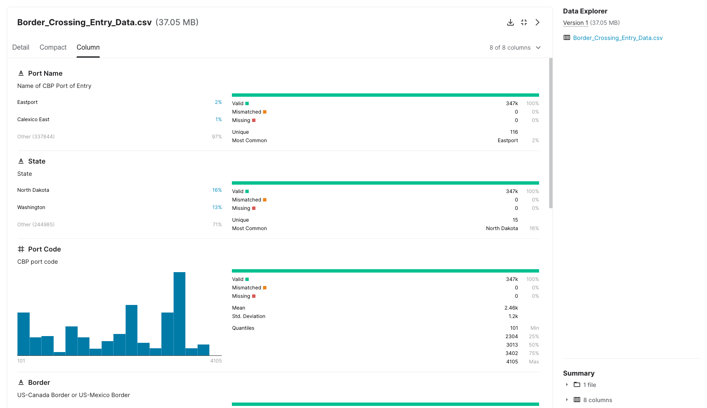

---
hide:
 - toc
# - navigation
title: Dove trovare buoni esempi di dati in CSV
---

Quella che segue è la descrizione di due iniziative che pubblicano set di dati aperti, di elevata qualità, disponibili in formato `CSV`:

- [Datahub](https://datahub.io/)
- [Kaggle](https://www.kaggle.com/)

In queste piattaforme è rilevante la qualità con cui i dati vengono pubblicati, data la forte comprensione della natura multi-scopo dell'uso dei dati e il trattamento professionale dei dati che è al centro di entrambe le iniziative.
**Datahub**, si distingue per l'**implementazione di un supporto completo per la trasformazione**, la **convalida** e la **pubblicazione** di dati di qualità e **Kaggle** è una delle più importanti **risorse di set di dati e conoscenze** che effettuano una **analisi professionale dei dati** di riferimento.
Entrambe le iniziative sono esempi di buone pratiche nel trattamento dei file `CSV` che possono essere presi in considerazione quando si tratta di processi di preparazione e pubblicazione di Open Data.

## Datahub.io

Datahub è una **piattaforma web-based** che supporta **flussi di lavoro** end-to-end per la **preparazione e la pubblicazione** di Open Data. È progettato per **preparare, catalogare e pubblicare dati** di alta qualità utilizzando il toolkit Frictionless Data.
Il Frictionless Data toolbox[^1] è una **raccolta di specifiche e applicazioni per la preparazione di file di dati**, incluse le Goodtables, descritte nel capitolo [Cassetta degli attrezzi per i file CSV](../linee_guida_pubblicazione/Cassetta_attrezzi.md) di questa guida. Datahub **contiene collezioni di dati di alto valore** conformi agli Open Data, come: **cambiamenti climatici, dati e indicatori economici, statistiche**, logistica, documenti aziendali provenienti da fonti ufficiali.
Ogni **voce di dati** disponibile contiene una serie di **elementi per visualizzare le proprietà del dataset** (schema e risorse di dati), opzioni per scaricare i dati in vari formati tra cui `CSV`, **viste delle tabelle di dati** e semplici visualizzazioni. Fornisce anche un accesso **diretto ai dati di importazione** utilizzando una varietà di strumenti comunemente usati nel contesto professionale: R, Python, JavaScript e SQL.

<figure markdown>
  
  <figcaption>Datahub</figcaption>
</figure>

[^1]: [Frictionless Data](https://frictionlessdata.io/)

Un [esempio](https://datahub.io/core/co2-ppm) di un **set di dati** `CSV` disponibile sulla piattaforma è quello che mostra l'**andamento dell'anidride carbonica nell'atmosfera**, proveniente dall'Earth System Research Laboratory del governo statunitense.

<iframe src="https://datahub.io/core/co2-ppm/view/0" width="100%" height="475px" frameborder="0"></iframe>

<iframe src="https://datahub.io/core/co2-ppm/view/1" width="100%" height="475px" frameborder="0"></iframe>

<iframe src="https://datahub.io/core/co2-ppm/r/0.html" width="100%" height="100%" frameborder="0"></iframe>

Il file `CSV` (visualizzato sopra) scaricabile del dataset "CO2 PPM - Trends in Atmospheric Carbon Dioxide" ha le seguenti caratteristiche:

- dizionario di dati elaborabile in formato `JSON` secondo la specifica Data Package;
- riga di intestazione singola;
- singolo record per riga;
- denominazione comprensibile delle colonne;
- struttura dati verticale;
- trattamento dei valori sconosciuti, indicati da valori di tipo -99,99 (per l'attributo `media`) e -1 (per l'attributo `giorni`);
- non contiene alcun totale o raggruppamenti;
- corretta digitazione dei campi;
- campo data codificato secondo lo standard ISO- 8601;
- non contiene dati con coordinate geografiche o campi codificati.

## Kaggle

Kaggle è una **piattaforma web** in cui **aziende e istituzioni propongono problemi strategici o di business** in modo che **gruppi con interesse o esperienza** nell'analisi dei dati **competano**, a pagamento, per **creare e proporre le migliori soluzioni**.
La piattaforma presenta **qualsiasi tipo di problema** da risolvere che può essere trovato in diversi domini del mondo reale, come ad esempio i **servizi finanziari, l'energia, la società e la tecnologia dell'informazione**. Oltre alle competizioni proposte e alla **disponibilità di risorse di codice per analizzare qualsiasi set di dati**, Kaggle ospita **centinaia di set di dati** di tutti i tipi e dimensioni che possono essere scaricati e utilizzati gratuitamente, per lo più in formato `CSV`. Ogni **set di dati** contiene una **descrizione dettagliata del suo contenuto e ha un'anteprima** del contenuto del file tramite un esploratore di dati.

<figure markdown>
  
  <figcaption>Kaggle</figcaption>
</figure>

I **file** includono la **specifica dello schema di dati associato**, comprese le **descrizioni delle colonne** con i loro **metadati corrispondenti**: tipi di dati, gamma di valori, unità e istogramma. Le **descrizioni sono assegnate a livello di tabella e a livello di singola colonna** per una facile comprensione. Ogni **dataset** è anche **valutato** dalla comunità di utenti per il suo grado di **usabilità** basato su aspetti come la facilità di comprensione del contenuto attraverso la **qualità dei descrittori essenziali**: file, colonna, tag, licenza, provenienza e frequenza di aggiornamento. Un esempio è il [set di dati](https://www.kaggle.com/datasets/akhilv11/border-crossing-entry-data) che contiene i dati di ingresso dei passaggi di frontiera dal "Bureau of Transportation Statistics" (BTS) degli Stati Uniti.

<figure markdown>
  
  <figcaption>Kaggle</figcaption>
</figure>

|nome_porto            |stato       |codice_porto    |confine                   |data                  |misura                         |valore|posizione                            |
|----------------------|------------|----------------|--------------------------|----------------------|-------------------------------|------|-------------------------------------|
|Calexico East         |California  |2507            |US-Mexico Border          |03/01/2019 12:00:00 AM|Trucks                         |34447 |POINT (- 115.48433000000001 32.67524)|
|Van Buren             |Maine       |108             |Confine USA-Canada        |03/01/2019 12:00:00 AM|Contenitori ferroviari pieni   |428   |POINT (- 67.94271 47.16207)          |
|Otay Mesa             |California  |2506            |US-Mexico Border          |03/01/2019 12:00:00 AM|Trucks                         |81217 |POINT (- 117.05333 32.57333)         |
|Nogales               |Arizona     |2604            |Confine USA-Messico       |03/01/2019 12:00:00 AM|Treni                          |62    |POINT (-110.93361 31.340279999999996)|   
|Trout River           |New York    |715             |US-Canada Border          |03/01/2019 12:00:00 AM|Passeggeri di veicoli personali|16377 |POINT (-73.44253 44.990010000000005) |
|Madawaska             |Maine       |109             |Confine USA-Canada        |03/01/2019 12:00:00 AM|Camion                         |179   |POINT (-68.3271 47.35446)            | 
|Pembina               |North Dakota|3401            |US-Canada Border          |03/01/2019 12:00:00 AM|Bus Passengers                 |1054  |POINT (-97.24333 48.96639)           |
|Progreso              |Texas       |2309            |US-Mexico Border          |03/01/2019 12:00:00 AM|Truck Containers Empty         |1808  |POINT (-97.94889 26.061670000000003) |
|Portal                |North Dakota|3403            |US-Canada Border          |03/01/2019 12:00:00 AM|Rail Containers Empty          |6685  |POINT (-102.54917 48.99583)          |
|Champlain-Rouses Point|New York    |712             |Confine USA-Canada        |03/01/2019 12:00:00 AM|Trucks                         |24759 |POINT (-73.44694 44.98639)           |
|Opheim                |Montana     |3317            |Confine USA-Canada        |03/01/2019 12:00:00 AM|Veicoli personali              |235   |POINT (- 106.40265 48.85574)         |

Il file `CSV` (visibile sopra) scaricabile del [set di dati](https://www.kaggle.com/datasets/akhilv11/border-crossing-entry-data) "Border crossing entry data" ha le seguenti caratteristiche:

- dizionario dei dati specificato in forma di tabella ma non elaborabile automaticamente, un possibile miglioramento sarebbe fornirlo in formato `JSON` direttamente in fase di download;
- riga di intestazione singola;
- singolo record per riga;
- denominazione comprensibile delle colonne;
- struttura dati verticale;
- non contiene totali o raggruppamenti;
- corretta digitazione dei campi;
- campo data codificato secondo lo standard ISO-8601;
- codifica dei porti;
- coordinate geografiche in gradi decimali indicate come punto geografico di latitudine-longitudine.