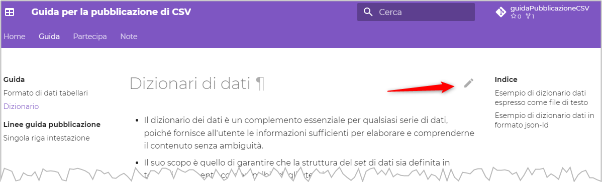

---
hide:
 - toc
 - navigation
title: Partecipa
---

Questa **guida** è un **bene comune**, sia da **lettore** che da **autore**.

!!! info

    Il testo della guida è quello che trovi nella cartella [`docs`](https://github.com/ondata/guidaPraticaPubblicazioneCSV/tree/main/docs) di [questo *repository* GitHub](https://github.com/ondata/guidaPraticaPubblicazioneCSV/).<br>


Da **lettore**, sei **libero** di:

- **Condividere** — riprodurre, distribuire, comunicare al pubblico, esporre in pubblico, rappresentare, eseguire e recitare questo materiale con qualsiasi mezzo e formato
- **Modificare** — remixare, trasformare il materiale e basarti su di esso per le tue opere
per qualsiasi fine, anche commerciale.

Alle seguenti condizioni:

- **Attribuzione** — Devi riconoscere una menzione di paternità adeguata, fornire un link alla licenza e indicare se sono state effettuate delle modifiche. Puoi fare ciò in qualsiasi maniera ragionevole possibile, ma non con modalità tali da suggerire che il licenziante avalli te o il tuo utilizzo del materiale.
- **Divieto di restrizioni aggiuntive** — Non puoi applicare termini legali o misure tecnologiche che impongano ad altri soggetti dei vincoli giuridici su quanto la licenza consente loro di fare.


Da **autore** puoi:

- se **non sai usare git e GitHub**, [**aprire una nuova discussione qui**](https://github.com/ondata/guidaPraticaPubblicazioneCSV/discussions), con delle proposte, suggerimenti, domande o per mostrarci per cosa ti è stata utile questa guida;
- se **sai usare git e GitHub**:
    - clonare il *repository* e fare dell *Pull Request*;
    - proporre delle modifiche al testo e suggerire delle correzione, utilizzando il tasto <kbd>EDIT</kbd>, che trovi in ogni pagina, in alto a destra (vedi immagine sotto) e fare sempre delle *Pull Request*, ma più "visuali", direttamente dall'interfaccia web.

[](imgs/edit_page.png)


## Citare questa guida

Per citare questa guida puoi fare riferimento a questo testo:

<span xmlns:dct="http://purl.org/dc/terms/" property="dct:title">"<a href="https://ondata.github.io/guidaPraticaPubblicazioneCSV/">Guida per la pubblicazione di CSV</a>"</span> dell'<a xmlns:cc="http://creativecommons.org/ns#" href="https://ondata.it/" property="cc:attributionName" rel="cc:attributionURL">Associazione onData</a>, distribuita con Licenza <a rel="license" href="http://creativecommons.org/licenses/by/4.0/">Creative Commons Attribuzione 4.0 Internazionale</a> | <a rel="license" href="http://creativecommons.org/licenses/by/4.0/"></a>

O direttamente a questo codice HTML:

```HTML
<span xmlns:dct="http://purl.org/dc/terms/" property="dct:title">"<a href="https://ondata.github.io/guidaPraticaPubblicazioneCSV/">Guida per la pubblicazione di CSV</a>"</span> dell'<a xmlns:cc="http://creativecommons.org/ns#" href="https://ondata.it/" property="cc:attributionName" rel="cc:attributionURL">Associazione onData</a>, distribuita con Licenza <a rel="license" href="http://creativecommons.org/licenses/by/4.0/">Creative Commons Attribuzione 4.0 Internazionale</a> | <a rel="license" href="http://creativecommons.org/licenses/by/4.0/"></a>
```

Potrai scrivere ad esempio:

> Fonte: <span xmlns:dct="http://purl.org/dc/terms/" property="dct:title">"<a href="https://ondata.github.io/guidaPraticaPubblicazioneCSV/">Guida per la pubblicazione di CSV</a>"</span> dell'<a xmlns:cc="http://creativecommons.org/ns#" href="https://ondata.it/" property="cc:attributionName" rel="cc:attributionURL">Associazione onData</a>, distribuita con Licenza <a rel="license" href="http://creativecommons.org/licenses/by/4.0/">Creative Commons Attribuzione 4.0 Internazionale</a> | <a rel="license" href="http://creativecommons.org/licenses/by/4.0/"></a>
