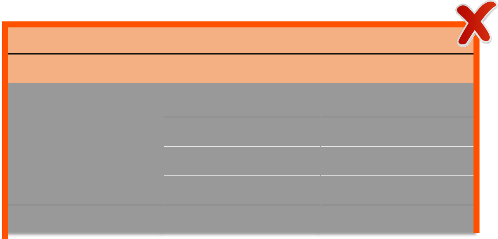
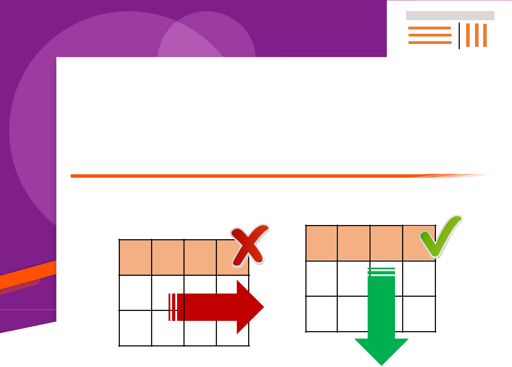
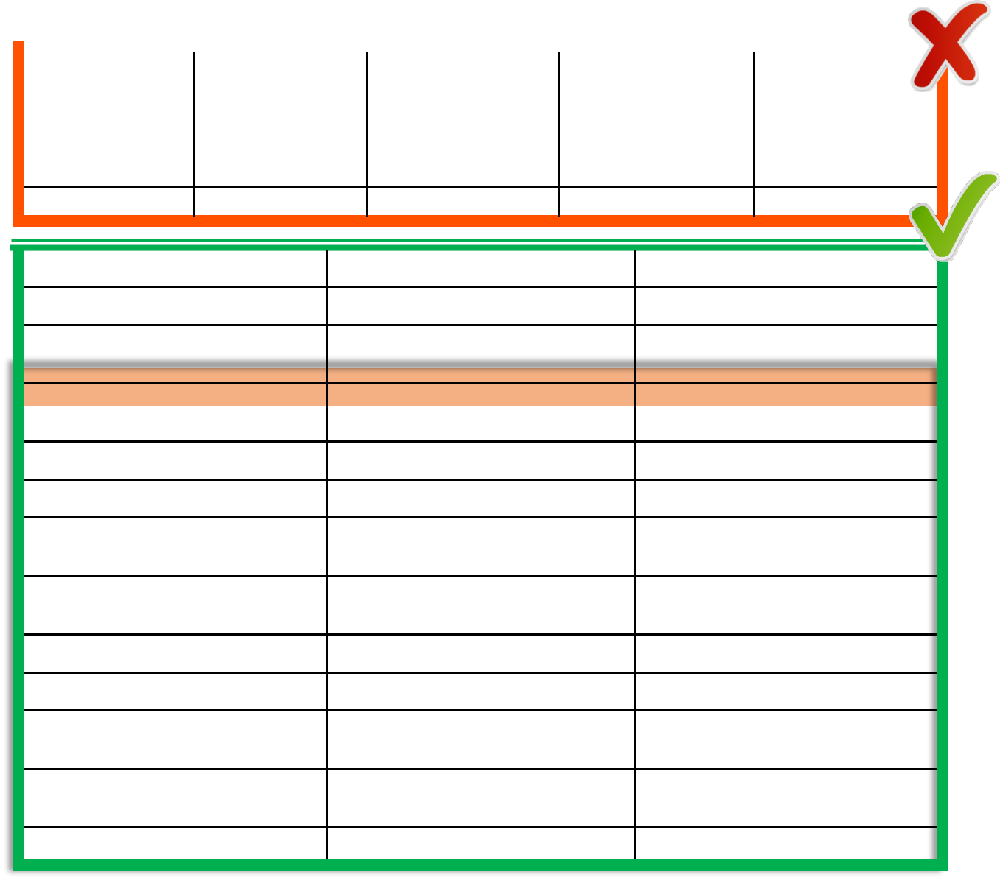
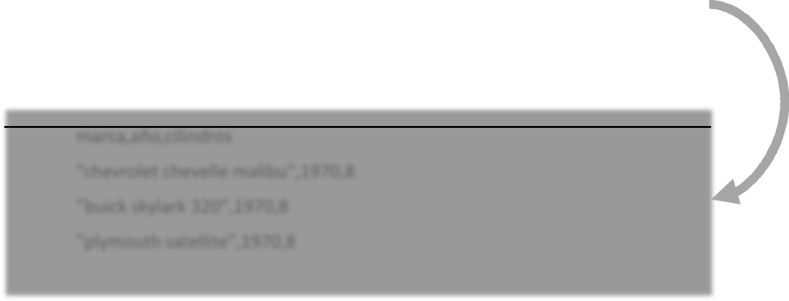
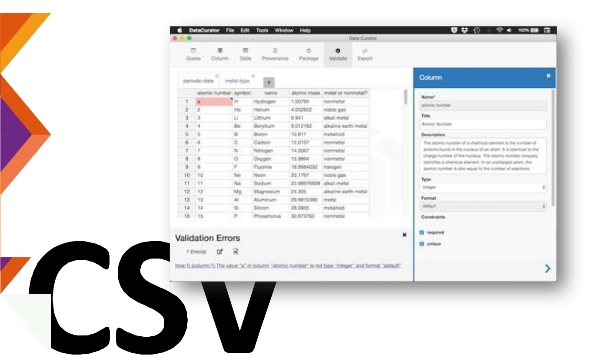

> 
> 
> Per ulteriori informazioni, visita [www.DeepL.com/pro.](https://www.deepl.com/pro?cta=edit-document&pdf=1)

Guida pratica

per la pubblicazione di dati tabulari in file

> CSV
> 
> **Contenuto preparato da Carlos de la Fuente García, esperto di dati aperti.**

*Questo studio è stato sviluppato nell'ambito dell'Iniziativa Aporta, sviluppata dal Ministero degli Affari Economici e della Trasformazione Digitale, attraverso l'Ente Pubblico Commerciale Red.es.*

*L'uso di questo documento implica l'accettazione espressa e completa delle condizioni generali di riutilizzo di cui all'avviso legale riportato su:* [http://datos.gob.es/es/aviso-legal.](http://datos.gob.es/es/aviso-legal)

**Riconoscimenti:**

*Per i loro contributi, suggerimenti e disponibilità nell'elaborazione di questa guida a:*

• *Alicia Martínez Domingo (Esperto di dati aperti).* • *Jorge López Pérez (Scienziato dei dati)* • *Jorge Cimentada Báez (Ricercatore)* • *Comunità Databeers Malaga:*

> • *María Sánchez Gonzalez (Università di Malaga).*
> 
> • *David Bueno Vallejo (Consiglio comunale di Malaga)*
> 
> • *Nuria PortilloPoblador( UniversitatPolitècnicadeValència)*
> 
> • *Roberto Magro Pedroviejo (Consiglio Comunale di Alcobendas)*

2

> 01
> 
> 02
> 
> 03
> 
> 04

[Introduzione04](#page5)

[Il ....................................................................................... formato dei dati](#page7)

[tabulari06](#page7)

[Dizionari di dati09](#page10)

[Linee guida generali per la pubblicazione di **file CSV14 ...............**](#page16)

[**P1:**](#page18)

> [......................................................................... lin](#page18)

<table>
<tbody>
<tr class="odd">
<td><a href="#page18">ea d'intestazione singola15</a></td>
<td></td>
<td></td>
</tr>
<tr class="even">
<td><a href="#page21"><strong>P2:</strong> record singolo per riga18 ...........................</a></td>
<td></td>
<td></td>
</tr>
<tr class="odd">
<td><strong>P3:</strong><a href="#page24">.........................................................................</a>Denominazionedelle</td>
<td><a href="#page24">co</a></td>
<td></td>
</tr>
<tr class="even">
<td><a href="#page24">lonne21</a></td>
<td></td>
<td></td>
</tr>
<tr class="odd">
<td></td>
<td></td>
<td></td>
</tr>
<tr class="even">
<td><a href="#page27"><strong>P4</strong>: strutture ....................................................</a></td>
<td><a href="#page27">di</a></td>
<td></td>
</tr>
<tr class="odd">
<td><a href="#page27">dati verticali e orizzontali23 ............................</a></td>
<td></td>
<td></td>
</tr>
<tr class="even">
<td><a href="#page30"><strong>P5</strong>: Trattamento di</a></td>
<td><a href="#page30">val</a></td>
<td></td>
</tr>
<tr class="odd">
<td>ori<a href="#page30">........................................................................</a>sconosciuti25</td>
<td></td>
<td></td>
</tr>
<tr class="even">
<td></td>
<td></td>
<td></td>
</tr>
<tr class="odd">
<td><strong>P6</strong><a href="#page34">.........................................................................</a>:subtotali,totalio</td>
<td><blockquote>

<a href="#page34">ra</a>

</blockquote></td>
<td></td>
</tr>
<tr class="even">
<td><a href="#page34">ggruppamenti28</a></td>
<td></td>
<td></td>
</tr>
<tr class="odd">
<td></td>
<td></td>
<td></td>
</tr>
<tr class="even">
<td><strong>Q7</strong><a href="#page37">.........................................................................</a>:</td>
<td><a href="#page37">Tip</a></td>
<td></td>
</tr>
<tr class="odd">
<td><a href="#page37">izzazione dei dati31</a></td>
<td></td>
<td></td>
</tr>
<tr class="even">
<td></td>
<td></td>
<td></td>
</tr>
<tr class="odd">
<td><a href="#page39"><strong>P8</strong>: Standardizzazione dei valori</a></td>
<td></td>
<td></td>
</tr>
<tr class="even">
<td>dei<a href="#page39">.........................................................................</a></td>
<td><a href="#page39">ca</a></td>
<td></td>
</tr>
<tr class="odd">
<td><a href="#page39">mpi33</a></td>
<td></td>
<td></td>
</tr>
<tr class="even">
<td></td>
<td></td>
<td></td>
</tr>
</tbody>
</table>

|                                                                                                                                                                                                                                                           |                               |  |
| --------------------------------------------------------------------------------------------------------------------------------------------------------------------------------------------------------------------------------------------------------- | ----------------------------- |  |
| [**P9**: ........................................](#page41)                                                                                                                                                                                               | [Campi codificati35](#page41) |  |
| [**P10**: .........................................](#page43)                                                                                                                                                                                             | [Campi di testo37](#page43)   |  |
| [**P11**: ......................................](#page46)                                                                                                                                                                                                | [Campi numerici39](#page46)   |  |
| [**P12**: ............................................](#page50)                                                                                                                                                                                          | [campi datati43](#page50)     |  |
| **P13**[............................................................................................................................................................................](#page52):Campiconnumeri | [telefono45](#page52)         |  |
| [**P14**: Campi con indirizzi](#page55)                                                                                                                                                                                                                   |                               |  |
|                                                                                                                                                                                                                                                           | [cartoline47](#page55)        |  |
| [**P15**: Campi con coordinate](#page57)                                                                                                                                                                                                                  |                               |  |
|                                                                                                                                                                                                                                                           | [geografie49](#page57)        |  |
|                                                                                                                                                                                                                                                           |                               |  |

> 3

0

065

07

08

09

Allegat o I

> [Linee guida per l'esportazione/importazione di dati tabulari da](#page59)
> 
> [strumenti a foglio elettronico a CSV51 .................................................](#page59)

[Altre considerazioni sul file ................................................................... CSV53](#page61)

> [Toolbox per i file .................................................................................... CSV54](#page63)
> 
> [Dove trovare buoni esempi di dati in formato .................................... CSV59](#page68)
> 
> [Link utili66](#page75)
> 
> [Tassonomie e liste di .................................. codici comunemente usati67](#page76)

> 4
> 
>  **Introduzione**
> 
> Oggi abbiamo sempre più fonti di dati a portata di mano. Paradossalmente, però, anche se i dati sono più accessibili che mai, le possibilità di riutilizzarli sono piuttosto limitate. I potenziali utenti di questi dati spesso affrontano molteplici barriere all'accesso e all'uso: bassa qualità dei dati, metadati poco descrittivi e standardizzati, licenze imprecise o formati inappropriati.
> 
> Queste difficoltà nel riutilizzare i dati sono menzionate ancora e ancora in [diversi studi di riferimento come l'Open Data Barometero il Global OpenData](https://blog.okfn.org/files/2017/06/FinalreportTheStateofOpenGovernmentDatain2017.pdf)   [Index, e sono in gran parte dovute alla convinzione iniziale dei](https://blog.okfn.org/files/2017/06/FinalreportTheStateofOpenGovernmentDatain2017.pdf) produttori di   dati che l'importante era pubblicare più informazioni possibili il più presto possibile, indipendentemente dalla loro qualità.
> 
> Di conseguenza, i cataloghi di dati pubblicano decine di migliaia di set di dati con carenze di qualità che possono essere identificate solo dopo aver iniziato il processo di riutilizzo, generando un carico di pulizia e preparazione che in molti casi è insopportabile per l'utente dei dati aperti. Questo fatto produce frustrazione e perdita di interesse nel settore del riutilizzo, colpendo la credibilità delle istituzioni editoriali e abbassando notevolmente le aspettative di ritorno e generazione di valore dal riutilizzo dei dati aperti.
> 
> Per tutte queste ragioni, e tenendo conto dell'attuale stato di maturità delle iniziative sui dati aperti, è il momento di rafforzare il miglioramento della qualità dei dati che vengono pubblicati. Questa guida è la prima pubblicazione di un compendio di linee guida compilato con lo scopo di guidare gli editori nell'uso appropriato di formati e mezzi di accesso ai dati aperti. In questa occasione, il focus è sul formato CSV, che è il formato più utilizzato nella pubblicazione di dati aperti.

4

>  **Perché CSV?**

  - > La forma tabellare dei dati è la forma più comune di trasferimento e scambio di informazioni e viene prodotta in diversi modi: file di dati con colonne delimitate o campi di lunghezza fissa, fogli di calcolo, tabelle HTML o download di tabelle di dati SQL, tra gli altri.

  - > Questo è il formato più popolare e ampiamente utilizzato nel contesto del riutilizzo degli Open Data. La maggior parte delle risorse disponibili nei cataloghi Open Data sono in formato CSV.

  - > Il portale europeo dei dati ha più di 120.000 set di dati [in formato CSV, il](https://www.europeandataportal.eu/data/datasets?locale=es) [formato più abbondante in questocatalogoOpenData.](https://www.europeandataportal.eu/data/datasets?locale=es)

  - > Da parte sua, il catalogo nazionale [datos.gob.es](https://datos.gob.es/es/catalogo) ha quasi 14 mila set di dati in formato CSV, che è anche il formato più comune.

  - > È conciso, facile da interpretare sia per gli uomini che per le macchine e adatto alla struttura naturale della maggior parte dei dati. È caratterizzato da [dati disposti in forma di tabella,](https://datos.gob.es/es/documentacion/como-generar-valor-partir-de-los-datos-formatos-tecnicas-y-herramientas-para-analizar%20que%20cataloga%20el%20CSV%20como%20un%20formato%20que%20para%20personas%20y%20para%20m%C3%A1quinas%20\(hibrido\)) dove i campi sono separati da un carattere separatore e i record da interruzioni di riga.

  - > Nessun software specifico è richiesto per aprire i file CSV, basta usare qualsiasi editor di testo disponibile su tutti i sistemi operativi.

> **Ma...**

  - > La semplicità di CSV ha il compromesso che il formato non include alcun meccanismo per indicare che tipo di dati sono in una colonna o se i valori in una colonna devono essere espressi in modo obbligatorio. È quindi incline a errori come i valori mancanti o la mescolanza di diversi tipi di dati all'interno di una colonna.

  - > La soluzione a questi problemi risiede nell'applicazione di buone pratiche nella fase di preparazione del dataset, nell'articolazione delle misure di controllo della qualità e nel collegamento del file di dati tabulari con schemi che esprimono il modello dei dati attraverso i metadati.

5

>  **Formato di Dati tabellari**
> 
> 2****Le serie di **dati tabulari** ben organizzate sono conformi a uno schema predefinito, sono facili da manipolare, modellare e visualizzare, e hanno una struttura specifica basata sulle seguenti regole:

> • Ogni variabile è una **colonna**.

> • Ogni osservazione o registrazione è una **riga**.

> • Ogni intersezione di riga e colonna è una **cella**.

> • Ogni serie di osservazioni è una **tabella**.

  - > **Esempio:** caratteristiche delle auto d'epoca 1

<table>
<tbody>
<tr class="odd">
<td><blockquote>

marchio

</blockquote></td>
<td><blockquote>

ann

</blockquote></td>
<td>cilindri</td>
<td>consumo</td>
<td>potenza</td>
<td><blockquote>

accelerazio

</blockquote></td>
<td></td>
</tr>
<tr class="even">
<td></td>
<td>o</td>
<td></td>
<td></td>
<td></td>
<td><blockquote>

ne

</blockquote></td>
<td></td>
</tr>
<tr class="odd">
<td>chevrolet</td>
<td>1970</td>
<td>8</td>
<td>18</td>
<td>130</td>
<td><blockquote>

12

</blockquote></td>
<td></td>
</tr>
<tr class="even">
<td>chevelle malibu</td>
<td></td>
<td></td>
<td></td>
<td></td>
<td></td>
<td></td>
</tr>
<tr class="odd">
<td></td>
<td></td>
<td></td>
<td></td>
<td></td>
<td></td>
<td></td>
</tr>
<tr class="even">
<td>buick skylark 320</td>
<td>1970</td>
<td>8</td>
<td>15</td>
<td>165</td>
<td><blockquote>

11,5

</blockquote></td>
<td></td>
</tr>
<tr class="odd">
<td>plymouth</td>
<td>1970</td>
<td>8</td>
<td>18</td>
<td>150</td>
<td><blockquote>

11

</blockquote></td>
<td></td>
</tr>
<tr class="even">
<td>satellite</td>
<td></td>
<td></td>
<td></td>
<td></td>
<td></td>
<td></td>
</tr>
<tr class="odd">
<td></td>
<td></td>
<td></td>
<td></td>
<td></td>
<td></td>
<td></td>
</tr>
<tr class="even">
<td>amc rebel sst</td>
<td>1970</td>
<td>8</td>
<td>16</td>
<td>150</td>
<td><blockquote>

12

</blockquote></td>
<td></td>
</tr>
<tr class="odd">
<td>ford torino</td>
<td>1970</td>
<td>8</td>
<td>17</td>
<td>140</td>
<td><blockquote>

10,5

</blockquote></td>
<td></td>
</tr>
</tbody>
</table>

1)  > Adattato dal "Auto MGP Dataset". Disponibile su: [https://archive.ics.uci.edu/ml/datasets/auto+mpg](https://archive.ics.uci.edu/ml/datasets/auto%2Bmpg)

6

0

2

> Anche se non esiste uno standard ufficiale per il formato "valori separati da virgola" (CSV), l'*Internet Engineering Task Force* (IETF) pubblica il documento di riferimento [RFC4180.](https://tools.ietf.org/html/rfc4180)

 **Caratteristiche principali:**

  - > Ogni file deve contenere solo una tabella di dati.

  - > Ogni record o riga è una linea.

  - > Tutti i record contengono lo stesso numero di campi o colonne, almeno uno.

  - > Facoltativamente, ci può essere una prima riga di intestazione contenente solo i nomi dei campi.

  - > Le celle nella stessa colonna forniscono valori per la stessa cella. proprietà delle osservazioni descritte in ogni riga.

  - > Tutti i valori nella stessa colonna devono essere dello stesso tipo di dati (testo, intero, decimale, data, ecc.).

  - > Ogni campo è separato dal successivo da un singolo carattere: per esempio, una virgola \[","\], un punto e virgola \[";"\], un carattere *pipe* \["|"\] o un carattere di tabulazione \[TAB\].

  - > Quando i campi sono separati da un carattere di tabulazione \[TAB\], il formato del file è [**TSV**.](https://www.iana.org/assignments/media-types/text/tab-separated-values)

  - > In alternativa, i campi possono avere una lunghezza fissa di caratteri.

  - > I valori dei campi che includono virgolette, virgole o ritorni a capo devono essere racchiusi tra virgolette.

  - > I file in formato CSV devono utilizzare la codifica dei caratteri UTF-8.

  - > Per quanto riguarda i nomi dei file, si raccomanda di usare lettere minuscole con i caratteri a-z, le cifre 0-9 e l'underscore ('\_') invece degli spazi bianchi, per assicurare la corretta elaborazione dei nomi dei file sia sui server che sulle applicazioni client.

  - > Qualsiasi informazione diversa dai valori dei dati, come metadati, descrizioni, commenti o unità di misura, deve essere fornita come allegato al file di dati sotto forma di dizionario dei dati.

> 7

>  **Esempio di file CSV**

<table>
<tbody>
<tr class="odd">
<td><blockquote>

<strong></strong>

</blockquote></td>
<td><blockquote>

Tabella dei

</blockquote></td>
<td></td>
<td></td>
<td></td>
<td></td>
<td></td>
<td></td>
<td></td>
</tr>
<tr class="even">
<td></td>
<td></td>
<td><blockquote>

dati:

</blockquote></td>
<td></td>
<td></td>
<td></td>
<td></td>
<td></td>
<td></td>
</tr>
<tr class="odd">
<td></td>
<td></td>
<td></td>
<td></td>
<td></td>
<td></td>
<td></td>
<td></td>
<td></td>
</tr>
<tr class="even">
<td></td>
<td></td>
<td>marchio</td>
<td>anno</td>
<td>cilindri</td>
<td>consumo</td>
<td>potenza</td>
<td>accelerazio</td>
<td></td>
</tr>
<tr class="odd">
<td></td>
<td></td>
<td></td>
<td></td>
<td></td>
<td></td>
<td></td>
<td>ne</td>
<td></td>
</tr>
<tr class="even">
<td></td>
<td></td>
<td>chevrolet</td>
<td></td>
<td></td>
<td></td>
<td></td>
<td></td>
<td></td>
</tr>
<tr class="odd">
<td>02</td>
<td></td>
<td>chevelle</td>
<td>1970</td>
<td>8</td>
<td>18</td>
<td>130</td>
<td>12</td>
<td></td>
</tr>
<tr class="even">
<td></td>
<td></td>
<td><blockquote>

malibu

</blockquote></td>
<td></td>
<td></td>
<td></td>
<td></td>
<td></td>
<td></td>
</tr>
<tr class="odd">
<td></td>
<td></td>
<td></td>
<td></td>
<td></td>
<td></td>
<td></td>
<td></td>
<td></td>
</tr>
<tr class="even">
<td></td>
<td></td>
<td>320</td>
<td></td>
<td></td>
<td></td>
<td></td>
<td></td>
<td></td>
</tr>
<tr class="odd">
<td></td>
<td></td>
<td>buick skylark</td>
<td>1970</td>
<td>8</td>
<td>15</td>
<td>165</td>
<td>11,5</td>
<td></td>
</tr>
<tr class="even">
<td></td>
<td></td>
<td></td>
<td></td>
<td></td>
<td></td>
<td></td>
<td></td>
<td></td>
</tr>
<tr class="odd">
<td></td>
<td></td>
<td></td>
<td></td>
<td></td>
<td></td>
<td></td>
<td></td>
<td></td>
</tr>
<tr class="even">
<td></td>
<td></td>
<td>plymouth</td>
<td>1970</td>
<td>8</td>
<td>18</td>
<td>150</td>
<td>11</td>
<td></td>
</tr>
<tr class="odd">
<td></td>
<td></td>
<td>satellite</td>
<td></td>
<td></td>
<td></td>
<td></td>
<td></td>
<td></td>
</tr>
<tr class="even">
<td></td>
<td></td>
<td></td>
<td></td>
<td></td>
<td></td>
<td></td>
<td></td>
<td></td>
</tr>
<tr class="odd">
<td></td>
<td></td>
<td></td>
<td></td>
<td></td>
<td></td>
<td></td>
<td></td>
<td></td>
</tr>
<tr class="even">
<td></td>
<td></td>
<td>amc rebel sst</td>
<td>1970</td>
<td>8</td>
<td>16</td>
<td>150</td>
<td>12</td>
<td></td>
</tr>
<tr class="odd">
<td></td>
<td></td>
<td></td>
<td></td>
<td></td>
<td></td>
<td></td>
<td></td>
<td></td>
</tr>
<tr class="even">
<td></td>
<td></td>
<td>ford torino</td>
<td>1970</td>
<td>8</td>
<td>17</td>
<td>140</td>
<td>10,5</td>
<td></td>
</tr>
<tr class="odd">
<td></td>
<td></td>
<td></td>
<td></td>
<td></td>
<td></td>
<td></td>
<td></td>
<td></td>
</tr>
</tbody>
</table>

  - > File in formato CSV:

> marca, anno, cilindri, consumo di carburante, potenza, accelerazione "chevrolet chevelle malibu",70,8,18,130,12
> 
> "buick skylark 320",70,8,15,165,11.5
> 
> "plymouth satellite",70,8,18,150,11
> 
> "amc rebel sst",70,8,16,150,12
> 
> "ford Torino",70,8,17,140,10.5

0

3

**Dizionari di dati**

  - > Il dizionario dei dati è un complemento essenziale per qualsiasi serie di dati, poiché fornisce all'utente dei dati informazioni sufficienti per elaborare e comprendere il suo contenuto senza ambiguità.

  - > Il suo scopo è quello di garantire che la struttura del set di dati sia definita in termini facilmente comprensibili dagli utenti.

  - > Ogni set di dati pubblicabile deve includere il suo dizionario di dati come documento separato, di solito accessibile tramite un URL dal punto di download del file di dati.

  - > Il contenuto di un dizionario di dati può essere espresso in diversi modi, anche come un file di testo che descrive il contenuto di ogni colonna del set di dati.

  - > Le caratteristiche o annotazioni espresse nel Dizionario dei dati sono le proprietà delle tabelle, colonne, righe e celle che compongono l'insieme di dati.

  - > Quello che segue è un esempio di un dizionario di dati espresso come un file di testo che può essere fornito attraverso un server web. Per esempio,

> tramite l'URL: [http://example.org/automoviles.csv-metadata.txt.](http://example.org/automoviles.csv-metadata.txt)

9

 **Esempio di dizionario dei dati**

**espresso come file di testo**

03

File di dati: <http://example.org/automoviles.csv> Descrizione:

tabella con dati sulle auto d'epoca Editore: Autore di esempi

Colonna 1:

> Titolo: marchio
> 
> Descrizione: Questo campo contiene informazioni sulla marca e il modello di ogni veicolo.
> 
> Tipo di dati: stringa

Colonna 2:

> Titolo: anno
> 
> Descrizione: Questo campo contiene informazioni sull'anno di
> 
> fabbricazione di ogni veicolo.
> 
> Tipo di dati: data

Colonna 3:

> Titolo: cilindri
> 
> Descrizione: Questo campo contiene informazioni sul numero di cilindri di ogni veicolo.
> 
> Tipo di dati: intero

Colonna 4:

> Titolo: consumo
> 
> Descrizione: Questo campo contiene informazioni sul consumo medio di ogni veicolo, misurato in litri / 100 km.
> 
> Tipo di dati: decimale

Colonna 5:

> Titolo: potenza
> 
> Descrizione: Questo campo contiene informazioni sulla potenza di ogni veicolo, misurata in CV.
> 
> Tipo di dati: decimale

Colonna 6:

> Titolo: accelerazione
> 
> Descrizione: Questo campo contiene dati sull'accelerazione di ogni veicolo, misurata in m/sec2.
> 
> Tipo di dati: decimale
> 
> 10

0

3

  - È buona pratica che il dizionario dei dati sia espresso in un formato azionabile, ad esempio [JSON](https://www.w3schools.com/js/js_json_intro.asp) o [JSON-LD,](https://www.w3.org/TR/json-ld11/) utilizzando un vocabolario standardizzato per definire ciascuna delle caratteristiche o annotazioni su ciascuno degli elementi del file di dati.

  - In alcune piattaforme Open Data, ad esempio quelle implementate con [CKAN,](https://ckan.org/) il dizionario dei dati è specificato come una sezione associata a ciascuna risorsa in un set di dati.

  - Secondo il [Technical Standard for Information Resources Interoperability (TSI](https://datos.gob.es/es/documentacion/norma-tecnica-de-interoperabilidad-de-reutilizacion-de-recursos-de-informacion)), il modo di specificare il modello di dati è usando la proprietà "*dct:relation*" nei metadati di distribuzione delle risorse del dataset.

  - Quando si impostano i valori delle proprietà, è consigliabile usare un linguaggio chiaro e conciso, poiché gli utenti finali dei dati potrebbero non avere necessariamente familiarità con i dati.

  - [Il](https://www.w3.org/TR/tabular-data-model/) W3C raccomanda un [modello per i dati tabulari](https://www.w3.org/TR/tabular-data-model/) e propone un vocabolario per la descrizione di queste proprietà.

  - Il vocabolario W3C è molto esaustivo, tuttavia, ci sono un certo numero di proprietà che è consigliabile prendere in considerazione per qualsiasi file tabellare:
    
      - > Per i tavoli:
        
          - > Titolo della tabella **\["dc:title"\].**
        
          - > Descrizione **\["dc:description"\]**
        
          - > Editore **\["dc:creator"\].**
        
          - > Posizione del file da descrivere **\["url"\].**
    
      - > Per le colonne:
        
          - > Colonna name**\["name"\]**
        
          - > Titolo della colonna **\["titoli"\].**
        
          - > Descrizione**\["dc:description"\]**
        
          - > Tipi di dati: **\["datatype"\].**

  - Inoltre, è possibile annotare attraverso l'uso di diverse proprietà, tra gli altri metadati, quanto segue: ordine delle colonne, valori attesi, valori richiesti, valori unici, chiavi esterne, elenchi di valori, lingue di stringa, formati, restrizioni, validazioni, istruzioni per la trasformazione del CSV in un altro formato.

  - Quello che segue è un esempio di un dizionario di dati espresso come schema in formato JSON che può essere fornito tramite un server web. Per esempio, tramite l'URL: [http://example.org/automoviles.csv-metadata.json.](http://example.org/automoviles.csv-metadata.json)

11

0

3

 **Esempio di dizionario di dati**

**usando il formato json-ld**

> {
> 
> "@context": "http://www.w3.org/ns/csvw",
> 
> "@type": "Table",
> 
> "url": ["http://example.org/automoviles.csv",](http://example.org/automoviles.csv)
> 
> "dc:description": "Tabella con dati sulle auto classiche"
> 
> "dc:creator": "Autore dell'esempio".
> 
> "tableSchema": {
> 
> "colonne": \[{
> 
> "nome": "identificatore",
> 
> "titoli": "marchio",
> 
> "dc:description": "Questo campo contiene informazioni sulla marca e il modello di ogni veicolo".
> 
> "datatype": "string" },
> 
> {"nome": "annio",
> 
> "titoli": "anno",
> 
> "dc:description": "Questo campo contiene informazioni su l'anno di fabbricazione di ogni veicolo".
> 
> "datatype": {
> 
> "base": "data". ,
> 
> "formato": "aaaa"}},
> 
> {"nome": "cilindri",
> 
> "titoli": cilindri",
> 
> "dc:description": "Questo campo contiene informazioni sul numero di cilindri di ogni veicolo".
> 
> "datatype": "integer" },
> 
> {"nome": "consumo",
> 
> "titoli": "consumo",
> 
> "dc:description": "Questo campo contiene informazioni sul consumo medio di carburante di ogni veicolo, misurato in litri / 100 km".
> 
> "datatype": "decimal" },
> 
> {"nome": "potenza",
> 
> "titoli": "potenza",
> 
> "dc:description": "Questo campo contiene informazioni sulla potenza di ogni veicolo, misurata in CV". "datatype": "decimal" },
> 
> {"nome":
> 
> "accelerazione",
> 
> "titoli":
> 
> "accelerazione",
> 
> "dc:description": "Questo campo contiene dati sull'accelerazione di ogni veicolo misurata in m/sec2" "datatype": "decimal" "dc:description": "Questo campo contiene dati sull'accelerazione di ogni veicolo misurata in m/sec2" "datatype": "decimal".
> 
> }}\]
> 
> }
> 
> }

12

0

3

  - Il dizionario dei dati mostrato come esempio è associato al set di dati mostrato in questa guida.

  - Tra le altre proprietà, il nome di ogni colonna viene descritto utilizzando la proprietà **"name"**.

  - L'uso della proprietà **"title"** è usato per specificare la riga di intestazione della tabella. L'assenza di questa proprietà indica che la tabella non ha una riga di intestazione.

  - Questa intestazione per ogni colonna può essere accompagnata da un codice di lingua in modo che la riga di intestazione possa essere espressa in diverse lingue.

  - La proprietà **"datatype"** è usata per descrivere i tipi di dati in cui il esprime ogni valore nella colonna corrispondente.

  - La proprietà **"description"** permette di includere un testo descrittivo del contenuto di ogni colonna.

  - [Strumenti come quelli descritti nella sezione**"Toolbox forCSVfiles"**di questa](#page63) [guida, per esempio CSVlint, permettono di controllare la coerenza del](#page63) dataset confrontando il contenuto del dizionario dei dati e la struttura del file dei dati.

  - Tra gli altri controlli, è possibile convalidare il numero di colonne e i loro nomi, il tipo di valori ammessi, se questi valori devono essere unici o se ci sono collegamenti di questi valori ad altre tabelle (chiavi esterne).

> 13

0

4

**Linee guida per**

**la**

**pubblicazione**

**di un file CSV**

> La seguente sezione di questa guida fornisce linee guida sugli aspetti più comuni della preparazione dei dati tabulari per la pubblicazione come file CSV.

> [P1-Singola fila di testate](#page18)

> [P4-Strutture di dati](#page27) [verticale vs. orizzontale](#page27)
> 
> 1 2 3
> 
> [P7-Tipi di dati](#page37)
> 
> **...ABCD**
> 
> [P10-Campi di testo](#page43)

[P2-Singolo record per riga](#page21)

?

[P5-Trattamento dei valori](#page30)

[sconosciuto](#page30)

> [P8-Standardizzazione](#page39)
> 
> dei valori dei campi
> 
> **1 2 3**
> 
> **4 5 6**
> 
> **7 8 9**
> 
> [P13- Campi con](#page52)

AB C

[P3-Nome delle colonne](#page24)

  - > \-

> x =
> 
> [P6-Subtotali, totali](#page34)
> 
> [o raggruppamento](#page34)

> [Campi codificati P9](#page41)

[numeri di telefono](#page52)

> 14

<table>
<tbody>
<tr class="odd">
<td><strong>...1234</strong></td>
<td><strong>01/12/....</strong></td>
<td></td>
</tr>
<tr class="even">
<td><a href="#page46">P11-Campi numerici</a></td>
<td><blockquote>

<a href="#page50">P12-Campi con</a>

</blockquote></td>
<td></td>
</tr>
<tr class="odd">
<td></td>
<td><blockquote>

<a href="#page50">date</a>

</blockquote></td>
<td></td>
</tr>
<tr class="even">
<td></td>
<td><blockquote>

<a href="#page57">P15-Campi con</a>

</blockquote></td>
<td></td>
</tr>
<tr class="odd">
<td><a href="#page55">P14-Campi con indirizzi postali</a></td>
<td><blockquote>

<a href="#page57">coordinate</a>

</blockquote></td>
<td></td>
</tr>
<tr class="even">
<td></td>
<td><blockquote>

<a href="#page57">geografiche</a>

</blockquote></td>
<td></td>
</tr>
<tr class="odd">
<td></td>
<td></td>
<td></td>
</tr>
</tbody>
</table>

15

<table>
<tbody>
<tr class="odd">
<td></td>
<td><blockquote>

Singola linea di

</blockquote></td>
<td></td>
</tr>
<tr class="even">
<td></td>
<td>P1 intestazione</td>
<td></td>
</tr>
<tr class="odd">
<td></td>
<td>opzionale</td>
<td></td>
</tr>
<tr class="even">
<td>04</td>
<td><blockquote>

<strong></strong> Le tabelle di dati possono opzionalmente contenere una e una sola riga di

</blockquote></td>
<td></td>
</tr>
<tr class="odd">
<td></td>
<td><blockquote>

intestazione per specificare i nomi dei campi.

</blockquote></td>
<td></td>
</tr>
<tr class="even">
<td></td>
<td><blockquote>

Da prendere in considerazione:

</blockquote></td>
<td></td>
</tr>
</tbody>
</table>

  - > L'esistenza di più righe di intestazione, mentre possono aumentare l'interpretabilità dei dati per gli esseri umani a causa della loro espressività e formato, rendono difficile l'elaborazione per le macchine, quindi qualsiasi informazione aggiuntiva sui dati deve essere inclusa nella descrizione dei dati utilizzando i metadati appropriati nel Dizionario dei dati.

  - > I **nomi delle colonne** inclusi nella riga di intestazione sono un tipo di annotazione o metadati che descrivono ogni colonna e **non fanno parte dei dati**, cioè non dovrebbero essere considerati quando si conta il numero di righe di dati in una tabella.

  - > Per nominare le colonne si devono usare **celle singole** e in nessun caso celle unite.

  - > Si noti che non c'è alcun meccanismo per discernere automaticamente se il primo record in un CSV è una riga di intestazione, poiché è codificato come qualsiasi altro record. Pertanto, è buona pratica specificare la presenza o l'assenza di una riga di intestazione attraverso il dizionario dei dati includendo la proprietà **"title".**

  - > Un altro modo per indicare la presenza o l'assenza della linea di intestazione è un parametro content-type quando il file di dati è trasmesso via HTTP, della forma: **Content-Type: text/csv;header=absent.**

16

  - > **Esempio 1**: non usare celle multiple di intestazione

> **Dati sulle vendite di auto (anni 1998 - 1999)**
> 
> Unità espresse in migliaia

<table>
<tbody>
<tr class="odd">
<td><blockquote>

march

</blockquote></td>
<td>anno</td>
<td>vendite_per_anno</td>
<td></td>
<td></td>
</tr>
<tr class="even">
<td></td>
<td></td>
<td></td>
<td></td>
<td></td>
</tr>
<tr class="odd">
<td><blockquote>

io

</blockquote></td>
<td></td>
<td></td>
<td></td>
<td></td>
</tr>
<tr class="even">
<td><blockquote>

chevrolet chevelle malibu

</blockquote></td>
<td>1998</td>
<td>2,50</td>
<td></td>
<td></td>
</tr>
<tr class="odd">
<td></td>
<td></td>
<td></td>
<td></td>
<td></td>
</tr>
<tr class="even">
<td><blockquote>

chevrolet chevelle malibu

</blockquote></td>
<td>1999</td>
<td>2,63</td>
<td></td>
<td></td>
</tr>
<tr class="odd">
<td></td>
<td></td>
<td></td>
<td></td>
<td></td>
</tr>
<tr class="even">
<td><blockquote>

buick skylark 320

</blockquote></td>
<td>1998</td>
<td>3,40</td>
<td></td>
<td></td>
</tr>
<tr class="odd">
<td></td>
<td></td>
<td></td>
<td></td>
<td></td>
</tr>
<tr class="even">
<td><blockquote>

buick skylark 320

</blockquote></td>
<td>1999</td>
<td>3,57</td>
<td></td>
<td></td>
</tr>
<tr class="odd">
<td></td>
<td></td>
<td></td>
<td></td>
<td></td>
</tr>
<tr class="even">
<td></td>
<td></td>
<td></td>
<td></td>
<td></td>
</tr>
</tbody>
</table>

march

io

ann

o

vendite\_per\_anno

|                           |      |
| ------------------------- | ---- |
| chevrolet chevelle malibu | 1998 |
| chevrolet chevelle malibu | 1999 |
| buick skylark 320         | 1998 |
| buick skylark 320         | 1999 |
|                           |      |

2,50

2,63

3,40

3,57

> Le informazioni "Dati di vendita delle auto (anni 1998 - 1999)" e "Unità espresse in migliaia" dovrebbero essere trasferite al dizionario dei dati usando la proprietà "description".

17

  - > **Esempio 2**: non usare celle unite

<table>
<tbody>
<tr class="odd">
<td></td>
<td></td>
<td></td>
<td></td>
<td></td>
<td></td>
</tr>
<tr class="even">
<td></td>
<td>march</td>
<td>contatto_concessionario</td>
<td></td>
<td></td>
<td></td>
</tr>
<tr class="odd">
<td></td>
<td></td>
<td></td>
<td></td>
<td></td>
<td></td>
</tr>
<tr class="even">
<td></td>
<td></td>
<td></td>
<td></td>
<td></td>
<td></td>
</tr>
<tr class="odd">
<td></td>
<td>io</td>
<td>e-mail del rivenditore</td>
<td>rivenditore_di_telefono</td>
<td></td>
<td></td>
</tr>
<tr class="even">
<td></td>
<td></td>
<td></td>
<td></td>
<td></td>
<td></td>
</tr>
<tr class="odd">
<td></td>
<td><blockquote>

chevrolet chevelle malibu

</blockquote></td>
<td>mail@concesionario_chevrolet.com</td>
<td>+34-1111111</td>
<td></td>
<td></td>
</tr>
<tr class="even">
<td></td>
<td></td>
<td></td>
<td></td>
<td></td>
<td></td>
</tr>
<tr class="odd">
<td></td>
<td><blockquote>

buick skylark 320

</blockquote></td>
<td>mail@concesionario_buick.com</td>
<td>+34-2222222</td>
<td></td>
<td></td>
</tr>
<tr class="even">
<td></td>
<td></td>
<td></td>
<td></td>
<td></td>
<td></td>
</tr>
<tr class="odd">
<td></td>
<td></td>
<td></td>
<td></td>
<td></td>
<td></td>
</tr>
</tbody>
</table>

<table>
<tbody>
<tr class="odd">
<td></td>
<td></td>
<td></td>
<td></td>
<td></td>
</tr>
<tr class="even">
<td></td>
<td>march</td>
<td>contatto_concessionario_mail</td>
<td>contatto_concessionario_telefono</td>
<td></td>
</tr>
<tr class="odd">
<td></td>
<td>io</td>
<td></td>
<td></td>
<td></td>
</tr>
<tr class="even">
<td></td>
<td><blockquote>

chevrolet chevelle malibu

</blockquote></td>
<td>mail@concesionario_chevrolet.com</td>
<td>+34-1111111</td>
<td></td>
</tr>
<tr class="odd">
<td></td>
<td></td>
<td></td>
<td></td>
<td></td>
</tr>
<tr class="even">
<td></td>
<td><blockquote>

buick skylark 320

</blockquote></td>
<td>mail@concesionario_buick.com</td>
<td>+34-2222222</td>
<td></td>
</tr>
<tr class="odd">
<td></td>
<td></td>
<td></td>
<td></td>
<td></td>
</tr>
<tr class="even">
<td></td>
<td></td>
<td></td>
<td></td>
<td></td>
</tr>
</tbody>
</table>

18

0

4

P2 Singolo record per riga

  - > Le tabelle di dati contengono osservazioni sui dati e ogni osservazione o record di dati deve occupare una riga. In ogni record ci deve essere esattamente lo stesso numero di campi.

<!-- end list -->

  - > Da prendere in considerazione:
    
      - > Ogni record o riga è contrassegnato da una sequenza di uno o più caratteri invisibili chiamati caratteri di controllo, cioè il *ritorno a capo* (CR) e l'*avanzamento di linea* (LF). Sfortunatamente, i sistemi operativi rappresentano i feed di linea usando sequenze diverse:
        
          - > Tutte le versioni DOS / Microsoft Windows rappresentano i fine riga come CR seguito da LF, cioè CRLF o "fine riga".
        
          - > UNIX e sistemi operativi simili, incluso MacOS, rappresentano le terminazioni di riga come LF o "LF".
    
    <!-- end list -->
    
      - > Il documento di riferimento RFC4180 per i dati in formato CSV definisce che le righe devono essere terminate con caratteri di controllo CRLF. Pertanto, è importante essere consapevoli che questo problema può causare alcuni problemi quando si scambiano, importano o esportano file CSV provenienti da diversi sistemi operativi.
    
      - > L'esistenza di caratteri di ritorno a capo \[CR\] all'interno di un valore di campo, per esempio campi che contengono più righe o commenti, devono sempre essere racchiusi in doppi apici.

> 19

  - > **Esempio 1**: comportamento di un'importazione di un file CSV contenente spazi vuoti e/o ritorni a capo in varie circostanze.
    
      - > **Caso 1: Importazione di un** CSV con valori di campo che includono spazi bianchi tra virgolette e separati da ','.

> marca, anno, cilindri
> 
> "chevrolet chevelle malibu",1970,8
> 
> "buick skylark 320",1970,8
> 
> "plymouth satellite",1970,8

<table>
<tbody>
<tr class="odd">
<td></td>
<td></td>
<td></td>
<td></td>
<td></td>
</tr>
<tr class="even">
<td></td>
<td>marchio</td>
<td>anno</td>
<td><blockquote>

cilindri

</blockquote></td>
<td></td>
</tr>
<tr class="odd">
<td></td>
<td></td>
<td></td>
<td></td>
<td></td>
</tr>
<tr class="even">
<td></td>
<td>chevrolet chevelle malibu</td>
<td>1970</td>
<td><blockquote>

8

</blockquote></td>
<td></td>
</tr>
<tr class="odd">
<td></td>
<td></td>
<td></td>
<td></td>
<td></td>
</tr>
<tr class="even">
<td></td>
<td>buick skylark 320</td>
<td>1970</td>
<td><blockquote>

8

</blockquote></td>
<td></td>
</tr>
<tr class="odd">
<td></td>
<td></td>
<td></td>
<td></td>
<td></td>
</tr>
<tr class="even">
<td></td>
<td>plymouth satellite</td>
<td>1970</td>
<td><blockquote>

8

</blockquote></td>
<td></td>
</tr>
<tr class="odd">
<td></td>
<td></td>
<td></td>
<td></td>
<td></td>
</tr>
</tbody>
</table>

  - > **Caso 2:** Importazione di un CSV con valori di campo che includono spazi vuoti e un carattere CR non racchiuso tra virgolette.

> marca, anno, cilindri
> 
> chevrolet chevelleCRmalibu,1970,8
> 
> buick skylark 320,1970,8
> 
> satellite plymouth, 1970, 8

<table>
<tbody>
<tr class="odd">
<td></td>
<td></td>
<td></td>
<td></td>
<td></td>
</tr>
<tr class="even">
<td></td>
<td>marchio</td>
<td><blockquote>

anno

</blockquote></td>
<td><blockquote>

cilindri

</blockquote></td>
<td></td>
</tr>
<tr class="odd">
<td></td>
<td>chevrolet chevelle</td>
<td></td>
<td></td>
<td></td>
</tr>
<tr class="even">
<td></td>
<td></td>
<td></td>
<td></td>
<td></td>
</tr>
<tr class="odd">
<td></td>
<td>malibu</td>
<td><blockquote>

1970

</blockquote></td>
<td><blockquote>

8

</blockquote></td>
<td></td>
</tr>
<tr class="even">
<td></td>
<td></td>
<td></td>
<td></td>
<td></td>
</tr>
<tr class="odd">
<td></td>
<td>buick skylark 320</td>
<td><blockquote>

1970

</blockquote></td>
<td><blockquote>

8

</blockquote></td>
<td></td>
</tr>
<tr class="even">
<td></td>
<td></td>
<td></td>
<td></td>
<td></td>
</tr>
<tr class="odd">
<td></td>
<td>plymouth satellite</td>
<td><blockquote>

1970

</blockquote></td>
<td><blockquote>

8

</blockquote></td>
<td></td>
</tr>
<tr class="even">
<td></td>
<td></td>
<td></td>
<td></td>
<td></td>
</tr>
</tbody>
</table>

> Nell'esempio precedente, il carattere di controllo carriage return (CR) è incluso a scopo illustrativo.
> 
> Entrambi i caratteri 'CR' e 'LF' non sono visibili.

> 20

  - > **Esempio 2**: comportamento nell'esportazione di una tabella con campi che includono spazi vuoti o interruzioni di riga nei loro valori.

> Il **CSV** generato dalla tabella deve contenere il valore di ogni campo tra virgolette, compresi i caratteri di controllo, in un unico record.

<table>
<tbody>
<tr class="odd">
<td></td>
<td><blockquote>

campo_1

</blockquote></td>
<td></td>
<td>campo_2</td>
<td></td>
<td></td>
<td>campo_3</td>
<td></td>
</tr>
<tr class="even">
<td></td>
<td></td>
<td></td>
<td></td>
<td></td>
<td></td>
<td></td>
<td></td>
</tr>
<tr class="odd">
<td></td>
<td></td>
<td></td>
<td></td>
<td></td>
<td></td>
<td></td>
<td></td>
</tr>
<tr class="even">
<td></td>
<td></td>
<td></td>
<td>Bbbb</td>
<td></td>
<td></td>
<td></td>
<td></td>
</tr>
<tr class="odd">
<td></td>
<td><blockquote>

aaaaa

</blockquote></td>
<td></td>
<td>Bbbb</td>
<td></td>
<td></td>
<td>ccccc</td>
<td></td>
</tr>
<tr class="even">
<td></td>
<td></td>
<td></td>
<td>Bbbb</td>
<td></td>
<td></td>
<td></td>
<td></td>
</tr>
<tr class="odd">
<td></td>
<td></td>
<td></td>
<td></td>
<td></td>
<td></td>
<td></td>
<td></td>
</tr>
<tr class="even">
<td></td>
<td></td>
<td></td>
<td>Bbbb</td>
<td></td>
<td></td>
<td></td>
<td></td>
</tr>
<tr class="odd">
<td></td>
<td></td>
<td></td>
<td>Bbbb</td>
<td></td>
<td></td>
<td></td>
<td></td>
</tr>
<tr class="even">
<td></td>
<td></td>
<td></td>
<td>Bb</td>
<td></td>
<td></td>
<td></td>
<td></td>
</tr>
<tr class="odd">
<td></td>
<td><blockquote>

Aa aa

</blockquote></td>
<td></td>
<td>Bb,bb</td>
<td></td>
<td></td>
<td>c</td>
<td></td>
</tr>
<tr class="even">
<td></td>
<td></td>
<td></td>
<td></td>
<td></td>
<td></td>
<td></td>
<td></td>
</tr>
<tr class="odd">
<td></td>
<td><blockquote>

Aaa

</blockquote></td>
<td></td>
<td>Bbbbb bbb bbb bbb bb</td>
<td></td>
<td></td>
<td>Ccc</td>
<td></td>
</tr>
<tr class="even">
<td></td>
<td><blockquote>

aaa

</blockquote></td>
<td></td>
<td></td>
<td></td>
<td></td>
<td>ccc</td>
<td></td>
</tr>
<tr class="odd">
<td></td>
<td></td>
<td></td>
<td></td>
<td></td>
<td></td>
<td></td>
<td></td>
</tr>
<tr class="even">
<td></td>
<td><blockquote>

aaa

</blockquote></td>
<td></td>
<td></td>
<td></td>
<td></td>
<td>ccc</td>
<td></td>
</tr>
<tr class="odd">
<td></td>
<td><blockquote>

aaaaa

</blockquote></td>
<td></td>
<td></td>
<td></td>
<td></td>
<td>ccc</td>
<td></td>
</tr>
<tr class="even">
<td></td>
<td><blockquote>

campo_1,campo_2,campo

</blockquote></td>
<td></td>
<td>_3CRLF</td>
<td></td>
<td></td>
<td></td>
<td></td>
</tr>
<tr class="odd">
<td></td>
<td></td>
<td></td>
<td></td>
<td></td>
<td></td>
<td></td>
<td></td>
</tr>
<tr class="even">
<td></td>
<td><blockquote>

"aaaaaa", "BbbbCRLFBbbCRLFBFBbbbCRLFbb", "ccccccc "CRLF

</blockquote></td>
<td></td>
<td></td>
<td></td>
<td></td>
<td></td>
<td></td>
</tr>
<tr class="odd">
<td></td>
<td><blockquote>

"Aa aa", "bb,bb", "c "CRLF

</blockquote></td>
<td></td>
<td></td>
<td></td>
<td></td>
<td></td>
<td></td>
</tr>
</tbody>
</table>

> "AaaCRLFaaaaaaaaaa"," Bbbbb bbb bbb bb"," CccCRLFccccccc "LF
> 
> I caratteri di controllo di fine linea (LF) e di ritorno a capo (CR) sono inclusi a scopo illustrativo, poiché non sono visibili.

> 21
> 
> 
> 
> P3 Denominazione delle
> 
> colonne
> 
> **** I nomi dei campi o delle colonne in una tabella di dati devono essere comprensibili

<table>
<tbody>
<tr class="odd">
<td>04</td>
<td><blockquote>

alle persone.

</blockquote></td>
<td></td>
</tr>
<tr class="even">
<td></td>
<td><blockquote>

Da prendere in considerazione:

</blockquote></td>
<td></td>
</tr>
<tr class="odd">
<td></td>
<td></td>
<td></td>
</tr>
</tbody>
</table>

  - > In molti casi, le colonne delle tabelle di dati mantengono i nomi assegnati dai sistemi di gestione di database, di solito soggetti a convenzioni tecniche che sono difficili da capire per le persone.

  - > Alcune raccomandazioni per la nomina dei campi:
    
      - > Non ripetere i nomi dei campi.
    
      - > Usate nomi brevi (nell'ordine di 20 caratteri) ma tenendo sempre presente che il risparmio di caratteri non deve portare a un'errata interpretazione del nome del campo.
    
      - > Evitare di usare abbreviazioni.
    
      - > Usa solo caratteri ASCII minuscoli (a-z; 0-9)
    
      - > Non usare caratteri speciali (per esempio äüöàéèê, ecc.).
    
      - > Non includere accenti o segni di punteggiatura.
    
      - > Usate i trattini bassi "\_" per separare le parole che compongono i nomi delle colonne invece degli spazi bianchi.
    
      - > Evitare l'uso di codici, e se assolutamente necessario, dovrebbe

22

> essere completamente spiegato nel dizionario dei dati che documenta il set di dati.

  - > I nomi dei campi devono corrispondere a quelli specificati nel dizionario dei dati.

23

 A B C

  - > **Esempio:** denominazione comprensibile delle colonne

<table>
<tbody>
<tr class="odd">
<td></td>
<td></td>
<td></td>
<td></td>
<td></td>
<td></td>
<td></td>
<td></td>
<td></td>
<td></td>
<td></td>
<td></td>
<td></td>
<td></td>
<td></td>
<td></td>
</tr>
<tr class="even">
<td></td>
<td><blockquote>

Identificatore_M

</blockquote></td>
<td>Annio</td>
<td>Cil.</td>
<td></td>
<td><blockquote>

Consumo_per_100_k

</blockquote></td>
<td></td>
<td><blockquote>

HP

</blockquote></td>
<td>m/sec^2</td>
<td></td>
<td></td>
<td></td>
<td></td>
<td></td>
<td></td>
<td></td>
</tr>
<tr class="odd">
<td></td>
<td></td>
<td></td>
<td></td>
<td></td>
<td><blockquote>

ms_di_viaggio_urbano

</blockquote></td>
<td></td>
<td></td>
<td></td>
<td></td>
<td></td>
<td></td>
<td></td>
<td></td>
<td></td>
<td></td>
</tr>
<tr class="even">
<td></td>
<td></td>
<td></td>
<td></td>
<td></td>
<td></td>
<td></td>
<td></td>
<td></td>
<td></td>
<td></td>
<td></td>
<td></td>
<td></td>
<td></td>
<td></td>
</tr>
<tr class="odd">
<td></td>
<td></td>
<td></td>
<td></td>
<td></td>
<td></td>
<td></td>
<td></td>
<td></td>
<td></td>
<td></td>
<td></td>
<td></td>
<td></td>
<td></td>
<td></td>
</tr>
<tr class="even">
<td></td>
<td><blockquote>

chevrolet chevelle

</blockquote></td>
<td>1970</td>
<td>8</td>
<td></td>
<td></td>
<td></td>
<td></td>
<td>18</td>
<td><blockquote>

130

</blockquote></td>
<td>12</td>
<td></td>
<td></td>
<td></td>
<td></td>
<td></td>
</tr>
<tr class="odd">
<td></td>
<td><blockquote>

malibu

</blockquote></td>
<td></td>
<td></td>
<td></td>
<td></td>
<td></td>
<td></td>
<td></td>
<td></td>
<td></td>
<td></td>
<td></td>
<td></td>
<td></td>
<td></td>
</tr>
<tr class="even">
<td></td>
<td></td>
<td></td>
<td></td>
<td></td>
<td></td>
<td></td>
<td></td>
<td></td>
<td></td>
<td></td>
<td></td>
<td></td>
<td></td>
<td></td>
<td></td>
</tr>
<tr class="odd">
<td></td>
<td></td>
<td></td>
<td></td>
<td></td>
<td></td>
<td></td>
<td></td>
<td></td>
<td></td>
<td></td>
<td></td>
<td></td>
<td></td>
<td></td>
<td></td>
</tr>
<tr class="even">
<td></td>
<td><blockquote>

buick skylark 320

</blockquote></td>
<td>1970</td>
<td>8</td>
<td></td>
<td></td>
<td></td>
<td></td>
<td>15</td>
<td><blockquote>

165

</blockquote></td>
<td>11,5</td>
<td></td>
<td></td>
<td></td>
<td></td>
<td></td>
</tr>
<tr class="odd">
<td></td>
<td></td>
<td></td>
<td></td>
<td></td>
<td></td>
<td></td>
<td></td>
<td></td>
<td></td>
<td></td>
<td></td>
<td></td>
<td></td>
<td></td>
<td></td>
</tr>
<tr class="even">
<td></td>
<td><blockquote>

plymouth satellite

</blockquote></td>
<td>1970</td>
<td>8</td>
<td></td>
<td></td>
<td></td>
<td></td>
<td>18</td>
<td><blockquote>

150

</blockquote></td>
<td>11</td>
<td></td>
<td></td>
<td></td>
<td></td>
<td></td>
</tr>
<tr class="odd">
<td></td>
<td></td>
<td></td>
<td></td>
<td></td>
<td></td>
<td></td>
<td></td>
<td></td>
<td></td>
<td></td>
<td></td>
<td></td>
<td></td>
<td></td>
<td></td>
</tr>
<tr class="even">
<td></td>
<td></td>
<td></td>
<td></td>
<td></td>
<td></td>
<td></td>
<td></td>
<td></td>
<td></td>
<td></td>
<td></td>
<td></td>
<td></td>
<td></td>
<td></td>
</tr>
<tr class="odd">
<td></td>
<td></td>
<td></td>
<td></td>
<td></td>
<td></td>
<td></td>
<td></td>
<td></td>
<td></td>
<td></td>
<td></td>
<td></td>
<td></td>
<td></td>
<td></td>
</tr>
<tr class="even">
<td></td>
<td></td>
<td></td>
<td></td>
<td></td>
<td></td>
<td></td>
<td></td>
<td></td>
<td></td>
<td></td>
<td></td>
<td></td>
<td></td>
<td></td>
<td></td>
</tr>
<tr class="odd">
<td></td>
<td><blockquote>

marchio

</blockquote></td>
<td></td>
<td>anno</td>
<td></td>
<td>cilindri</td>
<td></td>
<td>consumo</td>
<td></td>
<td><blockquote>

potenza

</blockquote></td>
<td>accelerazione</td>
<td></td>
<td></td>
<td></td>
<td></td>
<td></td>
</tr>
<tr class="even">
<td></td>
<td></td>
<td></td>
<td></td>
<td></td>
<td></td>
<td></td>
<td></td>
<td></td>
<td></td>
<td></td>
<td></td>
<td></td>
<td></td>
<td></td>
<td></td>
</tr>
<tr class="odd">
<td></td>
<td><blockquote>

chevrolet

</blockquote></td>
<td></td>
<td>1970</td>
<td></td>
<td></td>
<td></td>
<td><blockquote>

8

</blockquote></td>
<td>18</td>
<td></td>
<td></td>
<td>130</td>
<td></td>
<td>12</td>
<td></td>
<td></td>
</tr>
<tr class="even">
<td></td>
<td><blockquote>

chevelle malibu

</blockquote></td>
<td></td>
<td></td>
<td></td>
<td></td>
<td></td>
<td></td>
<td></td>
<td></td>
<td></td>
<td></td>
<td></td>
<td></td>
<td></td>
<td></td>
</tr>
<tr class="odd">
<td></td>
<td></td>
<td></td>
<td></td>
<td></td>
<td></td>
<td></td>
<td></td>
<td></td>
<td></td>
<td></td>
<td></td>
<td></td>
<td></td>
<td></td>
<td></td>
</tr>
<tr class="even">
<td></td>
<td></td>
<td></td>
<td></td>
<td></td>
<td></td>
<td></td>
<td></td>
<td></td>
<td></td>
<td></td>
<td></td>
<td></td>
<td></td>
<td></td>
<td></td>
</tr>
<tr class="odd">
<td></td>
<td><blockquote>

buick skylark

</blockquote></td>
<td></td>
<td>1970</td>
<td></td>
<td></td>
<td></td>
<td><blockquote>

8

</blockquote></td>
<td>15</td>
<td></td>
<td></td>
<td>165</td>
<td></td>
<td>11,5</td>
<td></td>
<td></td>
</tr>
<tr class="even">
<td></td>
<td><blockquote>

320

</blockquote></td>
<td></td>
<td></td>
<td></td>
<td></td>
<td></td>
<td></td>
<td></td>
<td></td>
<td></td>
<td></td>
<td></td>
<td></td>
<td></td>
<td></td>
</tr>
<tr class="odd">
<td></td>
<td></td>
<td></td>
<td></td>
<td></td>
<td></td>
<td></td>
<td></td>
<td></td>
<td></td>
<td></td>
<td></td>
<td></td>
<td></td>
<td></td>
<td></td>
</tr>
<tr class="even">
<td></td>
<td></td>
<td></td>
<td></td>
<td></td>
<td></td>
<td></td>
<td></td>
<td></td>
<td></td>
<td></td>
<td></td>
<td></td>
<td></td>
<td></td>
<td></td>
</tr>
<tr class="odd">
<td></td>
<td><blockquote>

plymouth

</blockquote></td>
<td></td>
<td>1970</td>
<td></td>
<td></td>
<td></td>
<td><blockquote>

8

</blockquote></td>
<td>18</td>
<td></td>
<td></td>
<td>150</td>
<td></td>
<td>11</td>
<td></td>
<td></td>
</tr>
<tr class="even">
<td></td>
<td><blockquote>

satellite

</blockquote></td>
<td></td>
<td></td>
<td></td>
<td></td>
<td></td>
<td></td>
<td></td>
<td></td>
<td></td>
<td></td>
<td></td>
<td></td>
<td></td>
<td></td>
</tr>
<tr class="odd">
<td></td>
<td></td>
<td></td>
<td></td>
<td></td>
<td></td>
<td></td>
<td></td>
<td></td>
<td></td>
<td></td>
<td></td>
<td></td>
<td></td>
<td></td>
<td></td>
</tr>
<tr class="even">
<td></td>
<td></td>
<td></td>
<td></td>
<td></td>
<td></td>
<td></td>
<td></td>
<td></td>
<td></td>
<td></td>
<td></td>
<td></td>
<td></td>
<td></td>
<td></td>
</tr>
</tbody>
</table>

  - > Se c'è un'entità che comprende diverse caratteristiche separate in diversi campi, è conveniente iniziare a nominare i campi con quell'entità e poi con gli attributi più specifici (dal più generale al più specifico). Per esempio:

> nome\_cliente

addebito al cliente

tipo di documento del richiedente

numero del documento del richiedente

  - > I campi che sono identificatori possono includere il suffisso "\_id" nel nome del campo, tranne in casi eccezionali in cui un nome alternativo è più conveniente perché fornisce informazioni sul sistema di identificazione usato.

  - > Per i campi che contengono la descrizione di quell'identificatore, si raccomanda di includere il suffisso "\_name", a meno che non ci sia un modo più conveniente per nominare il campo.

> dealer\_id

nome\_concessionario

> 24

<table>
<tbody>
<tr class="odd">
<td>P4</td>
<td><blockquote>

Strutture di dati

</blockquote></td>
<td></td>
</tr>
<tr class="even">
<td></td>
<td><blockquote>

verticale vs. orizzontale

</blockquote></td>
<td></td>
</tr>
</tbody>
</table>

<table>
<tbody>
<tr class="odd">
<td></td>
<td><blockquote>

<strong></strong> Quando si progettano strutture di dati tabulari è consigliabile evitare la crescita

</blockquote></td>
<td></td>
<td></td>
<td></td>
<td></td>
<td></td>
</tr>
<tr class="even">
<td>04</td>
<td><blockquote>

orizzontale dei valori.

</blockquote></td>
<td></td>
<td></td>
<td></td>
<td></td>
<td></td>
</tr>
<tr class="odd">
<td></td>
<td></td>
<td></td>
<td><blockquote>

vble

</blockquote></td>
<td><blockquote>

vble

</blockquote></td>
<td><blockquote>

vble

</blockquote></td>
<td></td>
</tr>
<tr class="even">
<td></td>
<td><blockquote>

obs

</blockquote></td>
<td><blockquote>

obs

</blockquote></td>
<td><blockquote>

obs

</blockquote></td>
<td></td>
<td></td>
<td></td>
</tr>
<tr class="odd">
<td></td>
<td></td>
<td></td>
<td><blockquote>

obs

</blockquote></td>
<td></td>
<td></td>
<td></td>
</tr>
<tr class="even">
<td></td>
<td><blockquote>

vble

</blockquote></td>
<td></td>
<td></td>
<td></td>
<td></td>
<td></td>
</tr>
<tr class="odd">
<td></td>
<td></td>
<td></td>
<td><blockquote>

obs

</blockquote></td>
<td></td>
<td></td>
<td></td>
</tr>
<tr class="even">
<td></td>
<td><blockquote>

vble

</blockquote></td>
<td></td>
<td></td>
<td></td>
<td></td>
<td></td>
</tr>
</tbody>
</table>

  - > Quando è possibile, è preferibile mettere le variabili o gli attributi dei dati nelle colonne di una tabella e aggiungere i valori corrispondenti alle osservazioni dei dati nelle righe.

  - > La crescita orizzontale di una struttura di dati tabulari può rendere difficile la manutenzione e la creazione di visualizzazioni.

  - > In generale, è più facile identificare le relazioni tra le variabili nelle colonne che tra le righe, ed è più facile fare confronti tra gruppi di osservazioni nelle righe che tra gruppi di colonne.

  - > Tuttavia, questa raccomandazione dovrebbe essere adattata in base alle esigenze di aggiornamento dei dati:
    
      - > Se è necessario registrare nuove variabili o attributi che non sono stati registrati in precedenza, per esempio una serie temporale, allora è ragionevole far crescere la struttura dei dati orizzontalmente, cioè aggiungere nuove colonne. Questo permetterà di inserire le osservazioni per le nuove variabili mantenendo i valori vuoti nelle osservazioni pre-aggiornamento per queste nuove colonne, se non esiste un valore assegnabile per quelle osservazioni. Quando si aggiungono nuove osservazioni, si devono necessariamente inserire nuove righe.

25

  - > **Esempio:** crescita orizzontale vs. verticale

<table>
<tbody>
<tr class="odd">
<td></td>
<td></td>
<td></td>
<td></td>
<td></td>
<td></td>
<td></td>
<td></td>
<td></td>
<td></td>
<td></td>
<td></td>
</tr>
<tr class="even">
<td></td>
<td>marchio</td>
<td></td>
<td>guasti al</td>
<td></td>
<td>guasti al</td>
<td></td>
<td>fallimenti_di_sospe</td>
<td></td>
<td><blockquote>

fallimenti della

</blockquote></td>
<td></td>
<td></td>
</tr>
<tr class="odd">
<td></td>
<td></td>
<td></td>
<td>radiatore</td>
<td></td>
<td>carburatore</td>
<td></td>
<td>nsione</td>
<td></td>
<td><blockquote>

frizione

</blockquote></td>
<td></td>
<td></td>
</tr>
<tr class="even">
<td></td>
<td>chevrolet</td>
<td>0</td>
<td>7</td>
<td><blockquote>

1

</blockquote></td>
<td><blockquote>

0

</blockquote></td>
<td></td>
<td></td>
<td></td>
<td></td>
<td></td>
<td></td>
</tr>
<tr class="odd">
<td></td>
<td>chevelle malibu</td>
<td></td>
<td></td>
<td></td>
<td></td>
<td></td>
<td></td>
<td></td>
<td></td>
<td></td>
<td></td>
</tr>
<tr class="even">
<td></td>
<td></td>
<td></td>
<td></td>
<td></td>
<td></td>
<td></td>
<td></td>
<td></td>
<td></td>
<td></td>
<td></td>
</tr>
<tr class="odd">
<td></td>
<td></td>
<td></td>
<td></td>
<td></td>
<td></td>
<td></td>
<td></td>
<td></td>
<td></td>
<td></td>
<td></td>
</tr>
<tr class="even">
<td></td>
<td>buick skylark 320</td>
<td>1</td>
<td>2</td>
<td><blockquote>

2

</blockquote></td>
<td><blockquote>

2

</blockquote></td>
<td></td>
<td></td>
<td></td>
<td></td>
<td></td>
<td></td>
</tr>
</tbody>
</table>

<table>
<tbody>
<tr class="odd">
<td>plymouth satellite</td>
<td>0</td>
<td>4</td>
<td>4</td>
<td>1</td>
</tr>
<tr class="even">
<td><blockquote>

marchio

</blockquote></td>
<td></td>
<td><blockquote>

tipo_averia

</blockquote></td>
<td></td>
<td><blockquote>

numero di possibilità

</blockquote></td>
</tr>
<tr class="odd">
<td>chevrolet chevelle malibu</td>
<td><blockquote>

radiatore

</blockquote></td>
<td></td>
<td><blockquote>

0

</blockquote></td>
<td></td>
</tr>
<tr class="even">
<td>chevrolet chevelle malibu</td>
<td><blockquote>

carburator

</blockquote></td>
<td></td>
<td><blockquote>

7

</blockquote></td>
<td></td>
</tr>
<tr class="odd">
<td></td>
<td></td>
<td><blockquote>

e

</blockquote></td>
<td></td>
<td></td>
</tr>
<tr class="even">
<td>chevrolet chevelle malibu</td>
<td><blockquote>

sospension

</blockquote></td>
<td></td>
<td><blockquote>

1

</blockquote></td>
<td></td>
</tr>
<tr class="odd">
<td></td>
<td></td>
<td><blockquote>

e

</blockquote></td>
<td></td>
<td></td>
</tr>
<tr class="even">
<td>chevrolet chevelle malibu</td>
<td><blockquote>

frizione

</blockquote></td>
<td></td>
<td><blockquote>

0

</blockquote></td>
<td></td>
</tr>
<tr class="odd">
<td><blockquote>

buick skylark 320

</blockquote></td>
<td></td>
<td><blockquote>

radiatore

</blockquote></td>
<td></td>
<td><blockquote>

1

</blockquote></td>
</tr>
<tr class="even">
<td><blockquote>

buick skylark 320

</blockquote></td>
<td></td>
<td><blockquote>

carburator

</blockquote></td>
<td></td>
<td><blockquote>

2

</blockquote></td>
</tr>
<tr class="odd">
<td></td>
<td></td>
<td><blockquote>

e

</blockquote></td>
<td></td>
<td></td>
</tr>
<tr class="even">
<td><blockquote>

buick skylark 320

</blockquote></td>
<td></td>
<td><blockquote>

sospension

</blockquote></td>
<td></td>
<td><blockquote>

2

</blockquote></td>
</tr>
<tr class="odd">
<td></td>
<td></td>
<td><blockquote>

e

</blockquote></td>
<td></td>
<td></td>
</tr>
<tr class="even">
<td><blockquote>

buick skylark 320

</blockquote></td>
<td></td>
<td><blockquote>

frizione

</blockquote></td>
<td></td>
<td><blockquote>

2

</blockquote></td>
</tr>
<tr class="odd">
<td><blockquote>

plymouth satellite

</blockquote></td>
<td></td>
<td><blockquote>

radiatore

</blockquote></td>
<td></td>
<td><blockquote>

0

</blockquote></td>
</tr>
<tr class="even">
<td><blockquote>

plymouth satellite

</blockquote></td>
<td></td>
<td><blockquote>

carburator

</blockquote></td>
<td></td>
<td><blockquote>

4

</blockquote></td>
</tr>
<tr class="odd">
<td></td>
<td></td>
<td><blockquote>

e

</blockquote></td>
<td></td>
<td></td>
</tr>
<tr class="even">
<td><blockquote>

plymouth satellite

</blockquote></td>
<td></td>
<td><blockquote>

sospension

</blockquote></td>
<td></td>
<td><blockquote>

4

</blockquote></td>
</tr>
<tr class="odd">
<td></td>
<td></td>
<td><blockquote>

e

</blockquote></td>
<td></td>
<td></td>
</tr>
<tr class="even">
<td><blockquote>

plymouth satellite

</blockquote></td>
<td></td>
<td><blockquote>

frizione

</blockquote></td>
<td></td>
<td><blockquote>

1

</blockquote></td>
</tr>
</tbody>
</table>

> L'esempio mostra un modo di organizzare i dati evitando la crescita orizzontale della struttura dei dati aggiungendo nuove variabili simili a quelle esistenti. La trasposizione in una struttura verticale creando due nuove variabili, 'type\_averia' e 'number\_of\_averias', permette di aggiungere facilmente nuove osservazioni sotto forma di righe.
> 
> D'altra parte, quando vengono pubblicate serie temporali, per esempio la storia della domanda di veicoli per gli anni 1972- 1977, la crescita orizzontale della struttura è ragionevole se si presenta la necessità, per esempio, di completare la serie temporale per gli anni '70.

<table>
<tbody>
<tr class="odd">
<td></td>
<td></td>
<td></td>
<td></td>
<td></td>
<td></td>
<td></td>
<td></td>
<td></td>
<td></td>
</tr>
<tr class="even">
<td></td>
<td><blockquote>

marchio

</blockquote></td>
<td>1972</td>
<td>1973</td>
<td>1974</td>
<td>1975</td>
<td>1976</td>
<td>1977</td>
<td></td>
<td></td>
</tr>
<tr class="odd">
<td></td>
<td></td>
<td></td>
<td></td>
<td></td>
<td></td>
<td></td>
<td></td>
<td></td>
<td></td>
</tr>
<tr class="even">
<td></td>
<td></td>
<td></td>
<td></td>
<td></td>
<td></td>
<td></td>
<td></td>
<td></td>
<td></td>
</tr>
<tr class="odd">
<td></td>
<td><blockquote>

chevrolet

</blockquote></td>
<td>345</td>
<td>423</td>
<td>1234</td>
<td>1690</td>
<td>2345</td>
<td>2134</td>
<td></td>
<td></td>
</tr>
<tr class="even">
<td></td>
<td><blockquote>

chevelle

</blockquote></td>
<td></td>
<td></td>
<td></td>
<td></td>
<td></td>
<td></td>
<td></td>
<td></td>
</tr>
<tr class="odd">
<td></td>
<td><blockquote>

malibu

</blockquote></td>
<td></td>
<td></td>
<td></td>
<td></td>
<td></td>
<td></td>
<td></td>
<td></td>
</tr>
<tr class="even">
<td></td>
<td></td>
<td></td>
<td></td>
<td></td>
<td></td>
<td></td>
<td></td>
<td></td>
<td></td>
</tr>
</tbody>
</table>

26

|  |               |     |     |     |     |      |      |  |  |
|  | ------------- | --- | --- | --- | --- | ---- | ---- |  |  |
|  | buick skylark | 124 | 252 | 785 | 914 | 1353 | 896  |  |  |
|  | 320           |     |     |     |     |      |      |  |  |
|  |               |     |     |     |     |      |      |  |  |
|  |               |     |     |     |     |      |      |  |  |
|  | plymouth      | 57  | 71  | 165 | 315 | 1104 | 1561 |  |  |
|  | satellite     |     |     |     |     |      |      |  |  |
|  |               |     |     |     |     |      |      |  |  |
|  |               |     |     |     |     |      |      |  |  |

27

?

> Trattamento di P5 valori sconosciuti

0

4

  - I valori dei dati devono essere completi e devono essere espressi in un modo che sia accurato e coerente con il tipo di dati del campo in modo che possano essere trattati in termini del loro valore effettivo.

  - Come regola generale, tutte le celle di una tabella dovrebbero essere riempite e un codice comune dovrebbe essere tenuto per i dati sconosciuti.

  - Da prendere in considerazione:
    
      - > I valori sconosciuti, se lasciati inspiegabili o semplicemente assenti, portano spesso a confusione, specialmente quando la colonna di dati è numerica. D'altra parte, generano risultati errati nei compiti di ordinamento.
    
      - > Raccomandazioni per evitare valori di dati sconosciuti:
        
          - > Se la cella vuota rappresenta uno zero, allora il valore deve essere 0.
        
          - > Se la cella vuota rappresenta un valore "sconosciuto" o "non ottenuto", allora questa possibilità deve essere spiegata nel dizionario dei dati e indicata con un codice specifico.
        
          - > Se un valore vuoto ha un significato, dovrebbe essere considerata l'opzione di aggiungere una nuova colonna per includere la spiegazione del valore "vuoto" come possibile valore.
        
          - > Una terminologia accettata per indicare valori sconosciuti o mancanti è il valore specifico o il codice NA o N/A. 1
        
          - > Il codice usato per indicare valori sconosciuti o mancanti, ad esempio NA, deve essere specificato nel dizionario dei dati.

1)  > *Non disponibile*, *non applicabile* o *nessuna risposta* (anche se questo significato è usato solo in certe situazioni). [ https://es.wikipedia.org/wiki/N/a](https://es.wikipedia.org/wiki/N/a)

28

?

  - > **Esempio 1**: vendite di automobili all'anno (in migliaia).

<table>
<tbody>
<tr class="odd">
<td></td>
<td></td>
<td></td>
<td></td>
<td></td>
<td></td>
<td></td>
<td></td>
<td></td>
</tr>
<tr class="even">
<td></td>
<td><blockquote>

marchio

</blockquote></td>
<td>anno</td>
<td></td>
<td>consumo</td>
<td></td>
<td>vendite</td>
<td></td>
<td></td>
</tr>
<tr class="odd">
<td></td>
<td></td>
<td></td>
<td></td>
<td></td>
<td></td>
<td></td>
<td></td>
<td></td>
</tr>
<tr class="even">
<td></td>
<td><blockquote>

chevrolet

</blockquote></td>
<td></td>
<td></td>
<td></td>
<td></td>
<td></td>
<td></td>
<td></td>
</tr>
<tr class="odd">
<td></td>
<td><blockquote>

chevelle

</blockquote></td>
<td>1998</td>
<td></td>
<td>Alto</td>
<td>2,50</td>
<td></td>
<td></td>
<td></td>
</tr>
<tr class="even">
<td></td>
<td><blockquote>

malibu

</blockquote></td>
<td></td>
<td></td>
<td></td>
<td></td>
<td></td>
<td></td>
<td></td>
</tr>
<tr class="odd">
<td></td>
<td></td>
<td></td>
<td></td>
<td></td>
<td></td>
<td></td>
<td></td>
<td></td>
</tr>
<tr class="even">
<td></td>
<td><blockquote>

chevrolet

</blockquote></td>
<td></td>
<td></td>
<td></td>
<td></td>
<td></td>
<td></td>
<td></td>
</tr>
<tr class="odd">
<td></td>
<td><blockquote>

chevelle

</blockquote></td>
<td>1999</td>
<td></td>
<td>Sotto</td>
<td>2,63</td>
<td></td>
<td></td>
<td></td>
</tr>
<tr class="even">
<td></td>
<td><blockquote>

malibu

</blockquote></td>
<td></td>
<td></td>
<td></td>
<td></td>
<td></td>
<td></td>
<td></td>
</tr>
<tr class="odd">
<td></td>
<td></td>
<td></td>
<td></td>
<td></td>
<td></td>
<td></td>
<td></td>
<td></td>
</tr>
<tr class="even">
<td></td>
<td><blockquote>

chevrolet

</blockquote></td>
<td>2000</td>
<td></td>
<td>Medio</td>
<td></td>
<td></td>
<td></td>
<td></td>
</tr>
<tr class="odd">
<td></td>
<td><blockquote>

chevelle

</blockquote></td>
<td></td>
<td></td>
<td></td>
<td></td>
<td></td>
<td></td>
<td></td>
</tr>
<tr class="even">
<td></td>
<td><blockquote>

malibu

</blockquote></td>
<td></td>
<td></td>
<td></td>
<td></td>
<td></td>
<td></td>
<td></td>
</tr>
<tr class="odd">
<td></td>
<td></td>
<td></td>
<td></td>
<td></td>
<td></td>
<td></td>
<td></td>
<td></td>
</tr>
<tr class="even">
<td></td>
<td><blockquote>

buick

</blockquote></td>
<td>1998</td>
<td></td>
<td></td>
<td>3,40</td>
<td></td>
<td></td>
<td></td>
</tr>
<tr class="odd">
<td></td>
<td><blockquote>

skylark 320

</blockquote></td>
<td></td>
<td></td>
<td></td>
<td></td>
<td></td>
<td></td>
<td></td>
</tr>
<tr class="even">
<td></td>
<td></td>
<td></td>
<td></td>
<td></td>
<td></td>
<td></td>
<td></td>
<td></td>
</tr>
<tr class="odd">
<td></td>
<td></td>
<td></td>
<td></td>
<td></td>
<td></td>
<td></td>
<td></td>
<td></td>
</tr>
<tr class="even">
<td></td>
<td><blockquote>

buick

</blockquote></td>
<td>1999</td>
<td></td>
<td>Medio</td>
<td>3,57</td>
<td></td>
<td></td>
<td></td>
</tr>
<tr class="odd">
<td></td>
<td><blockquote>

skylark 320

</blockquote></td>
<td></td>
<td></td>
<td></td>
<td></td>
<td></td>
<td></td>
<td></td>
</tr>
<tr class="even">
<td></td>
<td></td>
<td></td>
<td></td>
<td></td>
<td></td>
<td></td>
<td></td>
<td></td>
</tr>
<tr class="odd">
<td></td>
<td></td>
<td></td>
<td></td>
<td></td>
<td></td>
<td></td>
<td></td>
<td></td>
</tr>
<tr class="even">
<td></td>
<td><blockquote>

buick

</blockquote></td>
<td>2000</td>
<td></td>
<td>Medio</td>
<td></td>
<td>N/A</td>
<td></td>
<td></td>
</tr>
<tr class="odd">
<td></td>
<td><blockquote>

skylark 320

</blockquote></td>
<td></td>
<td></td>
<td></td>
<td></td>
<td></td>
<td></td>
<td></td>
</tr>
<tr class="even">
<td></td>
<td></td>
<td></td>
<td></td>
<td></td>
<td></td>
<td></td>
<td></td>
<td></td>
</tr>
<tr class="odd">
<td></td>
<td></td>
<td></td>
<td></td>
<td></td>
<td></td>
<td></td>
<td></td>
<td></td>
</tr>
<tr class="even">
<td></td>
<td><blockquote>

plymouth

</blockquote></td>
<td>1998</td>
<td></td>
<td></td>
<td>2,40</td>
<td></td>
<td></td>
<td></td>
</tr>
<tr class="odd">
<td></td>
<td><blockquote>

satellite

</blockquote></td>
<td></td>
<td></td>
<td></td>
<td></td>
<td></td>
<td></td>
<td></td>
</tr>
<tr class="even">
<td></td>
<td></td>
<td></td>
<td></td>
<td></td>
<td></td>
<td></td>
<td></td>
<td></td>
</tr>
<tr class="odd">
<td></td>
<td></td>
<td></td>
<td></td>
<td></td>
<td></td>
<td></td>
<td></td>
<td></td>
</tr>
<tr class="even">
<td></td>
<td><blockquote>

plymouth

</blockquote></td>
<td>1999</td>
<td></td>
<td></td>
<td>2,52</td>
<td></td>
<td></td>
<td></td>
</tr>
<tr class="odd">
<td></td>
<td><blockquote>

satellite

</blockquote></td>
<td></td>
<td></td>
<td></td>
<td></td>
<td></td>
<td></td>
<td></td>
</tr>
<tr class="even">
<td></td>
<td></td>
<td></td>
<td></td>
<td></td>
<td></td>
<td></td>
<td></td>
<td></td>
</tr>
<tr class="odd">
<td></td>
<td></td>
<td></td>
<td></td>
<td></td>
<td></td>
<td></td>
<td></td>
<td></td>
</tr>
<tr class="even">
<td></td>
<td><blockquote>

plymouth

</blockquote></td>
<td>2000</td>
<td></td>
<td>Alto</td>
<td>3,60</td>
<td></td>
<td></td>
<td></td>
</tr>
<tr class="odd">
<td></td>
<td><blockquote>

satellite

</blockquote></td>
<td></td>
<td></td>
<td></td>
<td></td>
<td></td>
<td></td>
<td></td>
</tr>
<tr class="even">
<td></td>
<td></td>
<td></td>
<td></td>
<td></td>
<td></td>
<td></td>
<td></td>
<td></td>
</tr>
<tr class="odd">
<td></td>
<td></td>
<td></td>
<td></td>
<td></td>
<td></td>
<td></td>
<td></td>
<td></td>
</tr>
</tbody>
</table>

<table>
<tbody>
<tr class="odd">
<td></td>
<td></td>
<td></td>
<td></td>
<td></td>
<td></td>
<td></td>
<td></td>
</tr>
<tr class="even">
<td></td>
<td><blockquote>

marchio

</blockquote></td>
<td></td>
<td>anno</td>
<td>consumo</td>
<td>vendite</td>
<td></td>
<td></td>
</tr>
<tr class="odd">
<td></td>
<td></td>
<td></td>
<td></td>
<td></td>
<td></td>
<td></td>
<td></td>
</tr>
<tr class="even">
<td></td>
<td><blockquote>

chevrolet

</blockquote></td>
<td></td>
<td></td>
<td></td>
<td></td>
<td></td>
<td></td>
</tr>
<tr class="odd">
<td></td>
<td><blockquote>

chevelle

</blockquote></td>
<td>1998</td>
<td>Alto</td>
<td>2,50</td>
<td></td>
<td></td>
<td></td>
</tr>
<tr class="even">
<td></td>
<td><blockquote>

malibu

</blockquote></td>
<td></td>
<td></td>
<td></td>
<td></td>
<td></td>
<td></td>
</tr>
<tr class="odd">
<td></td>
<td></td>
<td></td>
<td></td>
<td></td>
<td></td>
<td></td>
<td></td>
</tr>
<tr class="even">
<td></td>
<td><blockquote>

chevrolet

</blockquote></td>
<td></td>
<td></td>
<td></td>
<td></td>
<td></td>
<td></td>
</tr>
<tr class="odd">
<td></td>
<td><blockquote>

chevelle

</blockquote></td>
<td>1999</td>
<td>Sotto</td>
<td>2,63</td>
<td></td>
<td></td>
<td></td>
</tr>
<tr class="even">
<td></td>
<td><blockquote>

malibu

</blockquote></td>
<td></td>
<td></td>
<td></td>
<td></td>
<td></td>
<td></td>
</tr>
<tr class="odd">
<td></td>
<td></td>
<td></td>
<td></td>
<td></td>
<td></td>
<td></td>
<td></td>
</tr>
<tr class="even">
<td></td>
<td><blockquote>

chevrolet

</blockquote></td>
<td></td>
<td></td>
<td></td>
<td></td>
<td></td>
<td></td>
</tr>
<tr class="odd">
<td></td>
<td><blockquote>

chevelle

</blockquote></td>
<td>2000</td>
<td>Medio</td>
<td>0</td>
<td></td>
<td></td>
<td></td>
</tr>
<tr class="even">
<td></td>
<td><blockquote>

malibu

</blockquote></td>
<td></td>
<td></td>
<td></td>
<td></td>
<td></td>
<td></td>
</tr>
<tr class="odd">
<td></td>
<td></td>
<td></td>
<td></td>
<td></td>
<td></td>
<td></td>
<td></td>
</tr>
<tr class="even">
<td></td>
<td><blockquote>

buick

</blockquote></td>
<td>1998</td>
<td>NA</td>
<td>3,40</td>
<td></td>
<td></td>
<td></td>
</tr>
<tr class="odd">
<td></td>
<td><blockquote>

skylark 320

</blockquote></td>
<td></td>
<td></td>
<td></td>
<td></td>
<td></td>
<td></td>
</tr>
<tr class="even">
<td></td>
<td></td>
<td></td>
<td></td>
<td></td>
<td></td>
<td></td>
<td></td>
</tr>
<tr class="odd">
<td></td>
<td></td>
<td></td>
<td></td>
<td></td>
<td></td>
<td></td>
<td></td>
</tr>
<tr class="even">
<td></td>
<td><blockquote>

buick

</blockquote></td>
<td>1999</td>
<td>Medio</td>
<td>3,57</td>
<td></td>
<td></td>
<td></td>
</tr>
<tr class="odd">
<td></td>
<td><blockquote>

skylark 320

</blockquote></td>
<td></td>
<td></td>
<td></td>
<td></td>
<td></td>
<td></td>
</tr>
<tr class="even">
<td></td>
<td></td>
<td></td>
<td></td>
<td></td>
<td></td>
<td></td>
<td></td>
</tr>
<tr class="odd">
<td></td>
<td></td>
<td></td>
<td></td>
<td></td>
<td></td>
<td></td>
<td></td>
</tr>
<tr class="even">
<td></td>
<td><blockquote>

buick

</blockquote></td>
<td>2000</td>
<td>Medio</td>
<td>NA</td>
<td></td>
<td></td>
<td></td>
</tr>
<tr class="odd">
<td></td>
<td><blockquote>

skylark 320

</blockquote></td>
<td></td>
<td></td>
<td></td>
<td></td>
<td></td>
<td></td>
</tr>
<tr class="even">
<td></td>
<td></td>
<td></td>
<td></td>
<td></td>
<td></td>
<td></td>
<td></td>
</tr>
<tr class="odd">
<td></td>
<td></td>
<td></td>
<td></td>
<td></td>
<td></td>
<td></td>
<td></td>
</tr>
<tr class="even">
<td></td>
<td><blockquote>

plymouth

</blockquote></td>
<td>1998</td>
<td>NA</td>
<td>2,40</td>
<td></td>
<td></td>
<td></td>
</tr>
<tr class="odd">
<td></td>
<td><blockquote>

satellite

</blockquote></td>
<td></td>
<td></td>
<td></td>
<td></td>
<td></td>
<td></td>
</tr>
<tr class="even">
<td></td>
<td></td>
<td></td>
<td></td>
<td></td>
<td></td>
<td></td>
<td></td>
</tr>
<tr class="odd">
<td></td>
<td></td>
<td></td>
<td></td>
<td></td>
<td></td>
<td></td>
<td></td>
</tr>
<tr class="even">
<td></td>
<td><blockquote>

plymouth

</blockquote></td>
<td>1999</td>
<td>NA</td>
<td>2,52</td>
<td></td>
<td></td>
<td></td>
</tr>
<tr class="odd">
<td></td>
<td><blockquote>

satellite

</blockquote></td>
<td></td>
<td></td>
<td></td>
<td></td>
<td></td>
<td></td>
</tr>
<tr class="even">
<td></td>
<td></td>
<td></td>
<td></td>
<td></td>
<td></td>
<td></td>
<td></td>
</tr>
<tr class="odd">
<td></td>
<td></td>
<td></td>
<td></td>
<td></td>
<td></td>
<td></td>
<td></td>
</tr>
<tr class="even">
<td></td>
<td><blockquote>

plymouth

</blockquote></td>
<td>2000</td>
<td>Alto</td>
<td>3,60</td>
<td></td>
<td></td>
<td></td>
</tr>
<tr class="odd">
<td></td>
<td><blockquote>

satellite

</blockquote></td>
<td></td>
<td></td>
<td></td>
<td></td>
<td></td>
<td></td>
</tr>
<tr class="even">
<td></td>
<td></td>
<td></td>
<td></td>
<td></td>
<td></td>
<td></td>
<td></td>
</tr>
<tr class="odd">
<td></td>
<td></td>
<td></td>
<td></td>
<td></td>
<td></td>
<td></td>
<td></td>
</tr>
</tbody>
</table>

> Nell'esempio si può vedere che un valore di 0 nella colonna "vendite" indica che per quell'anno le vendite di auto di quel modello sono state 0. Tutti i valori sconosciuti in qualsiasi colonna sono indicati con lo stesso codice: NA.

29

?

  - > **Esempio 2**: vendite di automobili all'anno (in migliaia).

<table>
<tbody>
<tr class="odd">
<td></td>
<td></td>
<td></td>
<td></td>
<td></td>
<td></td>
<td></td>
</tr>
<tr class="even">
<td></td>
<td><blockquote>

marchio

</blockquote></td>
<td><blockquote>

anno

</blockquote></td>
<td>consumo</td>
<td>vendite</td>
<td></td>
<td></td>
</tr>
<tr class="odd">
<td></td>
<td></td>
<td></td>
<td></td>
<td></td>
<td></td>
<td></td>
</tr>
<tr class="even">
<td></td>
<td><blockquote>

chevrolet

</blockquote></td>
<td></td>
<td></td>
<td></td>
<td></td>
<td></td>
</tr>
<tr class="odd">
<td></td>
<td><blockquote>

chevelle

</blockquote></td>
<td><blockquote>

1998

</blockquote></td>
<td>Alto</td>
<td>2,50</td>
<td></td>
<td></td>
</tr>
<tr class="even">
<td></td>
<td><blockquote>

malibu

</blockquote></td>
<td></td>
<td></td>
<td></td>
<td></td>
<td></td>
</tr>
<tr class="odd">
<td></td>
<td></td>
<td></td>
<td></td>
<td></td>
<td></td>
<td></td>
</tr>
<tr class="even">
<td></td>
<td><blockquote>

chevrolet

</blockquote></td>
<td></td>
<td></td>
<td></td>
<td></td>
<td></td>
</tr>
<tr class="odd">
<td></td>
<td><blockquote>

chevelle

</blockquote></td>
<td><blockquote>

1999

</blockquote></td>
<td>Sotto</td>
<td>2,63</td>
<td></td>
<td></td>
</tr>
<tr class="even">
<td></td>
<td><blockquote>

malibu

</blockquote></td>
<td></td>
<td></td>
<td></td>
<td></td>
<td></td>
</tr>
<tr class="odd">
<td></td>
<td></td>
<td></td>
<td></td>
<td></td>
<td></td>
<td></td>
</tr>
<tr class="even">
<td></td>
<td><blockquote>

chevrolet

</blockquote></td>
<td></td>
<td></td>
<td></td>
<td></td>
<td></td>
</tr>
<tr class="odd">
<td></td>
<td><blockquote>

chevelle

</blockquote></td>
<td><blockquote>

2000

</blockquote></td>
<td>Medio</td>
<td>3,75</td>
<td></td>
<td></td>
</tr>
<tr class="even">
<td></td>
<td><blockquote>

malibu

</blockquote></td>
<td></td>
<td></td>
<td></td>
<td></td>
<td></td>
</tr>
<tr class="odd">
<td></td>
<td></td>
<td></td>
<td></td>
<td></td>
<td></td>
<td></td>
</tr>
<tr class="even">
<td></td>
<td><blockquote>

buick skylark

</blockquote></td>
<td><blockquote>

1998

</blockquote></td>
<td>NA</td>
<td></td>
<td></td>
<td></td>
</tr>
<tr class="odd">
<td></td>
<td><blockquote>

320

</blockquote></td>
<td></td>
<td></td>
<td></td>
<td></td>
<td></td>
</tr>
<tr class="even">
<td></td>
<td></td>
<td></td>
<td></td>
<td></td>
<td></td>
<td></td>
</tr>
<tr class="odd">
<td></td>
<td></td>
<td></td>
<td></td>
<td></td>
<td></td>
<td></td>
</tr>
<tr class="even">
<td></td>
<td><blockquote>

buick skylark

</blockquote></td>
<td><blockquote>

1999

</blockquote></td>
<td>Medio</td>
<td>3,57</td>
<td></td>
<td></td>
</tr>
<tr class="odd">
<td></td>
<td><blockquote>

320

</blockquote></td>
<td></td>
<td></td>
<td></td>
<td></td>
<td></td>
</tr>
<tr class="even">
<td></td>
<td></td>
<td></td>
<td></td>
<td></td>
<td></td>
<td></td>
</tr>
<tr class="odd">
<td></td>
<td></td>
<td></td>
<td></td>
<td></td>
<td></td>
<td></td>
</tr>
<tr class="even">
<td></td>
<td><blockquote>

buick skylark

</blockquote></td>
<td><blockquote>

2000

</blockquote></td>
<td>Medio</td>
<td>5,10</td>
<td></td>
<td></td>
</tr>
<tr class="odd">
<td></td>
<td><blockquote>

320

</blockquote></td>
<td></td>
<td></td>
<td></td>
<td></td>
<td></td>
</tr>
<tr class="even">
<td></td>
<td></td>
<td></td>
<td></td>
<td></td>
<td></td>
<td></td>
</tr>
<tr class="odd">
<td></td>
<td></td>
<td></td>
<td></td>
<td></td>
<td></td>
<td></td>
</tr>
<tr class="even">
<td></td>
<td><blockquote>

plymouth

</blockquote></td>
<td><blockquote>

1998

</blockquote></td>
<td>NA</td>
<td></td>
<td></td>
<td></td>
</tr>
<tr class="odd">
<td></td>
<td><blockquote>

satellite

</blockquote></td>
<td></td>
<td></td>
<td></td>
<td></td>
<td></td>
</tr>
<tr class="even">
<td></td>
<td></td>
<td></td>
<td></td>
<td></td>
<td></td>
<td></td>
</tr>
<tr class="odd">
<td></td>
<td></td>
<td></td>
<td></td>
<td></td>
<td></td>
<td></td>
</tr>
<tr class="even">
<td></td>
<td><blockquote>

plymouth

</blockquote></td>
<td><blockquote>

1999

</blockquote></td>
<td>NA</td>
<td>2,52</td>
<td></td>
<td></td>
</tr>
<tr class="odd">
<td></td>
<td><blockquote>

satellite

</blockquote></td>
<td></td>
<td></td>
<td></td>
<td></td>
<td></td>
</tr>
<tr class="even">
<td></td>
<td></td>
<td></td>
<td></td>
<td></td>
<td></td>
<td></td>
</tr>
<tr class="odd">
<td></td>
<td></td>
<td></td>
<td></td>
<td></td>
<td></td>
<td></td>
</tr>
<tr class="even">
<td></td>
<td><blockquote>

plymouth

</blockquote></td>
<td><blockquote>

2000

</blockquote></td>
<td>Alto</td>
<td>3,60</td>
<td></td>
<td></td>
</tr>
<tr class="odd">
<td></td>
<td><blockquote>

satellite

</blockquote></td>
<td></td>
<td></td>
<td></td>
<td></td>
<td></td>
</tr>
<tr class="even">
<td></td>
<td></td>
<td></td>
<td></td>
<td></td>
<td></td>
<td></td>
</tr>
<tr class="odd">
<td></td>
<td></td>
<td></td>
<td></td>
<td></td>
<td></td>
<td></td>
</tr>
<tr class="even">
<td></td>
<td></td>
<td></td>
<td></td>
<td></td>
<td></td>
<td></td>
</tr>
</tbody>
</table>

<table>
<tbody>
<tr class="odd">
<td></td>
<td></td>
<td></td>
<td></td>
<td></td>
<td></td>
<td></td>
<td></td>
</tr>
<tr class="even">
<td></td>
<td></td>
<td></td>
<td></td>
<td></td>
<td><blockquote>

Significato

</blockquote></td>
<td></td>
<td></td>
</tr>
<tr class="odd">
<td></td>
<td><blockquote>

marchio

</blockquote></td>
<td>anno</td>
<td>consumo</td>
<td>vendit</td>
<td><blockquote>

valore

</blockquote></td>
<td></td>
<td></td>
</tr>
<tr class="even">
<td></td>
<td></td>
<td></td>
<td></td>
<td>e</td>
<td><blockquote>

mancante

</blockquote></td>
<td></td>
<td></td>
</tr>
<tr class="odd">
<td></td>
<td></td>
<td></td>
<td></td>
<td></td>
<td><blockquote>

vendite

</blockquote></td>
<td></td>
<td></td>
</tr>
<tr class="even">
<td></td>
<td></td>
<td></td>
<td></td>
<td></td>
<td></td>
<td></td>
<td></td>
</tr>
<tr class="odd">
<td></td>
<td><blockquote>

chevrolet

</blockquote></td>
<td></td>
<td></td>
<td></td>
<td></td>
<td></td>
<td></td>
</tr>
<tr class="even">
<td></td>
<td><blockquote>

chevelle

</blockquote></td>
<td>1998</td>
<td>Alto</td>
<td>2,50</td>
<td></td>
<td></td>
<td></td>
</tr>
<tr class="odd">
<td></td>
<td><blockquote>

malibu

</blockquote></td>
<td></td>
<td></td>
<td></td>
<td></td>
<td></td>
<td></td>
</tr>
<tr class="even">
<td></td>
<td></td>
<td></td>
<td></td>
<td></td>
<td></td>
<td></td>
<td></td>
</tr>
<tr class="odd">
<td></td>
<td><blockquote>

chevrolet

</blockquote></td>
<td></td>
<td></td>
<td></td>
<td></td>
<td></td>
<td></td>
</tr>
<tr class="even">
<td></td>
<td><blockquote>

chevelle

</blockquote></td>
<td>1999</td>
<td>Sotto</td>
<td>2,63</td>
<td></td>
<td></td>
<td></td>
</tr>
<tr class="odd">
<td></td>
<td><blockquote>

malibu

</blockquote></td>
<td></td>
<td></td>
<td></td>
<td></td>
<td></td>
<td></td>
</tr>
<tr class="even">
<td></td>
<td></td>
<td></td>
<td></td>
<td></td>
<td></td>
<td></td>
<td></td>
</tr>
<tr class="odd">
<td></td>
<td><blockquote>

chevrolet

</blockquote></td>
<td></td>
<td></td>
<td></td>
<td></td>
<td></td>
<td></td>
</tr>
<tr class="even">
<td></td>
<td><blockquote>

chevelle

</blockquote></td>
<td>2000</td>
<td>Medio</td>
<td>3,75</td>
<td></td>
<td></td>
<td></td>
</tr>
<tr class="odd">
<td></td>
<td><blockquote>

malibu

</blockquote></td>
<td></td>
<td></td>
<td></td>
<td></td>
<td></td>
<td></td>
</tr>
<tr class="even">
<td></td>
<td></td>
<td></td>
<td></td>
<td></td>
<td></td>
<td></td>
<td></td>
</tr>
<tr class="odd">
<td></td>
<td><blockquote>

buick

</blockquote></td>
<td>1998</td>
<td>NA</td>
<td></td>
<td><blockquote>

&lt; soglia

</blockquote></td>
<td></td>
<td></td>
</tr>
<tr class="even">
<td></td>
<td><blockquote>

skylark

</blockquote></td>
<td></td>
<td></td>
<td></td>
<td><blockquote>

minima

</blockquote></td>
<td></td>
<td></td>
</tr>
<tr class="odd">
<td></td>
<td><blockquote>

320

</blockquote></td>
<td></td>
<td></td>
<td></td>
<td><blockquote>

(0,1)

</blockquote></td>
<td></td>
<td></td>
</tr>
<tr class="even">
<td></td>
<td></td>
<td></td>
<td></td>
<td></td>
<td></td>
<td></td>
<td></td>
</tr>
<tr class="odd">
<td></td>
<td><blockquote>

buick

</blockquote></td>
<td>1999</td>
<td>Medio</td>
<td>3,57</td>
<td></td>
<td></td>
<td></td>
</tr>
<tr class="even">
<td></td>
<td><blockquote>

skylark

</blockquote></td>
<td></td>
<td></td>
<td></td>
<td></td>
<td></td>
<td></td>
</tr>
<tr class="odd">
<td></td>
<td><blockquote>

320

</blockquote></td>
<td></td>
<td></td>
<td></td>
<td></td>
<td></td>
<td></td>
</tr>
<tr class="even">
<td></td>
<td></td>
<td></td>
<td></td>
<td></td>
<td></td>
<td></td>
<td></td>
</tr>
<tr class="odd">
<td></td>
<td><blockquote>

buick

</blockquote></td>
<td></td>
<td></td>
<td></td>
<td></td>
<td></td>
<td></td>
</tr>
<tr class="even">
<td></td>
<td><blockquote>

skylark

</blockquote></td>
<td>2000</td>
<td>Medio</td>
<td>5,10</td>
<td></td>
<td></td>
<td></td>
</tr>
<tr class="odd">
<td></td>
<td><blockquote>

320

</blockquote></td>
<td></td>
<td></td>
<td></td>
<td></td>
<td></td>
<td></td>
</tr>
<tr class="even">
<td></td>
<td></td>
<td></td>
<td></td>
<td></td>
<td></td>
<td></td>
<td></td>
</tr>
<tr class="odd">
<td></td>
<td><blockquote>

plymouth

</blockquote></td>
<td></td>
<td></td>
<td></td>
<td><blockquote>

&lt; soglia

</blockquote></td>
<td></td>
<td></td>
</tr>
<tr class="even">
<td></td>
<td></td>
<td>1998</td>
<td>NA</td>
<td></td>
<td><blockquote>

minima

</blockquote></td>
<td></td>
<td></td>
</tr>
<tr class="odd">
<td></td>
<td><blockquote>

satellite

</blockquote></td>
<td></td>
<td></td>
<td></td>
<td></td>
<td></td>
<td></td>
</tr>
<tr class="even">
<td></td>
<td></td>
<td></td>
<td></td>
<td></td>
<td><blockquote>

(0,1)

</blockquote></td>
<td></td>
<td></td>
</tr>
<tr class="odd">
<td></td>
<td></td>
<td></td>
<td></td>
<td></td>
<td></td>
<td></td>
<td></td>
</tr>
<tr class="even">
<td></td>
<td></td>
<td></td>
<td></td>
<td></td>
<td></td>
<td></td>
<td></td>
</tr>
<tr class="odd">
<td></td>
<td><blockquote>

plymouth

</blockquote></td>
<td>1999</td>
<td>NA</td>
<td>2,52</td>
<td></td>
<td></td>
<td></td>
</tr>
<tr class="even">
<td></td>
<td><blockquote>

satellite

</blockquote></td>
<td></td>
<td></td>
<td></td>
<td></td>
<td></td>
<td></td>
</tr>
<tr class="odd">
<td></td>
<td></td>
<td></td>
<td></td>
<td></td>
<td></td>
<td></td>
<td></td>
</tr>
<tr class="even">
<td></td>
<td></td>
<td></td>
<td></td>
<td></td>
<td></td>
<td></td>
<td></td>
</tr>
<tr class="odd">
<td></td>
<td><blockquote>

plymouth

</blockquote></td>
<td>2000</td>
<td>Alto</td>
<td>3,60</td>
<td></td>
<td></td>
<td></td>
</tr>
<tr class="even">
<td></td>
<td><blockquote>

satellite

</blockquote></td>
<td></td>
<td></td>
<td></td>
<td></td>
<td></td>
<td></td>
</tr>
<tr class="odd">
<td></td>
<td></td>
<td></td>
<td></td>
<td></td>
<td></td>
<td></td>
<td></td>
</tr>
<tr class="even">
<td></td>
<td></td>
<td></td>
<td></td>
<td></td>
<td></td>
<td></td>
<td></td>
</tr>
<tr class="odd">
<td></td>
<td></td>
<td></td>
<td></td>
<td></td>
<td></td>
<td></td>
<td></td>
</tr>
</tbody>
</table>

> Nell'esempio viene aggiunta una nuova colonna per spiegare il significato del valore mancante nella colonna "vendite".
> 
> Ci sono circostanze in cui certe misurazioni non possono essere registrate, perché i dispositivi o i sistemi usati per misurare certe quantità registrano solo valori al di sopra di una certa soglia (per esempio un sensore di inquinamento ambientale). In questi casi, deve essere

30

spiegato nel dizionario dei dati e indicato nella tabella con un codice comune.

31

> 
> 
> x =
> 
> Subtotali, totali o Raggruppamenti P6

  - > Nessuna riga o colonna di totali o subtotali dovrebbe essere inclusa a meno che non sia assolutamente necessario, mantenendo il massimo livello di disaggregazione dei dati.

04possibile .

> **** Da prendere in considerazione:
> 
> • Un file contenente risultati e/o operazioni eseguite sui dati non può essere considerato un file di dati in senso stretto, ma un file contenente i risultati di una determinata analisi dei dati.
> 
> • Quando si includono righe o colonne con valori di dati aggregati, per esempio come risultato di un'operazione, è molto difficile e a volte impossibile recuperare i dati disaggregati.
> 
> • Un set di dati deve essere coerente nel livello di granularità dei dati che contiene. Se il livello di granularità è impostato secondo una certa dimensione, per esempio le vendite mensili, i dati con un altro livello di granularità, per esempio le vendite annuali, non dovrebbero essere mescolati.
> 
> • Un livello superiore di granularità può sempre essere ottenuto da un livello inferiore, ma non viceversa. Seguendo l'esempio, è possibile ricavare le vendite annuali dai dati di vendita mensili, ma non è possibile recuperare i dati di vendita mensili dalle vendite annuali.
> 
> • Il raggruppamento di righe relative a un'entità lasciando alcune celle vuote ripetendo l'entità per tutte le righe del raggruppamento dovrebbe essere evitato. Questo problema è comune e può causare problemi quando si cambia l'ordine originale delle righe.

32

 x+=-

  - > **Esempio 1**: vendite semestrali di automobili (in migliaia), con subtotali (mix di livelli di granularità) e senza subtotali (stesso livello di granularità).

<table>
<tbody>
<tr class="odd">
<td></td>
<td></td>
<td></td>
<td></td>
<td></td>
</tr>
<tr class="even">
<td></td>
<td><blockquote>

march

</blockquote></td>
<td><blockquote>

anno

</blockquote></td>
<td><blockquote>

vendite semestrali

</blockquote></td>
<td></td>
</tr>
<tr class="odd">
<td></td>
<td><blockquote>

io

</blockquote></td>
<td></td>
<td></td>
<td></td>
</tr>
<tr class="even">
<td></td>
<td><blockquote>

chevrolet chevelle malibu

</blockquote></td>
<td><blockquote>

1998

</blockquote></td>
<td><blockquote>

2,5

</blockquote></td>
<td></td>
</tr>
<tr class="odd">
<td></td>
<td></td>
<td></td>
<td></td>
<td></td>
</tr>
<tr class="even">
<td></td>
<td><blockquote>

chevrolet chevelle malibu

</blockquote></td>
<td><blockquote>

1998

</blockquote></td>
<td><blockquote>

2,63

</blockquote></td>
<td></td>
</tr>
<tr class="odd">
<td></td>
<td></td>
<td></td>
<td></td>
<td></td>
</tr>
<tr class="even">
<td></td>
<td><blockquote>

Subtotale annuale

</blockquote></td>
<td><blockquote>

1999

</blockquote></td>
<td><blockquote>

5,13

</blockquote></td>
<td></td>
</tr>
<tr class="odd">
<td></td>
<td></td>
<td></td>
<td></td>
<td></td>
</tr>
<tr class="even">
<td></td>
<td><blockquote>

buick skylark 320

</blockquote></td>
<td><blockquote>

1999

</blockquote></td>
<td><blockquote>

3,4

</blockquote></td>
<td></td>
</tr>
<tr class="odd">
<td></td>
<td></td>
<td></td>
<td></td>
<td></td>
</tr>
<tr class="even">
<td></td>
<td><blockquote>

buick skylark 320

</blockquote></td>
<td><blockquote>

1999

</blockquote></td>
<td><blockquote>

3,57

</blockquote></td>
<td></td>
</tr>
<tr class="odd">
<td></td>
<td></td>
<td></td>
<td></td>
<td></td>
</tr>
<tr class="even">
<td></td>
<td><blockquote>

Subtotale annuale

</blockquote></td>
<td><blockquote>

1999

</blockquote></td>
<td><blockquote>

6,97

</blockquote></td>
<td></td>
</tr>
<tr class="odd">
<td></td>
<td></td>
<td></td>
<td></td>
<td></td>
</tr>
<tr class="even">
<td></td>
<td><blockquote>

plymouth satellite

</blockquote></td>
<td><blockquote>

2000

</blockquote></td>
<td><blockquote>

2,4

</blockquote></td>
<td></td>
</tr>
<tr class="odd">
<td></td>
<td></td>
<td></td>
<td></td>
<td></td>
</tr>
<tr class="even">
<td></td>
<td><blockquote>

plymouth satellite

</blockquote></td>
<td><blockquote>

2000

</blockquote></td>
<td><blockquote>

2,52

</blockquote></td>
<td></td>
</tr>
<tr class="odd">
<td></td>
<td></td>
<td></td>
<td></td>
<td></td>
</tr>
<tr class="even">
<td></td>
<td><blockquote>

Subtotale annuale

</blockquote></td>
<td><blockquote>

2000

</blockquote></td>
<td><blockquote>

4,92

</blockquote></td>
<td></td>
</tr>
<tr class="odd">
<td></td>
<td></td>
<td></td>
<td></td>
<td></td>
</tr>
<tr class="even">
<td></td>
<td></td>
<td></td>
<td></td>
<td></td>
</tr>
</tbody>
</table>

<table>
<tbody>
<tr class="odd">
<td>marchio</td>
<td>anno</td>
<td>vendite_1</td>
<td><blockquote>

vendite_s

</blockquote></td>
</tr>
<tr class="even">
<td></td>
<td></td>
<td></td>
<td><blockquote>

2

</blockquote></td>
</tr>
<tr class="odd">
<td>chevrolet chevelle malibu</td>
<td>1998</td>
<td>2,5</td>
<td><blockquote>

2,63

</blockquote></td>
</tr>
<tr class="even">
<td>buick skylark 320</td>
<td>1999</td>
<td>3,4</td>
<td><blockquote>

3,57

</blockquote></td>
</tr>
<tr class="odd">
<td>plymouth satellite</td>
<td>2000</td>
<td>2,4</td>
<td><blockquote>

2,52

</blockquote></td>
</tr>
</tbody>
</table>

33

 x+=-

  - > **Esempio 2**: non usare raggruppamenti basati sull'uso di celle vuote.

<table>
<tbody>
<tr class="odd">
<td></td>
<td>marchio</td>
<td><blockquote>

anno

</blockquote></td>
<td></td>
<td>vendite semestrali</td>
<td></td>
<td></td>
</tr>
<tr class="even">
<td></td>
<td></td>
<td></td>
<td></td>
<td></td>
<td></td>
<td></td>
</tr>
<tr class="odd">
<td></td>
<td>chevrolet chevelle malibu</td>
<td><blockquote>

1998

</blockquote></td>
<td><blockquote>

2,5

</blockquote></td>
<td></td>
<td></td>
<td></td>
</tr>
<tr class="even">
<td></td>
<td></td>
<td></td>
<td></td>
<td></td>
<td></td>
<td></td>
</tr>
<tr class="odd">
<td></td>
<td></td>
<td><blockquote>

1999

</blockquote></td>
<td>2,63</td>
<td></td>
<td></td>
<td></td>
</tr>
<tr class="even">
<td></td>
<td></td>
<td></td>
<td></td>
<td></td>
<td></td>
<td></td>
</tr>
<tr class="odd">
<td></td>
<td></td>
<td><blockquote>

2000

</blockquote></td>
<td>3,13</td>
<td></td>
<td></td>
<td></td>
</tr>
<tr class="even">
<td></td>
<td></td>
<td></td>
<td></td>
<td></td>
<td></td>
<td></td>
</tr>
<tr class="odd">
<td></td>
<td>buick skylark 320</td>
<td><blockquote>

1998

</blockquote></td>
<td><blockquote>

3,4

</blockquote></td>
<td></td>
<td></td>
<td></td>
</tr>
<tr class="even">
<td></td>
<td></td>
<td></td>
<td></td>
<td></td>
<td></td>
<td></td>
</tr>
<tr class="odd">
<td></td>
<td></td>
<td><blockquote>

1999

</blockquote></td>
<td>3,57</td>
<td></td>
<td></td>
<td></td>
</tr>
<tr class="even">
<td></td>
<td></td>
<td></td>
<td></td>
<td></td>
<td></td>
<td></td>
</tr>
<tr class="odd">
<td></td>
<td></td>
<td><blockquote>

2000

</blockquote></td>
<td>3,97</td>
<td></td>
<td></td>
<td></td>
</tr>
<tr class="even">
<td></td>
<td></td>
<td></td>
<td></td>
<td></td>
<td></td>
<td></td>
</tr>
<tr class="odd">
<td></td>
<td></td>
<td></td>
<td></td>
<td></td>
<td></td>
<td></td>
</tr>
<tr class="even">
<td></td>
<td></td>
<td></td>
<td></td>
<td></td>
<td></td>
<td></td>
</tr>
<tr class="odd">
<td></td>
<td>marchio</td>
<td><blockquote>

anno

</blockquote></td>
<td></td>
<td>vendite semestrali</td>
<td></td>
<td></td>
</tr>
<tr class="even">
<td></td>
<td></td>
<td></td>
<td></td>
<td></td>
<td></td>
<td></td>
</tr>
<tr class="odd">
<td></td>
<td>chevrolet chevelle malibu</td>
<td><blockquote>

1998

</blockquote></td>
<td></td>
<td>2,5</td>
<td></td>
<td></td>
</tr>
<tr class="even">
<td></td>
<td></td>
<td></td>
<td></td>
<td></td>
<td></td>
<td></td>
</tr>
<tr class="odd">
<td></td>
<td>chevrolet chevelle malibu</td>
<td><blockquote>

1999

</blockquote></td>
<td></td>
<td><blockquote>

2,63

</blockquote></td>
<td></td>
<td></td>
</tr>
<tr class="even">
<td></td>
<td></td>
<td></td>
<td></td>
<td></td>
<td></td>
<td></td>
</tr>
<tr class="odd">
<td></td>
<td>chevrolet chevelle malibu</td>
<td><blockquote>

2000

</blockquote></td>
<td></td>
<td><blockquote>

3,13

</blockquote></td>
<td></td>
<td></td>
</tr>
<tr class="even">
<td></td>
<td></td>
<td></td>
<td></td>
<td></td>
<td></td>
<td></td>
</tr>
<tr class="odd">
<td></td>
<td>buick skylark 320</td>
<td><blockquote>

1998

</blockquote></td>
<td></td>
<td>3,4</td>
<td></td>
<td></td>
</tr>
<tr class="even">
<td></td>
<td></td>
<td></td>
<td></td>
<td></td>
<td></td>
<td></td>
</tr>
<tr class="odd">
<td></td>
<td>buick skylark 320</td>
<td><blockquote>

1999

</blockquote></td>
<td></td>
<td><blockquote>

3,57

</blockquote></td>
<td></td>
<td></td>
</tr>
<tr class="even">
<td></td>
<td></td>
<td></td>
<td></td>
<td></td>
<td></td>
<td></td>
</tr>
<tr class="odd">
<td></td>
<td>buick skylark 320</td>
<td><blockquote>

2000

</blockquote></td>
<td></td>
<td><blockquote>

3,97

</blockquote></td>
<td></td>
<td></td>
</tr>
<tr class="even">
<td></td>
<td></td>
<td></td>
<td></td>
<td></td>
<td></td>
<td></td>
</tr>
</tbody>
</table>

  - > importante tenere presente che l'esistenza di celle vuote può produrre effetti indesiderati in caso di possibile smistamento dei dati. La tabella seguente mostra l'effetto dell'ordinamento della tabella iniziale secondo i valori del campo 'mark'.

<table>
<tbody>
<tr class="odd">
<td></td>
<td></td>
<td></td>
<td></td>
<td></td>
</tr>
<tr class="even">
<td></td>
<td>marchio</td>
<td><blockquote>

anno

</blockquote></td>
<td><blockquote>

vendite semestrali

</blockquote></td>
<td></td>
</tr>
<tr class="odd">
<td></td>
<td>buick skylark 320</td>
<td><blockquote>

1998

</blockquote></td>
<td><blockquote>

3,40

</blockquote></td>
<td></td>
</tr>
<tr class="even">
<td></td>
<td></td>
<td></td>
<td></td>
<td></td>
</tr>
<tr class="odd">
<td></td>
<td>chevrolet chevelle malibu</td>
<td><blockquote>

1998

</blockquote></td>
<td><blockquote>

2,50

</blockquote></td>
<td></td>
</tr>
<tr class="even">
<td></td>
<td></td>
<td></td>
<td></td>
<td></td>
</tr>
<tr class="odd">
<td></td>
<td></td>
<td><blockquote>

1999

</blockquote></td>
<td><blockquote>

2,63

</blockquote></td>
<td></td>
</tr>
<tr class="even">
<td></td>
<td></td>
<td></td>
<td></td>
<td></td>
</tr>
<tr class="odd">
<td></td>
<td></td>
<td><blockquote>

2000

</blockquote></td>
<td><blockquote>

3,13

</blockquote></td>
<td></td>
</tr>
<tr class="even">
<td></td>
<td></td>
<td></td>
<td></td>
<td></td>
</tr>
<tr class="odd">
<td></td>
<td></td>
<td><blockquote>

1999

</blockquote></td>
<td><blockquote>

3,57

</blockquote></td>
<td></td>
</tr>
<tr class="even">
<td></td>
<td></td>
<td></td>
<td></td>
<td></td>
</tr>
<tr class="odd">
<td></td>
<td></td>
<td><blockquote>

2000

</blockquote></td>
<td><blockquote>

3,97

</blockquote></td>
<td></td>
</tr>
<tr class="even">
<td></td>
<td></td>
<td></td>
<td></td>
<td></td>
</tr>
</tbody>
</table>

34

> 

2

3

<table>
<tbody>
<tr class="odd">
<td></td>
<td><blockquote>

P7

</blockquote></td>
<td><blockquote>

Tipi di dati

</blockquote></td>
<td></td>
<td></td>
<td></td>
</tr>
<tr class="even">
<td></td>
<td></td>
<td><blockquote>

I valori in una tabella di dati devono essere formattati secondo il <a href="https://www.w3.org/TR/xmlschema/">tipo didati.</a>

</blockquote></td>
<td></td>
<td></td>
<td></td>
</tr>
<tr class="odd">
<td>04</td>
<td></td>
<td><blockquote>

tipo di campo. In particolare, i numeri dovrebbero essere sempre nel formato/tipo

</blockquote></td>
<td></td>
<td></td>
<td></td>
</tr>
<tr class="even">
<td></td>
<td></td>
<td><blockquote>

di cella 'numero', i campi di tipo testo dovrebbero essere nel formato/tipo di cella

</blockquote></td>
<td></td>
<td></td>
<td></td>
</tr>
<tr class="odd">
<td></td>
<td></td>
<td></td>
<td></td>
<td></td>
<td></td>
</tr>
<tr class="even">
<td></td>
<td></td>
<td><blockquote>

'testo' e i campi di tipo data dovrebbero essere nel formato/tipo di cella 'data'.

</blockquote></td>
<td></td>
<td></td>
<td></td>
</tr>
<tr class="odd">
<td></td>
<td></td>
<td></td>
<td></td>
<td></td>
<td></td>
</tr>
<tr class="even">
<td></td>
<td></td>
<td></td>
<td><strong>Datum</strong></td>
<td><blockquote>

<strong>Tipo</strong>

</blockquote></td>
<td></td>
</tr>
<tr class="odd">
<td></td>
<td></td>
<td></td>
<td></td>
<td></td>
<td></td>
</tr>
<tr class="even">
<td></td>
<td></td>
<td>Stringa di caratteri</td>
<td><blockquote>

stringa

</blockquote></td>
<td></td>
<td></td>
</tr>
<tr class="odd">
<td></td>
<td></td>
<td></td>
<td></td>
<td></td>
<td></td>
</tr>
<tr class="even">
<td></td>
<td></td>
<td></td>
<td>Numero</td>
<td><blockquote>

intero, decimale, float, doppio

</blockquote></td>
<td></td>
</tr>
<tr class="odd">
<td></td>
<td></td>
<td></td>
<td></td>
<td></td>
<td></td>
</tr>
<tr class="even">
<td></td>
<td></td>
<td></td>
<td>Data</td>
<td><blockquote>

data, ora, datetime, anno, mese, giorno

</blockquote></td>
<td></td>
</tr>
<tr class="odd">
<td></td>
<td></td>
<td></td>
<td></td>
<td></td>
<td></td>
</tr>
<tr class="even">
<td></td>
<td></td>
<td></td>
<td>binario</td>
<td><blockquote>

booleano

</blockquote></td>
<td></td>
</tr>
<tr class="odd">
<td></td>
<td></td>
<td></td>
<td></td>
<td></td>
<td></td>
</tr>
</tbody>
</table>

  - > Da prendere in considerazione:
    
      - > Mantenere la formattazione corretta delle celle in base al tipo di dati che contengono aumenta la probabilità che un'esportazione in un altro formato abbia successo e rende i dati più operativi nella tabella dati stessa.

31

 1

2

3

  - > **Esempio**: tipi di dati in tre colonne (stringa, integro, intero).

<table>
<tbody>
<tr class="odd">
<td></td>
<td></td>
<td></td>
<td></td>
<td></td>
</tr>
<tr class="even">
<td></td>
<td><strong>marchio</strong></td>
<td><strong>consumo</strong></td>
<td><blockquote>

<strong>potenza</strong>

</blockquote></td>
<td></td>
</tr>
<tr class="odd">
<td></td>
<td></td>
<td></td>
<td></td>
<td></td>
</tr>
<tr class="even">
<td></td>
<td>chevrolet chevelle malibu</td>
<td>18</td>
<td><blockquote>

130 CV

</blockquote></td>
<td></td>
</tr>
<tr class="odd">
<td></td>
<td></td>
<td></td>
<td></td>
<td></td>
</tr>
<tr class="even">
<td></td>
<td>buick skylark 320</td>
<td><blockquote>

15 litri

</blockquote></td>
<td><blockquote>

165

</blockquote></td>
<td></td>
</tr>
<tr class="odd">
<td></td>
<td></td>
<td></td>
<td></td>
<td></td>
</tr>
<tr class="even">
<td></td>
<td>plymouth satellite</td>
<td>18</td>
<td><blockquote>

150 CV

</blockquote></td>
<td></td>
</tr>
<tr class="odd">
<td></td>
<td></td>
<td></td>
<td></td>
<td></td>
</tr>
<tr class="even">
<td></td>
<td>amc rebel sst</td>
<td>16 l.</td>
<td><blockquote>

150 CV

</blockquote></td>
<td></td>
</tr>
<tr class="odd">
<td></td>
<td></td>
<td></td>
<td></td>
<td></td>
</tr>
<tr class="even">
<td></td>
<td>ford torino</td>
<td>17</td>
<td><blockquote>

140

</blockquote></td>
<td></td>
</tr>
<tr class="odd">
<td></td>
<td></td>
<td></td>
<td></td>
<td></td>
</tr>
<tr class="even">
<td></td>
<td></td>
<td></td>
<td></td>
<td></td>
</tr>
</tbody>
</table>

<table>
<tbody>
<tr class="odd">
<td></td>
<td></td>
<td></td>
<td></td>
<td></td>
</tr>
<tr class="even">
<td></td>
<td>marchio</td>
<td>consumo</td>
<td><blockquote>

potenza

</blockquote></td>
<td></td>
</tr>
<tr class="odd">
<td></td>
<td></td>
<td></td>
<td></td>
<td></td>
</tr>
<tr class="even">
<td></td>
<td>chevrolet chevelle malibu</td>
<td>18</td>
<td><blockquote>

130

</blockquote></td>
<td></td>
</tr>
<tr class="odd">
<td></td>
<td></td>
<td></td>
<td></td>
<td></td>
</tr>
<tr class="even">
<td></td>
<td>buick skylark 320</td>
<td>15</td>
<td><blockquote>

165

</blockquote></td>
<td></td>
</tr>
<tr class="odd">
<td></td>
<td></td>
<td></td>
<td></td>
<td></td>
</tr>
<tr class="even">
<td></td>
<td>plymouth satellite</td>
<td>18</td>
<td><blockquote>

150

</blockquote></td>
<td></td>
</tr>
<tr class="odd">
<td></td>
<td></td>
<td></td>
<td></td>
<td></td>
</tr>
<tr class="even">
<td></td>
<td>amc rebel sst</td>
<td>16</td>
<td><blockquote>

150

</blockquote></td>
<td></td>
</tr>
<tr class="odd">
<td></td>
<td></td>
<td></td>
<td></td>
<td></td>
</tr>
<tr class="even">
<td></td>
<td>ford torino</td>
<td>17</td>
<td><blockquote>

140

</blockquote></td>
<td></td>
</tr>
<tr class="odd">
<td></td>
<td></td>
<td></td>
<td></td>
<td></td>
</tr>
<tr class="even">
<td></td>
<td></td>
<td></td>
<td></td>
<td></td>
</tr>
</tbody>
</table>

> La buona pratica indica che le unità di misura dovrebbero essere descritte nel dizionario dei dati e non nella denominazione dei campi. Come ultima risorsa, se non c'è un dizionario, è possibile indicare l'unità di misura nel nome del campo, per esempio 'litri \_consumo' o 'hp\_potenza', purché tutti i valori della colonna abbiano la stessa unità di misura associata.

32

> Standardizzazione di Valori del campo P8

0

4

  - L'uso di valori standardizzati permette la correlazione dei dati tra insiemi di dati, il confronto tra amministrazioni (tra agenzie e/o settori), l'interoperabilità e il collegamento dei dati. Per questo, i valori di certi campi devono essere coerenti tra le serie di dati.

  - Da prendere in considerazione:
    
      - > È possibile sapere se una grandezza è grande o piccola solo se può essere confrontata con un'altra grandezza tenendo conto di somiglianze e differenze, per esempio, tra serie di dati provenienti da diverse amministrazioni.
    
      - > Lo [standardAENOR137801:2015,SmartCities,OpenData,](http://vocab.linkeddata.es/datosabiertos/) considera dati tecnicamente corretti quelli che, tra le altre caratteristiche:
        
          - > Usano la stessa codifica e normalizzazione per lo stesso tipo di dati pubblicati in diverse serie di dati di un catalogo. Per esempio, gli indirizzi sono sempre pubblicati con la stessa struttura, tipo, formati in qualsiasi set di dati e gli elementi di georeferenziazione usano lo stesso sistema di coordinate di riferimento.
        
          - > La codifica e la standardizzazione utilizzate si basano su alcuni standard comuni riconosciuti e utilizzati da altre organizzazioni di codifica. Per esempio: norme approvate da [EUROSTAT](https://ec.europa.eu/eurostat/ramon/nomenclatures/index.cfm?TargetUrl=LST_NOM_DTL&StrNom=NACE_REV2&StrLanguageCode=ES&IntPcKey&StrLayoutCode=HIERARCHIC&IntCurrentPage=1) o [INE.](https://www.ine.es/ss/Satellite?L=0&c=Page&cid=1254735839296&p=1254735839296&pagename=MetodologiaYEstandares%2FINELayout)
    
      - > Si raccomanda:
        
          - > Utilizzare vocabolari comunemente usati per standardizzare la struttura e i valori delle informazioni pubblicate nei set di dati. 2
        
          - > Nel caso in cui non si utilizzino vocabolari di riferimento, il valore assegnato a un dato attributo deve essere unico e coerente in tutta la tabella. In altre parole, se si sceglie di usare il valore "Barcellona" per riferirsi a questa città, non si dovrebbe usare il valore "Città di Barcellona".

2)  > [La](http://vocab.linkeddata.es/datosabiertos/) norma AENOR 137801:2015 include una lista di vocabolari di riferimento disponibili su: [ http://vocab.linkeddata.es/datosabiertos/](http://vocab.linkeddata.es/datosabiertos/)

33

  - > **Esempio**: standardizzazione del nome e del codice dell'attività economica.

> marchio

attività\_vendite

> chevrolet

Vendite di auto

> buick

Vendita di veicoli

> plymouth

Vendita

<table>
<tbody>
<tr class="odd">
<td></td>
<td></td>
<td></td>
<td></td>
<td></td>
<td></td>
</tr>
<tr class="even">
<td></td>
<td>marchio</td>
<td>codice venditore</td>
<td><blockquote>

attività_vendite

</blockquote></td>
<td></td>
<td></td>
</tr>
<tr class="odd">
<td></td>
<td></td>
<td></td>
<td></td>
<td></td>
<td></td>
</tr>
<tr class="even">
<td></td>
<td>chevrolet</td>
<td>45.11</td>
<td><blockquote>

Vendita di automobili e veicoli a motore

</blockquote></td>
<td></td>
<td></td>
</tr>
<tr class="odd">
<td></td>
<td></td>
<td></td>
<td><blockquote>

leggeri

</blockquote></td>
<td></td>
<td></td>
</tr>
<tr class="even">
<td></td>
<td></td>
<td></td>
<td></td>
<td></td>
<td></td>
</tr>
<tr class="odd">
<td></td>
<td></td>
<td></td>
<td></td>
<td></td>
<td></td>
</tr>
<tr class="even">
<td></td>
<td>buick</td>
<td>45.11</td>
<td><blockquote>

Vendita di automobili e veicoli leggeri a

</blockquote></td>
<td></td>
<td></td>
</tr>
<tr class="odd">
<td></td>
<td></td>
<td></td>
<td><blockquote>

motore

</blockquote></td>
<td></td>
<td></td>
</tr>
<tr class="even">
<td></td>
<td></td>
<td></td>
<td></td>
<td></td>
<td></td>
</tr>
<tr class="odd">
<td></td>
<td></td>
<td></td>
<td></td>
<td></td>
<td></td>
</tr>
<tr class="even">
<td></td>
<td>plymouth</td>
<td>45.19</td>
<td><blockquote>

Vendita di altri veicoli a motore

</blockquote></td>
<td></td>
<td></td>
</tr>
<tr class="odd">
<td></td>
<td></td>
<td></td>
<td></td>
<td></td>
<td></td>
</tr>
<tr class="even">
<td></td>
<td></td>
<td></td>
<td></td>
<td></td>
<td></td>
</tr>
</tbody>
</table>

> [Inquestoesempio, i valoridelcampo"dealer\_code"sonoquellicorrispondentiallaclassificazione](https://ec.europa.eu/eurostat/ramon/nomenclatures/index.cfm?TargetUrl=LST_NOM_DTL&StrNom=NACE_REV2&StrLanguageCode=ES&IntPcKey&StrLayoutCode=HIERARCHIC&IntCurrentPage=1)   [statistica](https://ec.europa.eu/eurostat/ramon/nomenclatures/index.cfm?TargetUrl=LST_NOM_DTL&StrNom=NACE_REV2&StrLanguageCode=ES&IntPcKey&StrLayoutCode=HIERARCHIC&IntCurrentPage=1) EUROSTAT [delle attività economiche della Comunità europea(NACE Rev. 2)](https://ec.europa.eu/eurostat/ramon/nomenclatures/index.cfm?TargetUrl=LST_NOM_DTL&StrNom=NACE_REV2&StrLanguageCode=ES&IntPcKey&StrLayoutCode=HIERARCHIC&IntCurrentPage=1) per la   standardizzazione delle attività economiche dei concessionari di veicoli.

34

0

4

P9 Campi codificati

  - > Riferirsi correttamente agli schemi concettuali, cioè alle *liste di codici* e alle tassonomie di termini come valori prescritti per proprietà o attributi definiti.

  - > Da prendere in considerazione:
    
      - > Sono molto utili per eseguire analisi di dati categorizzati (ad esempio per estrarre modelli, filtrare, riassumere, ordinare, ecc.), ma possono essere difficili da interpretare per le persone che non hanno familiarità con tali codifiche, se non sono spiegate con precisione nel set di dati stesso o attraverso il Dizionario dei dati.
    
      - > L'[allegato I](#page75) di questa guida fornisce una panoramica dei termini riutilizzabili, comprese le tassonomie, le classificazioni e gli standard nazionali e internazionali armonizzati.
    
      - > Se possibile, si dovrebbe aggiungere una colonna che includa il valore standard dell'attributo in questione. Per esempio, se il campo si riferisce ai Consigli Comunali, è consigliabile mantenere due colonne: "Codice del

> Consiglio Comunale" e ["Consiglio Comunale". Il](https://administracionelectronica.gob.es/ctt/dir3) [codicesaràquelloindicatonel"Repertoriocomunedelleunitàorganizzativee](https://administracionelectronica.gob.es/ctt/dir3)   [degliuffici"(DIR3)eilvaloredellacolonna](https://administracionelectronica.gob.es/ctt/dir3) "Comune", il nome di questa   istituzione.

  - > In linea con quanto detto sopra, il nome del campo non dovrebbe essere incluso nel valore del campo. Per esempio, se il nome della colonna è "City Council" il valore in ogni riga non dovrebbe includere le parole "City Council of".

> 35

  - > **Esempio**: uso di campi codificati

<table>
<tbody>
<tr class="odd">
<td></td>
<td></td>
<td></td>
<td></td>
<td></td>
<td></td>
<td></td>
<td></td>
<td></td>
<td></td>
<td></td>
<td></td>
<td></td>
<td></td>
<td></td>
</tr>
<tr class="even">
<td></td>
<td><strong>marchio</strong></td>
<td><blockquote>

<strong>consumo</strong>

</blockquote></td>
<td></td>
<td></td>
<td><strong>potenza</strong></td>
<td></td>
<td><strong>cambiare</strong></td>
<td></td>
<td><strong>accelerazio</strong></td>
<td></td>
<td></td>
<td></td>
<td></td>
<td></td>
</tr>
<tr class="odd">
<td></td>
<td></td>
<td></td>
<td></td>
<td></td>
<td></td>
<td></td>
<td></td>
<td></td>
<td></td>
<td></td>
<td></td>
<td><strong>ne</strong></td>
<td></td>
<td></td>
</tr>
<tr class="even">
<td></td>
<td>chevrolet chevelle</td>
<td><blockquote>

18

</blockquote></td>
<td></td>
<td></td>
<td></td>
<td>130</td>
<td></td>
<td><blockquote>

M

</blockquote></td>
<td><blockquote>

12

</blockquote></td>
<td></td>
<td></td>
<td></td>
<td></td>
<td></td>
</tr>
<tr class="odd">
<td></td>
<td>malibu</td>
<td></td>
<td></td>
<td></td>
<td></td>
<td></td>
<td></td>
<td></td>
<td></td>
<td></td>
<td></td>
<td></td>
<td></td>
<td></td>
</tr>
<tr class="even">
<td></td>
<td></td>
<td></td>
<td></td>
<td></td>
<td></td>
<td></td>
<td></td>
<td></td>
<td></td>
<td></td>
<td></td>
<td></td>
<td></td>
<td></td>
</tr>
<tr class="odd">
<td></td>
<td></td>
<td></td>
<td></td>
<td></td>
<td></td>
<td></td>
<td></td>
<td></td>
<td></td>
<td></td>
<td></td>
<td></td>
<td></td>
<td></td>
</tr>
<tr class="even">
<td></td>
<td>buick skylark 320</td>
<td><blockquote>

15

</blockquote></td>
<td></td>
<td></td>
<td></td>
<td>165</td>
<td></td>
<td><blockquote>

A

</blockquote></td>
<td>11,5</td>
<td></td>
<td></td>
<td></td>
<td></td>
<td></td>
</tr>
<tr class="odd">
<td></td>
<td></td>
<td></td>
<td></td>
<td></td>
<td></td>
<td></td>
<td></td>
<td></td>
<td></td>
<td></td>
<td></td>
<td></td>
<td></td>
<td></td>
</tr>
<tr class="even">
<td></td>
<td>plymouth satellite</td>
<td><blockquote>

18

</blockquote></td>
<td></td>
<td></td>
<td></td>
<td>150</td>
<td></td>
<td><blockquote>

A

</blockquote></td>
<td><blockquote>

11

</blockquote></td>
<td></td>
<td></td>
<td></td>
<td></td>
<td></td>
</tr>
<tr class="odd">
<td></td>
<td></td>
<td></td>
<td></td>
<td></td>
<td></td>
<td></td>
<td></td>
<td></td>
<td></td>
<td></td>
<td></td>
<td></td>
<td></td>
<td></td>
</tr>
<tr class="even">
<td></td>
<td>amc rebel sst</td>
<td><blockquote>

16

</blockquote></td>
<td></td>
<td></td>
<td></td>
<td>150</td>
<td></td>
<td><blockquote>

M

</blockquote></td>
<td><blockquote>

12

</blockquote></td>
<td></td>
<td></td>
<td></td>
<td></td>
<td></td>
</tr>
<tr class="odd">
<td></td>
<td></td>
<td></td>
<td></td>
<td></td>
<td></td>
<td></td>
<td></td>
<td></td>
<td></td>
<td></td>
<td></td>
<td></td>
<td></td>
<td></td>
</tr>
<tr class="even">
<td></td>
<td>ford torino</td>
<td><blockquote>

17

</blockquote></td>
<td></td>
<td></td>
<td></td>
<td>140</td>
<td></td>
<td><blockquote>

M

</blockquote></td>
<td>10,5</td>
<td></td>
<td></td>
<td></td>
<td></td>
<td></td>
</tr>
<tr class="odd">
<td></td>
<td></td>
<td></td>
<td></td>
<td></td>
<td></td>
<td></td>
<td></td>
<td></td>
<td></td>
<td></td>
<td></td>
<td></td>
<td></td>
<td></td>
</tr>
<tr class="even">
<td></td>
<td></td>
<td></td>
<td></td>
<td></td>
<td></td>
<td></td>
<td></td>
<td></td>
<td></td>
<td></td>
<td></td>
<td></td>
<td></td>
<td></td>
</tr>
<tr class="odd">
<td></td>
<td></td>
<td></td>
<td></td>
<td></td>
<td></td>
<td></td>
<td></td>
<td></td>
<td></td>
<td></td>
<td></td>
<td></td>
<td></td>
<td></td>
</tr>
<tr class="even">
<td></td>
<td></td>
<td></td>
<td></td>
<td></td>
<td></td>
<td></td>
<td></td>
<td></td>
<td></td>
<td></td>
<td></td>
<td></td>
<td></td>
<td></td>
</tr>
<tr class="odd">
<td></td>
<td>marchio</td>
<td></td>
<td>consumo</td>
<td></td>
<td>potenza</td>
<td></td>
<td>cambiare</td>
<td><blockquote>

modifica-

</blockquote></td>
<td></td>
<td>accelerazio</td>
<td></td>
<td></td>
<td></td>
<td></td>
</tr>
<tr class="even">
<td></td>
<td></td>
<td></td>
<td></td>
<td></td>
<td></td>
<td></td>
<td></td>
<td><blockquote>

descrizione

</blockquote></td>
<td></td>
<td></td>
<td></td>
<td></td>
<td></td>
<td></td>
</tr>
<tr class="odd">
<td></td>
<td></td>
<td></td>
<td></td>
<td></td>
<td></td>
<td></td>
<td></td>
<td></td>
<td></td>
<td></td>
<td></td>
<td>ne</td>
<td></td>
<td></td>
</tr>
<tr class="even">
<td></td>
<td></td>
<td></td>
<td></td>
<td></td>
<td></td>
<td></td>
<td></td>
<td></td>
<td></td>
<td></td>
<td></td>
<td></td>
<td></td>
<td></td>
</tr>
<tr class="odd">
<td></td>
<td>chevrolet chevelle</td>
<td></td>
<td>18</td>
<td></td>
<td>130</td>
<td></td>
<td>M</td>
<td><blockquote>

Manuale

</blockquote></td>
<td></td>
<td>12</td>
<td></td>
<td></td>
<td></td>
<td></td>
</tr>
<tr class="even">
<td></td>
<td>malibu</td>
<td></td>
<td></td>
<td></td>
<td></td>
<td></td>
<td></td>
<td></td>
<td></td>
<td></td>
<td></td>
<td></td>
<td></td>
<td></td>
</tr>
<tr class="odd">
<td></td>
<td></td>
<td></td>
<td></td>
<td></td>
<td></td>
<td></td>
<td></td>
<td></td>
<td></td>
<td></td>
<td></td>
<td></td>
<td></td>
<td></td>
</tr>
<tr class="even">
<td></td>
<td>buick skylark 320</td>
<td></td>
<td>15</td>
<td></td>
<td>165</td>
<td></td>
<td>A</td>
<td><blockquote>

Automatico

</blockquote></td>
<td></td>
<td><blockquote>

11,5

</blockquote></td>
<td></td>
<td></td>
<td></td>
<td></td>
</tr>
<tr class="odd">
<td></td>
<td></td>
<td></td>
<td></td>
<td></td>
<td></td>
<td></td>
<td></td>
<td></td>
<td></td>
<td></td>
<td></td>
<td></td>
<td></td>
<td></td>
</tr>
<tr class="even">
<td></td>
<td>plymouth satellite</td>
<td></td>
<td>18</td>
<td></td>
<td>150</td>
<td></td>
<td>A</td>
<td><blockquote>

Automatico

</blockquote></td>
<td></td>
<td>11</td>
<td></td>
<td></td>
<td></td>
<td></td>
</tr>
<tr class="odd">
<td></td>
<td></td>
<td></td>
<td></td>
<td></td>
<td></td>
<td></td>
<td></td>
<td></td>
<td></td>
<td></td>
<td></td>
<td></td>
<td></td>
<td></td>
</tr>
<tr class="even">
<td></td>
<td>amc rebel sst</td>
<td></td>
<td>16</td>
<td></td>
<td>150</td>
<td></td>
<td>M</td>
<td><blockquote>

Manuale

</blockquote></td>
<td></td>
<td>12</td>
<td></td>
<td></td>
<td></td>
<td></td>
</tr>
<tr class="odd">
<td></td>
<td></td>
<td></td>
<td></td>
<td></td>
<td></td>
<td></td>
<td></td>
<td></td>
<td></td>
<td></td>
<td></td>
<td></td>
<td></td>
<td></td>
</tr>
<tr class="even">
<td></td>
<td>ford torino</td>
<td></td>
<td>17</td>
<td></td>
<td>140</td>
<td></td>
<td>M</td>
<td><blockquote>

Manuale

</blockquote></td>
<td></td>
<td><blockquote>

10,5

</blockquote></td>
<td></td>
<td></td>
<td></td>
<td></td>
</tr>
<tr class="odd">
<td></td>
<td></td>
<td></td>
<td></td>
<td></td>
<td></td>
<td></td>
<td></td>
<td></td>
<td></td>
<td></td>
<td></td>
<td></td>
<td></td>
<td></td>
</tr>
<tr class="even">
<td></td>
<td></td>
<td></td>
<td></td>
<td></td>
<td></td>
<td></td>
<td></td>
<td></td>
<td></td>
<td></td>
<td></td>
<td></td>
<td></td>
<td></td>
</tr>
</tbody>
</table>

> 36

0

4

**...ABCD**

> P10Campi di tipo testo

  - I campi di tipo testo devono contenere stringhe di testo senza spazi vuoti iniziali o finali. Se questo non è il caso, i caratteri (spazi o tabulazioni) adiacenti ai separatori di campo saranno ignorati.

  - Da prendere in considerazione:
    
      - > I campi di testo possono sempre essere delimitati da doppi apici e le applicazioni che eseguono operazioni di lettura dei dati analizzeranno e scarteranno tali delimitatori.
    
      - > Se il valore di un campo contiene una qualsiasi stringa di testo che ha uno dei seguenti casi, deve essere trattato come indicato:

<!-- end list -->

15. > Se gli spazi bianchi all'inizio o alla fine di una stringa di testo sono significativi e devono essere preservati, il campo deve essere delimitato da doppi apici.

<!-- end list -->

15. > Stringhe che includono virgole: il campo deve essere delimitato da doppi apici.

<!-- end list -->

15. > Stringhe che includono testo quotato: i caratteri doppi tra virgolette incorporati devono essere duplicati e il campo deve essere delimitato da doppi apici.

<!-- end list -->

15. > Stringhe che includono interruzioni di riga: i campi devono essere racchiusi in doppi apici.

> 37

<table>
<tbody>
<tr class="odd">
<td>04</td>
<td><blockquote>

<strong>...ABC</strong>

</blockquote></td>
</tr>
<tr class="even">
<td></td>
<td><blockquote>

<strong>D</strong>

</blockquote></td>
</tr>
</tbody>
</table>

  - > **Esempio 1**: comportamento nell'esportazione di una tabella con valori contenenti spazi vuoti (iniziali o finali). Quando si esporta la tabella come CSV, i valori vuoti scompaiono.

<table>
<tbody>
<tr class="odd">
<td></td>
<td><blockquote>

march

</blockquote></td>
<td></td>
<td></td>
<td><blockquote>

anno

</blockquote></td>
<td>cilindri</td>
<td></td>
</tr>
<tr class="even">
<td></td>
<td></td>
<td></td>
<td></td>
<td></td>
<td></td>
<td></td>
</tr>
<tr class="odd">
<td></td>
<td><blockquote>

io

</blockquote></td>
<td></td>
<td></td>
<td></td>
<td></td>
<td></td>
</tr>
<tr class="even">
<td></td>
<td>BBBBBBBchevrolet</td>
<td></td>
<td></td>
<td><blockquote>

1970

</blockquote></td>
<td>8</td>
<td></td>
</tr>
<tr class="odd">
<td></td>
<td>chevelle malibu</td>
<td></td>
<td></td>
<td></td>
<td></td>
<td></td>
</tr>
<tr class="even">
<td></td>
<td>BBBBBBBbuick allodola</td>
<td></td>
<td></td>
<td><blockquote>

1970

</blockquote></td>
<td>8</td>
<td></td>
</tr>
<tr class="odd">
<td></td>
<td>320BBBBBB</td>
<td></td>
<td></td>
<td></td>
<td></td>
<td></td>
</tr>
<tr class="even">
<td></td>
<td></td>
<td></td>
<td></td>
<td></td>
<td></td>
<td></td>
</tr>
<tr class="odd">
<td></td>
<td>plymouth satellite</td>
<td></td>
<td></td>
<td><blockquote>

1970

</blockquote></td>
<td>8</td>
<td></td>
</tr>
<tr class="even">
<td></td>
<td><blockquote>

marca, anno, cilindri

</blockquote></td>
<td></td>
<td></td>
<td></td>
<td></td>
<td></td>
</tr>
<tr class="odd">
<td></td>
<td></td>
<td></td>
<td></td>
<td></td>
<td></td>
<td></td>
</tr>
<tr class="even">
<td></td>
<td><blockquote>

"chevrolet chevelle

</blockquote></td>
<td></td>
<td></td>
<td></td>
<td></td>
<td></td>
</tr>
<tr class="odd">
<td></td>
<td><blockquote>

malibu",1970,8 "buick skylark

</blockquote></td>
<td></td>
<td></td>
<td></td>
<td></td>
<td></td>
</tr>
<tr class="even">
<td></td>
<td><blockquote>

320",1970,8 "plymouth

</blockquote></td>
<td></td>
<td></td>
<td></td>
<td></td>
<td></td>
</tr>
<tr class="odd">
<td></td>
<td><blockquote>

satellite",1970,8

</blockquote></td>
<td></td>
<td></td>
<td></td>
<td></td>
<td></td>
</tr>
<tr class="even">
<td></td>
<td></td>
<td></td>
<td></td>
<td></td>
<td></td>
<td></td>
</tr>
</tbody>
</table>

  - > **Esempio 2:** comportamento dell'importazione di un file CSV con valori contenenti spazi vuoti (iniziali o finali¡) e caratteri quotati.

<table>
<tbody>
<tr class="odd">
<td><blockquote>

campo1,campo2,campo3

</blockquote></td>
<td></td>
<td></td>
<td></td>
<td></td>
<td></td>
</tr>
<tr class="even">
<td><blockquote>

valore del

</blockquote></td>
<td></td>
<td><blockquote>

campo1", "valore del campo2 con spazi iniziali",

</blockquote></td>
<td></td>
<td></td>
<td></td>
</tr>
<tr class="odd">
<td><blockquote>

"valore del campo ""3"" compresi i dati tra virgolette", campo1",

</blockquote></td>
<td></td>
<td></td>
<td></td>
<td></td>
<td></td>
</tr>
<tr class="even">
<td></td>
<td></td>
<td></td>
<td></td>
<td></td>
<td></td>
</tr>
<tr class="odd">
<td><blockquote>

"valore del campo2 con spazi iniziali", "valore del campo ""3"" compresi i

</blockquote></td>
<td></td>
<td></td>
<td></td>
<td></td>
<td></td>
</tr>
<tr class="even">
<td><blockquote>

campo1 dati tra virgo

</blockquote></td>
<td>lette"campo2.</td>
<td></td>
<td><blockquote>

campo3

</blockquote></td>
<td></td>
<td></td>
</tr>
<tr class="odd">
<td></td>
<td><blockquote>

BBBBvalore del campo2 con spazi

</blockquote></td>
<td><blockquote>

valore del campo

</blockquote></td>
<td></td>
<td></td>
<td></td>
</tr>
<tr class="even">
<td><blockquote>

valore del campo1

</blockquote></td>
<td></td>
<td><blockquote>

'3' contenente una

</blockquote></td>
<td></td>
<td></td>
<td></td>
</tr>
<tr class="odd">
<td></td>
<td><blockquote>

iniziali

</blockquote></td>
<td></td>
<td></td>
<td></td>
<td></td>
</tr>
<tr class="even">
<td></td>
<td></td>
<td></td>
<td><blockquote>

voce

</blockquote></td>
<td></td>
<td></td>
</tr>
<tr class="odd">
<td></td>
<td></td>
<td></td>
<td></td>
<td></td>
<td></td>
</tr>
<tr class="even">
<td></td>
<td></td>
<td></td>
<td><blockquote>

tra virgolette

</blockquote></td>
<td></td>
<td></td>
</tr>
</tbody>
</table>

38

In questi esempi, gli spazi vuoti sono indicati con il carattere "B" a scopo illustrativo.

39

0

4

> **...1234**

> Campi di tipo

P11numerico

  - > I campi numerici devono essere codificati esclusivamente come tipi di dati numerici (interi o decimali). Se questo non è il caso, alcune operazioni sui dati, come l'ordinamento, possono causare problemi inaspettati.

  - > Da prendere in considerazione:
    
      - > In generale:

> o I mille separatori non devono essere usati. Gli spazi vuoti non dovrebbero essere usati come separatori.
> 
> o Il separatore decimale può essere un ',' o un '.', a seconda della configurazione regionale delle applicazioni di elaborazione dati. In Spagna, Francia o Germania, tra gli altri paesi, si usa il ',' e nell'area anglosassone il '. L'uso dell'uno o dell'altro carattere separatore può implicare la pre-elaborazione dei dati per il riutilizzo con certi strumenti e linguaggi di programmazione.
> 
> o I valori negativi devono essere preceduti da un segno meno (-). Non usare le parentesi per indicare valori negativi.
> 
> o Se una colonna contiene sia valori interi che decimali, il tipo di dati deve essere decimale e quindi il separatore ',' o '.' e il numero appropriato di posizioni decimali, normalmente due, devono essere inclusi.
> 
> o Se una colonna contiene solo valori interi, essi devono essere espressi senza separatore decimale.
> 
> o Non mischiare testo e valori numerici. Per esempio: non usare €50 o 27 km come valore in un campo numerico.

  - > Raccomandazioni nel caso della valuta:

15. > I valori numerici devono essere espressi senza decimali o con 2 decimali.

> o Il numero di cifre decimali utilizzato per formattare l'intera colonna di valori non deve variare. Se varia, la caratteristica di coerenza dei dati è violata.

15. > Non includere simboli di valuta o separatori di migliaia (punti e virgole, a seconda dei casi).

40

<table>
<tbody>
<tr class="odd">
<td>04</td>
<td><blockquote>

<strong>...123</strong>

</blockquote></td>
</tr>
<tr class="even">
<td></td>
<td><blockquote>

<strong>4</strong>

</blockquote></td>
</tr>
</tbody>
</table>

  - > Raccomandazioni nel caso delle unità di misura:

<!-- end list -->

15. > Gli spazi decimali dovrebbero essere usati come necessario.

<!-- end list -->

15. > Si raccomanda di usare il dizionario dei dati per esprimere le unità di misura associate ai valori numerici. Se non c'è un dizionario, è possibile indicare l'unità di misura nel nome del campo, per esempio "distanza\_metri", purché tutti i valori della colonna abbiano la stessa unità di misura associata.

<!-- end list -->

15. > Nel caso in cui l'unità di misura abbia valori diversi per la stessa colonna, i valori per ogni unità di misura devono essere indicati in una colonna separata seguita dalla colonna contenente il valore numerico.

<!-- end list -->

15. > Per esempio:

<table>
<tbody>
<tr class="odd">
<td></td>
<td></td>
<td></td>
<td></td>
<td></td>
</tr>
<tr class="even">
<td></td>
<td>marchio</td>
<td>prezzo di</td>
<td><blockquote>

valuta

</blockquote></td>
<td></td>
</tr>
<tr class="odd">
<td></td>
<td></td>
<td>vendita</td>
<td></td>
<td></td>
</tr>
<tr class="even">
<td></td>
<td>chevrolet chevelle malibu</td>
<td>23540,20</td>
<td><blockquote>

EUR

</blockquote></td>
<td></td>
</tr>
<tr class="odd">
<td></td>
<td></td>
<td></td>
<td></td>
<td></td>
</tr>
<tr class="even">
<td></td>
<td>buick skylark 320</td>
<td>22189,00</td>
<td><blockquote>

EUR

</blockquote></td>
<td></td>
</tr>
<tr class="odd">
<td></td>
<td></td>
<td></td>
<td></td>
<td></td>
</tr>
<tr class="even">
<td></td>
<td>plymouth satellite</td>
<td>28362,65</td>
<td><blockquote>

USD

</blockquote></td>
<td></td>
</tr>
<tr class="odd">
<td></td>
<td></td>
<td></td>
<td></td>
<td></td>
</tr>
<tr class="even">
<td></td>
<td>amc rebel sst</td>
<td>29200,00</td>
<td><blockquote>

USD

</blockquote></td>
<td></td>
</tr>
<tr class="odd">
<td></td>
<td></td>
<td></td>
<td></td>
<td></td>
</tr>
</tbody>
</table>

  - > Raccomandazioni nel caso di numeri che indicano valori codificati:

<!-- end list -->

15. > Quando ci sono degli zeri come numeri di intestazione di valori che sono significativi, devono essere digitati come valori di testo per evitare che vengano troncati. Per esempio: codice con valore: "00000023456".

41

<table>
<tbody>
<tr class="odd">
<td>04</td>
<td><blockquote>

<strong>...123</strong>

</blockquote></td>
</tr>
<tr class="even">
<td></td>
<td><blockquote>

<strong>4</strong>

</blockquote></td>
</tr>
</tbody>
</table>

  - > **Esempio 1**: evitare di usare i separatori di migliaia. Uso del punto decimale. Coerenza nel numero di cifre decimali. Evitare di mescolare il testo con i valori numerici.

<table>
<tbody>
<tr class="odd">
<td></td>
<td></td>
<td></td>
<td></td>
<td></td>
<td></td>
<td></td>
</tr>
<tr class="even">
<td></td>
<td></td>
<td>marchio</td>
<td></td>
<td><blockquote>

ricavi_vendite

</blockquote></td>
<td></td>
<td></td>
</tr>
<tr class="odd">
<td></td>
<td></td>
<td>chevrolet chevelle malibu</td>
<td></td>
<td>1.234.454,34 €</td>
<td></td>
<td></td>
</tr>
<tr class="even">
<td></td>
<td></td>
<td></td>
<td></td>
<td></td>
<td></td>
<td></td>
</tr>
<tr class="odd">
<td></td>
<td></td>
<td>buick skylark 320</td>
<td></td>
<td><blockquote>

2.345.567,892 euro

</blockquote></td>
<td></td>
<td></td>
</tr>
<tr class="even">
<td></td>
<td></td>
<td></td>
<td></td>
<td></td>
<td></td>
<td></td>
</tr>
<tr class="odd">
<td></td>
<td></td>
<td>plymouth satellite</td>
<td>344,678.23</td>
<td></td>
<td></td>
<td></td>
</tr>
<tr class="even">
<td></td>
<td></td>
<td></td>
<td></td>
<td></td>
<td></td>
<td></td>
</tr>
<tr class="odd">
<td></td>
<td></td>
<td>amc rebel sst</td>
<td>267.331</td>
<td></td>
<td></td>
<td></td>
</tr>
<tr class="even">
<td></td>
<td></td>
<td></td>
<td></td>
<td></td>
<td></td>
<td></td>
</tr>
<tr class="odd">
<td></td>
<td></td>
<td>ford torino</td>
<td>1.234678.67</td>
<td></td>
<td></td>
<td></td>
</tr>
<tr class="even">
<td></td>
<td></td>
<td></td>
<td></td>
<td></td>
<td></td>
<td></td>
</tr>
<tr class="odd">
<td></td>
<td></td>
<td></td>
<td></td>
<td></td>
<td></td>
<td></td>
</tr>
<tr class="even">
<td></td>
<td></td>
<td></td>
<td></td>
<td></td>
<td></td>
<td></td>
</tr>
<tr class="odd">
<td></td>
<td></td>
<td><blockquote>

marchio

</blockquote></td>
<td></td>
<td><blockquote>

Vendite_incasso

</blockquote></td>
<td></td>
<td></td>
</tr>
<tr class="even">
<td></td>
<td></td>
<td></td>
<td></td>
<td></td>
<td></td>
<td></td>
</tr>
<tr class="odd">
<td></td>
<td></td>
<td><blockquote>

chevrolet chevelle malibu

</blockquote></td>
<td></td>
<td>1234454,34</td>
<td></td>
<td></td>
</tr>
<tr class="even">
<td></td>
<td></td>
<td></td>
<td></td>
<td></td>
<td></td>
<td></td>
</tr>
<tr class="odd">
<td></td>
<td></td>
<td><blockquote>

buick skylark 320

</blockquote></td>
<td></td>
<td>2345567,89</td>
<td></td>
<td></td>
</tr>
<tr class="even">
<td></td>
<td></td>
<td></td>
<td></td>
<td></td>
<td></td>
<td></td>
</tr>
<tr class="odd">
<td></td>
<td></td>
<td><blockquote>

plymouth satellite

</blockquote></td>
<td></td>
<td>344678,23</td>
<td></td>
<td></td>
</tr>
<tr class="even">
<td></td>
<td></td>
<td></td>
<td></td>
<td></td>
<td></td>
<td></td>
</tr>
<tr class="odd">
<td></td>
<td></td>
<td><blockquote>

amc rebel sst

</blockquote></td>
<td></td>
<td>267331,00</td>
<td></td>
<td></td>
</tr>
<tr class="even">
<td></td>
<td></td>
<td></td>
<td></td>
<td></td>
<td></td>
<td></td>
</tr>
<tr class="odd">
<td></td>
<td></td>
<td><blockquote>

ford torino

</blockquote></td>
<td></td>
<td>1234678,67</td>
<td></td>
<td></td>
</tr>
<tr class="even">
<td></td>
<td></td>
<td></td>
<td></td>
<td></td>
<td></td>
<td></td>
</tr>
</tbody>
</table>

> In questo esempio, la valuta usata per tutti i valori nel campo "sales\_revenue" è la stessa e sarà descritta nel dizionario dei dati. In alternativa, il nome del campo potrebbe essere "sales\_revenue\_euros".

  - > **Esempio 2**: utilizzare il numero di decimali appropriato per ogni tipo di dati numerici. Usa il segno meno (-) per i valori negativi. Digita degli zeri significativi come valori di con testo.

<table>
<tbody>
<tr class="odd">
<td></td>
<td></td>
<td></td>
<td></td>
<td></td>
<td></td>
<td></td>
<td></td>
<td></td>
<td></td>
<td></td>
</tr>
<tr class="even">
<td></td>
<td></td>
<td>identificatore_di_m</td>
<td></td>
<td>punto</td>
<td><blockquote>

latitudine

</blockquote></td>
<td></td>
<td><blockquote>

lunghezza

</blockquote></td>
<td></td>
<td></td>
<td></td>
</tr>
<tr class="odd">
<td></td>
<td></td>
<td>arca</td>
<td></td>
<td>chilometrico</td>
<td></td>
<td></td>
<td></td>
<td></td>
<td></td>
<td></td>
</tr>
<tr class="even">
<td></td>
<td></td>
<td>345600</td>
<td>2.3</td>
<td></td>
<td>43,2345678</td>
<td>(5,1234567)</td>
<td></td>
<td></td>
<td></td>
<td></td>
</tr>
<tr class="odd">
<td></td>
<td></td>
<td></td>
<td></td>
<td></td>
<td></td>
<td></td>
<td></td>
<td></td>
<td></td>
<td></td>
</tr>
<tr class="even">
<td></td>
<td></td>
<td>0000345601</td>
<td>12,56</td>
<td></td>
<td>43,345</td>
<td>-5,2345678</td>
<td></td>
<td></td>
<td></td>
<td></td>
</tr>
<tr class="odd">
<td></td>
<td></td>
<td></td>
<td></td>
<td></td>
<td></td>
<td></td>
<td></td>
<td></td>
<td></td>
<td></td>
</tr>
<tr class="even">
<td></td>
<td></td>
<td></td>
<td></td>
<td></td>
<td></td>
<td></td>
<td></td>
<td></td>
<td></td>
<td></td>
</tr>
<tr class="odd">
<td></td>
<td></td>
<td></td>
<td></td>
<td></td>
<td></td>
<td></td>
<td></td>
<td></td>
<td></td>
<td></td>
</tr>
<tr class="even">
<td></td>
<td></td>
<td><blockquote>

identificatore_di_m

</blockquote></td>
<td></td>
<td>punto</td>
<td></td>
<td><blockquote>

latitudine

</blockquote></td>
<td></td>
<td><blockquote>

lunghezza

</blockquote></td>
<td></td>
<td></td>
</tr>
<tr class="odd">
<td></td>
<td></td>
<td><blockquote>

arca

</blockquote></td>
<td></td>
<td>chilometrico</td>
<td></td>
<td></td>
<td></td>
<td></td>
<td></td>
<td></td>
</tr>
<tr class="even">
<td></td>
<td></td>
<td><blockquote>

0000345600

</blockquote></td>
<td></td>
<td>2,334</td>
<td></td>
<td><blockquote>

43,2345678

</blockquote></td>
<td></td>
<td><blockquote>

-5,1234567

</blockquote></td>
<td></td>
<td></td>
</tr>
<tr class="odd">
<td></td>
<td></td>
<td></td>
<td></td>
<td></td>
<td></td>
<td></td>
<td></td>
<td></td>
<td></td>
<td></td>
</tr>
<tr class="even">
<td></td>
<td></td>
<td><blockquote>

0000345601

</blockquote></td>
<td></td>
<td>12,567</td>
<td></td>
<td><blockquote>

43,3456789

</blockquote></td>
<td></td>
<td><blockquote>

-5,2345678

</blockquote></td>
<td></td>
<td></td>
</tr>
<tr class="odd">
<td></td>
<td></td>
<td></td>
<td></td>
<td></td>
<td></td>
<td></td>
<td></td>
<td></td>
<td></td>
<td></td>
</tr>
</tbody>
</table>

42

<table>
<tbody>
<tr class="odd">
<td>04</td>
<td><blockquote>

<strong>...123</strong>

</blockquote></td>
</tr>
<tr class="even">
<td></td>
<td><blockquote>

<strong>4</strong>

</blockquote></td>
</tr>
</tbody>
</table>

  - > **Esempio 3**: comportamento di fronte a un processo di ordinamento in campi

**** **Caso 1**: risultato corretto dopo un processo di ordinamento quando il campo

> "classifica" è di tipo "numerico".

|                           |          |  |
| ------------------------- | -------- |  |
| marchio                   | classifi |  |
|                           |          |  |
|                           | ca       |  |
| chevrolet chevelle malibu | 1        |  |
|                           |          |  |
| buick skylark 320         | 9        |  |
|                           |          |  |
| plymouth satellite        | 6        |  |
|                           |          |  |
| amc rebel sst             | 2        |  |
|                           |          |  |
| ford torino               | 4        |  |
|                           |          |  |

|                           |           |  |
| ------------------------- | --------- |  |
| marchio                   | classific |  |
|                           |           |  |
|                           | a         |  |
| chevrolet chevelle malibu | 1         |  |
|                           |           |  |
| amc rebel sst             | 2         |  |
|                           |           |  |
| ford torino               | 4         |  |
|                           |           |  |
| plymouth satellite        | 6         |  |
|                           |           |  |
| buick skylark 320         | 9         |  |
|                           |           |  |

**** **Caso 2**: risultato errato dopo un processo di ordinamento quando il campo

> "Classifica" è di tipo "testo".

|                           |           |  |
| ------------------------- | --------- |  |
| marchio                   | classific |  |
|                           |           |  |
|                           | a         |  |
| chevrolet chevelle malibu | "123"     |  |
|                           |           |  |
| buick skylark 320         | "9"       |  |
|                           |           |  |
| plymouth satellite        | "324"     |  |
|                           |           |  |
| amc rebel sst             | "11"      |  |
|                           |           |  |
| ford torino               | "45"      |  |
|                           |           |  |

|                           |           |  |
| ------------------------- | --------- |  |
| marchio                   | classific |  |
|                           |           |  |
|                           | a         |  |
| amc rebel sst             | "11"      |  |
|                           |           |  |
| chevrolet chevelle malibu | "123"     |  |
|                           |           |  |
| plymouth satellite        | "324"     |  |
|                           |           |  |
| ford torino               | "45"      |  |
|                           |           |  |
| buick skylark 320         | "9"       |  |
|                           |           |  |

> In quest'ultimo esempio, le virgolette intorno ad ogni stringa di numeri sono incluse per rendere l'esempio più esplicito, ma in un foglio elettronico reale non devono essere visibili anche se il campo è di tipo "testo".

> Una buona pratica è quella di controllare nel sistema o nel foglio di calcolo in cui viene generato il file o per mezzo di uno strumento di convalida come quelli dettagliati nella sezione ["ToolboxperfileCSV"](#page63) ogni tipo di dati prima della pubblicazione.

43

> 

0

4

Campi di tipo P12Date

  - > Codificare le date utilizzando uno standard è fondamentale per facilitare l'analisi dei [dati delle](https://es.wikipedia.org/wiki/ISO_8601) serie [temporali. Lo standard di riferimento nella STI riutilizzo](https://es.wikipedia.org/wiki/ISO_8601) [èISO8601, che codifica i valori di data con il formato YYYYY-MM-DD, nella sua](https://es.wikipedia.org/wiki/ISO_8601) [forma](https://es.wikipedia.org/wiki/ISO_8601) abbreviata, o YYYYY-MM-DDTHH:MM:SS, nella sua versione estesa.

  - > Da prendere in considerazione:

<!-- end list -->

  - > Raccomandazioni nel caso delle date:

<!-- end list -->

15. > Riempite di zeri i valori 0-9 per indicare MM, DD, HH, MM e SS, poiché ogni valore deve avere un numero fisso di cifre.

<!-- end list -->

15. > Usa "-" come separatore per le date e ":" per le ore.

<!-- end list -->

15. > Usa la lettera "T" come carattere separatore tra una data e un'ora quando usi la versione estesa.

<!-- end list -->

15. > È preferibile usare le date complete (AAAA-MM-GG) piuttosto che indicare solo i mesi o gli anni, quando ciò è possibile dalla fonte dei dati.

<!-- end list -->

15. > Se sono disponibili solo dati mensili, l'opzione migliore è quella di includere una data completa aggiustata all'ultimo giorno del mese. Per esempio, per settembre, 2019-09-30.
    
    15. > Se la data completa non può essere inclusa, è preferibile esprimere anno e mese in colonne separate. È persino ragionevole includere una colonna per indicare il nome del mese.

<!-- end list -->

  - > Raccomandazioni in caso di ore:
    
    15. > È preferibile usare il formato 24 ore (HH:MM:SS) piuttosto che il formato 12 ore AM/PM (HH:MM:SS AM/PM).

> o È preferibile usare un unico campo per includere i valori che rappresentano la data e l'ora combinate usando il formato YYYYY-MM- DDTHH:MM:SS.
> 
> 44

<table>
<tbody>
<tr class="odd">
<td>04</td>
<td><blockquote>

<strong>01/12/...</strong>

</blockquote></td>
</tr>
<tr class="even">
<td></td>
<td><blockquote>

<strong>.</strong>

</blockquote></td>
</tr>
</tbody>
</table>

  - > **Esempio 1**: campi con date (forma breve)

<table>
<tbody>
<tr class="odd">
<td></td>
<td></td>
<td></td>
<td></td>
<td></td>
</tr>
<tr class="even">
<td></td>
<td></td>
<td>marchio</td>
<td>data di lancio</td>
<td></td>
</tr>
<tr class="odd">
<td></td>
<td></td>
<td></td>
<td></td>
<td></td>
</tr>
<tr class="even">
<td></td>
<td></td>
<td>chevrolet chevelle malibu</td>
<td>Gennaio 1970</td>
<td></td>
</tr>
<tr class="odd">
<td></td>
<td></td>
<td></td>
<td></td>
<td></td>
</tr>
<tr class="even">
<td></td>
<td></td>
<td>buick skylark 320</td>
<td>23/07/1970</td>
<td></td>
</tr>
<tr class="odd">
<td></td>
<td></td>
<td></td>
<td></td>
<td></td>
</tr>
<tr class="even">
<td></td>
<td></td>
<td>plymouth satellite</td>
<td>1 febbraio 1970</td>
<td></td>
</tr>
<tr class="odd">
<td></td>
<td></td>
<td></td>
<td></td>
<td></td>
</tr>
<tr class="even">
<td></td>
<td></td>
<td></td>
<td></td>
<td></td>
</tr>
<tr class="odd">
<td></td>
<td></td>
<td></td>
<td></td>
<td></td>
</tr>
<tr class="even">
<td></td>
<td></td>
<td></td>
<td></td>
<td></td>
</tr>
<tr class="odd">
<td></td>
<td></td>
<td>marchio</td>
<td><blockquote>

data di lancio

</blockquote></td>
<td></td>
</tr>
<tr class="even">
<td></td>
<td></td>
<td></td>
<td></td>
<td></td>
</tr>
<tr class="odd">
<td></td>
<td></td>
<td>chevrolet chevelle malibu</td>
<td><blockquote>

1970-01-31

</blockquote></td>
<td></td>
</tr>
<tr class="even">
<td></td>
<td></td>
<td></td>
<td></td>
<td></td>
</tr>
<tr class="odd">
<td></td>
<td></td>
<td>buick skylark 320</td>
<td><blockquote>

1970-07-23

</blockquote></td>
<td></td>
</tr>
<tr class="even">
<td></td>
<td></td>
<td></td>
<td></td>
<td></td>
</tr>
<tr class="odd">
<td></td>
<td></td>
<td>plymouth satellite</td>
<td><blockquote>

1970-02-01

</blockquote></td>
<td></td>
</tr>
<tr class="even">
<td></td>
<td></td>
<td></td>
<td></td>
<td></td>
</tr>
</tbody>
</table>

  - > **Esempio 2**: campi con date e orari (modulo esteso)

<table>
<tbody>
<tr class="odd">
<td></td>
<td></td>
<td></td>
<td></td>
<td></td>
</tr>
<tr class="even">
<td></td>
<td>Identificativo del veicolo</td>
<td>data_di_vendita</td>
<td></td>
<td></td>
</tr>
<tr class="odd">
<td></td>
<td></td>
<td></td>
<td></td>
<td></td>
</tr>
<tr class="even">
<td></td>
<td>0003407G236</td>
<td><blockquote>

12 gennaio 1970, alle 15:10.

</blockquote></td>
<td></td>
<td></td>
</tr>
<tr class="odd">
<td></td>
<td></td>
<td></td>
<td></td>
<td></td>
</tr>
<tr class="even">
<td></td>
<td></td>
<td></td>
<td></td>
<td></td>
</tr>
<tr class="odd">
<td></td>
<td>0003507H003</td>
<td>23/07/1970 - 04:34 PM</td>
<td></td>
<td></td>
</tr>
<tr class="even">
<td></td>
<td></td>
<td></td>
<td></td>
<td></td>
</tr>
<tr class="odd">
<td></td>
<td>0003407G237</td>
<td>1-Febrero-1970-12-23-34</td>
<td></td>
<td></td>
</tr>
<tr class="even">
<td></td>
<td></td>
<td></td>
<td></td>
<td></td>
</tr>
<tr class="odd">
<td></td>
<td></td>
<td></td>
<td></td>
<td></td>
</tr>
<tr class="even">
<td></td>
<td></td>
<td></td>
<td></td>
<td></td>
</tr>
<tr class="odd">
<td></td>
<td>marchio</td>
<td><blockquote>

data_di_vendita

</blockquote></td>
<td></td>
<td></td>
</tr>
<tr class="even">
<td></td>
<td></td>
<td></td>
<td></td>
<td></td>
</tr>
<tr class="odd">
<td></td>
<td>0003407G236</td>
<td><blockquote>

1970-01-31T15:10:00

</blockquote></td>
<td></td>
<td></td>
</tr>
<tr class="even">
<td></td>
<td></td>
<td></td>
<td></td>
<td></td>
</tr>
<tr class="odd">
<td></td>
<td>0003407G236</td>
<td><blockquote>

1970-07-23T16:34:00

</blockquote></td>
<td></td>
<td></td>
</tr>
<tr class="even">
<td></td>
<td></td>
<td></td>
<td></td>
<td></td>
</tr>
<tr class="odd">
<td></td>
<td>0003407G236</td>
<td><blockquote>

1970-02-01T12:23:34

</blockquote></td>
<td></td>
<td></td>
</tr>
<tr class="even">
<td></td>
<td></td>
<td></td>
<td></td>
<td></td>
</tr>
</tbody>
</table>

45

>  **2** **3**
> 
> **4** **5** **6**

|       |       |       |
| ----- | ----- | ----- |
| **7** | **8** | **9** |
|       | **0** |       |

> Campi con numeri
> 
> P13del

0

4

> telefono

  - > Quando si includono valori con numeri di telefono, la cosa più importante è assicurare la coerenza del formato di questi numeri in tutti i valori della colonna. Cioè, potresti usare +34-6660000 o (34)6660000 o 34-666-00-00, ma sempre lo stesso formato.

  - Da prendere in considerazione:
    
      - > Quando è necessario includere più di un numero di telefono come valore di campo, devono essere aggiunti nuovi campi.
    
      - > Si consiglia di includere il prefisso del paese prima del numero di telefono.
    
      - > Per i numeri di telefono che richiedono l'inclusione di un numero interno, per esempio un'estensione, si dovrebbe considerare l'inclusione di un altro campo di tipo testo, poiché i numeri per uso interno possono includere certi caratteri. Per esempio: "\*86", "\#36", ecc.

|    |       |       |       |  |
| -- | ----- | ----- | ----- |  |
| 04 | **1** | **0** | **3** |  |
|    |       | **2** |       |  |
|    | **4** | **5** | **6** |  |
|    | **7** | **8** | **9** |  |

  - > **Esempio**: tabella con una colonna consistente che contiene numeri di telefono

<table>
<tbody>
<tr class="odd">
<td></td>
<td></td>
<td></td>
<td></td>
</tr>
<tr class="even">
<td></td>
<td>marchio</td>
<td><blockquote>

numero di telefono del

</blockquote></td>
<td></td>
</tr>
<tr class="odd">
<td></td>
<td></td>
<td><blockquote>

rivenditore

</blockquote></td>
<td></td>
</tr>
<tr class="even">
<td></td>
<td>chevrolet chevelle malibu</td>
<td><blockquote>

+34-6760000

</blockquote></td>
<td></td>
</tr>
<tr class="odd">
<td></td>
<td></td>
<td></td>
<td></td>
</tr>
<tr class="even">
<td></td>
<td>buick skylark 320</td>
<td><blockquote>

(34)6960001

</blockquote></td>
<td></td>
</tr>
<tr class="odd">
<td></td>
<td></td>
<td></td>
<td></td>
</tr>
<tr class="even">
<td></td>
<td>plymouth satellite</td>
<td><blockquote>

34-676-00-03

</blockquote></td>
<td></td>
</tr>
<tr class="odd">
<td></td>
<td></td>
<td></td>
<td></td>
</tr>
<tr class="even">
<td></td>
<td>amc rebel sst</td>
<td><blockquote>

346960004

</blockquote></td>
<td></td>
</tr>
<tr class="odd">
<td></td>
<td></td>
<td></td>
<td></td>
</tr>
<tr class="even">
<td></td>
<td></td>
<td></td>
<td></td>
</tr>
</tbody>
</table>

<table>
<tbody>
<tr class="odd">
<td>marchio</td>
<td><blockquote>

numero di telefono del

</blockquote></td>
</tr>
<tr class="even">
<td></td>
<td><blockquote>

rivenditore

</blockquote></td>
</tr>
<tr class="odd">
<td>chevrolet chevelle malibu</td>
<td><blockquote>

+34-6760000

</blockquote></td>
</tr>
<tr class="even">
<td>buick skylark 320</td>
<td><blockquote>

+34-6960001

</blockquote></td>
</tr>
<tr class="odd">
<td>plymouth satellite</td>
<td><blockquote>

+34-6760003

</blockquote></td>
</tr>
<tr class="even">
<td>amc rebel sst</td>
<td><blockquote>

+34-6960004

</blockquote></td>
</tr>
</tbody>
</table>

46

0

4

> Campi con

> P14indirizzi postali

  - Utilizzare una codifica accurata degli indirizzi postali è essenziale per gestire le dimensioni geografiche con i dati. Indirizzi postali ben strutturati possono essere geolocalizzati, generando coordinate di latitudine e longitudine, utilizzando applicazioni specifiche.

  - Da prendere in considerazione:
    
      - > [Anche se esiste uno standard tecnico per laprogettazione dei record dei file](https://www.ine.es/ss/Satellite?L=es_ES&c=Page&cid=1259952026632&p=1259952026632&pagename=ProductosYServicios%2FPYSLayout)   [discambio diinformazioni del registrocomunale(INE,](https://www.ine.es/ss/Satellite?L=es_ES&c=Page&cid=1259952026632&p=1259952026632&pagename=ProductosYServicios%2FPYSLayout) Callejero de Censo   Electoral), è consigliabile codificare un indirizzo postale come una stringa di caratteri con gli elementi necessari per localizzare un indirizzo all'interno di una località.
    
      - > Questi elementi sono:

<!-- end list -->

15. > tipo di strada (strada, viale, piazza, ...)
    
    15. > nome della strada, numero, blocco, piano, lettera, ecc. o località (nome)
    
    <!-- end list -->
    
    15. > codice postale (5 caratteri numerici)

<!-- end list -->

  - > Quando è possibile, è consigliabile utilizzare anche campi separati per i valori di latitudine e longitudine corrispondenti al punto geografico dell'indirizzo postale.

> 47

  - > **Esempio**: codifica degli indirizzi postali in campi separati.

> Marchio

Indirizzo del rivenditore

> chevrolet chevelle malibu

Calle Automoción, 23, Bajo, Alicante

> buick skylark 320

C/ Industria, 33, 33201, Asturias

<table>
<tbody>
<tr class="odd">
<td></td>
<td></td>
<td></td>
<td></td>
<td></td>
<td></td>
<td></td>
<td></td>
</tr>
<tr class="even">
<td></td>
<td>march</td>
<td><blockquote>

tipo di strada con

</blockquote></td>
<td>nome_direttore_di_strada_concession</td>
<td><blockquote>

indirizzodelconcessionario

</blockquote></td>
<td><blockquote>

codicepostaledell'indirizzodelconcessionario

</blockquote></td>
<td></td>
<td></td>
</tr>
<tr class="odd">
<td></td>
<td></td>
<td><blockquote>

indirizzo del

</blockquote></td>
<td><blockquote>

ario

</blockquote></td>
<td></td>
<td></td>
<td></td>
<td></td>
</tr>
<tr class="even">
<td></td>
<td>io</td>
<td></td>
<td></td>
<td></td>
<td></td>
<td></td>
<td></td>
</tr>
<tr class="odd">
<td></td>
<td></td>
<td><blockquote>

rivenditore

</blockquote></td>
<td></td>
<td></td>
<td></td>
<td></td>
<td></td>
</tr>
<tr class="even">
<td></td>
<td></td>
<td></td>
<td></td>
<td></td>
<td></td>
<td></td>
<td></td>
</tr>
<tr class="odd">
<td></td>
<td>chevrolet</td>
<td>Via</td>
<td>automoción, 23,</td>
<td>Alicante</td>
<td><blockquote>

03011

</blockquote></td>
<td></td>
<td></td>
</tr>
<tr class="even">
<td></td>
<td>chevelle malibu</td>
<td></td>
<td>Bajo</td>
<td></td>
<td></td>
<td></td>
<td></td>
</tr>
<tr class="odd">
<td></td>
<td></td>
<td></td>
<td></td>
<td></td>
<td></td>
<td></td>
<td></td>
</tr>
<tr class="even">
<td></td>
<td></td>
<td></td>
<td></td>
<td></td>
<td></td>
<td></td>
<td></td>
</tr>
<tr class="odd">
<td></td>
<td>buick skylark</td>
<td>Viale</td>
<td>industria, 33</td>
<td>Oviedo</td>
<td><blockquote>

33201

</blockquote></td>
<td></td>
<td></td>
</tr>
<tr class="even">
<td></td>
<td>320</td>
<td></td>
<td></td>
<td></td>
<td></td>
<td></td>
<td></td>
</tr>
<tr class="odd">
<td></td>
<td></td>
<td></td>
<td></td>
<td></td>
<td></td>
<td></td>
<td></td>
</tr>
<tr class="even">
<td></td>
<td></td>
<td></td>
<td></td>
<td></td>
<td></td>
<td></td>
<td></td>
</tr>
<tr class="odd">
<td></td>
<td></td>
<td></td>
<td></td>
<td></td>
<td></td>
<td></td>
<td></td>
</tr>
</tbody>
</table>

48

0

4

> Campi con

> P15Coordinate geografiche

  - Il formato più adattabile per rappresentare le coordinate geografiche sulle mappe
    
      - > la specificazione della latitudine e della longitudine in gradi decimali, i cui valori dovrebbero essere presentati in colonne separate, con intestazioni di colonna da nominare: Latitudine e Longitudine, rispettivamente.

  - Da prendere in considerazione:
    
      - > Se è necessario specificare il nome di un'entità di cui si riportano le coordinate, si usano i suffissi "\_latitude" e "\_longitude".
    
      - > Si possono usare convertitori di coordinate UTM o convertitori gradi [sessagesimaliagradidecimaliPeresempio:lostrumentoconversionedellaJunta](http://www.juntadeandalucia.es/economiainnovacioncienciayempleo/pam/ConvED50.action) [deAndalucía](http://www.juntadeandalucia.es/economiainnovacioncienciayempleo/pam/ConvED50.action)
    
      - > Per i dati geografici diversi dai punti, ad esempio linee o [poligoni, si](https://www.opengeospatial.org/standards/wkt-crs)

> [raccomanda diseguire laspecifica*Well-knowntextrepresentationsofcoordinatereferencesystems*(WKT-CRS)dell'Open](https://www.opengeospatial.org/standards/wkt-crs) Geospatial Consortium.

  - > È consigliabile, ogni volta che si pubblicano dati geografici in formati come [SHP](https://es.wikipedia.org/wiki/Shapefile) o [KML,](https://es.wikipedia.org/wiki/KML) accompagnare questi file con un file CSV in cui sono incluse   anche le coordinate geografiche per facilitare il loro riutilizzo.

> 49

  - > **Esempio**: coordinate geografiche in notazione decimale.

<table>
<tbody>
<tr class="odd">
<td></td>
<td></td>
<td></td>
<td></td>
<td></td>
</tr>
<tr class="even">
<td></td>
<td>rivenditore</td>
<td><blockquote>

latitudine

</blockquote></td>
<td><blockquote>

lunghezz

</blockquote></td>
<td></td>
</tr>
<tr class="odd">
<td></td>
<td></td>
<td></td>
<td><blockquote>

a

</blockquote></td>
<td></td>
</tr>
<tr class="even">
<td></td>
<td>chevrolet</td>
<td>43º 14' 04"</td>
<td><blockquote>

5º07'24"

</blockquote></td>
<td></td>
</tr>
<tr class="odd">
<td></td>
<td></td>
<td></td>
<td></td>
<td></td>
</tr>
<tr class="even">
<td></td>
<td>buick</td>
<td>43º20'44"</td>
<td><blockquote>

5º14'14"

</blockquote></td>
<td></td>
</tr>
<tr class="odd">
<td></td>
<td></td>
<td></td>
<td></td>
<td></td>
</tr>
<tr class="even">
<td></td>
<td></td>
<td></td>
<td></td>
<td></td>
</tr>
<tr class="odd">
<td></td>
<td></td>
<td></td>
<td></td>
<td></td>
</tr>
<tr class="even">
<td></td>
<td></td>
<td></td>
<td></td>
<td></td>
</tr>
</tbody>
</table>

<table>
<tbody>
<tr class="odd">
<td>rivenditore</td>
<td>latitudine</td>
<td><blockquote>

lunghezza

</blockquote></td>
<td></td>
</tr>
<tr class="even">
<td></td>
<td></td>
<td></td>
<td></td>
</tr>
<tr class="odd">
<td>chevrolet</td>
<td>43,2345678</td>
<td><blockquote>

-5,1234567

</blockquote></td>
<td></td>
</tr>
<tr class="even">
<td></td>
<td></td>
<td></td>
<td></td>
</tr>
<tr class="odd">
<td>buick</td>
<td>43,3456789</td>
<td><blockquote>

-5,2345678

</blockquote></td>
<td></td>
</tr>
<tr class="even">
<td></td>
<td></td>
<td></td>
<td></td>
</tr>
<tr class="odd">
<td></td>
<td></td>
<td></td>
<td></td>
</tr>
</tbody>
</table>

50

Linee guida per esportazione/importazione di dati tabulari da strumenti di foglio di calcolo a CSV

> 5****Gli strumenti di elaborazione dei fogli di calcolo, ad esempio Microsoft Excel o Libreoffice Calc, possono causare problemi se le tabelle di dati vengono esportate direttamente perché possono contenere: celle unite, formule, macro, schede di espansione dati, o altre caratteristiche derivate dall'applicazione delle funzionalità proprie di questi strumenti.
> 
> **** Da prendere in considerazione:
> 
> • Per esportare correttamente i dati tabulari dagli strumenti di elaborazione dei fogli di calcolo, è necessario considerare le seguenti linee guida:
> 
> o A seconda delle impostazioni regionali, può essere più conveniente usare ";" come separatore piuttosto che ",". In Europa, il "," non è un separatore appropriato poiché è usato come separatore decimale, quindi, è preferibile usare ";". D'altra parte, in paesi come il Regno Unito o gli Stati Uniti, il separatore appropriato è ",", poiché il separatore decimale usato è ". Tuttavia, per evitare ambiguità, si usa spesso un altro tipo di separatore, come il separatore "*pipe*", "|".

15. > Non usare celle unite.

<!-- end list -->

15. > Non lasciare celle, righe e/o colonne vuote tra i dati.

<!-- end list -->

15. > Non usare campi calcolati.

51

0

5

  - Una buona pratica per verificare che i dati esportati siano formattati correttamente in CSV è quella di aprire il file in un programma di testo come notepad o un editor di testo. Se l'esportazione è corretta, vedrai i dati esportati esattamente come formattati dal software di esportazione.

  - Quando Excel importa dati CSV, rimuove gli zeri iniziali dai campi prima di visualizzarli, se i campi non sono racchiusi tra virgolette. Questo può causare problemi quando, per esempio, questi campi contengono chiavi numeriche. Inoltre, rimuovete sempre gli spazi iniziali.

  - [Si raccomanda di esportare i dati tabellari in formato CSV utilizzando la codifica](https://www.w3.org/International/questions/qa-choosing-encodings)   [standard dei caratteri UTF-8.](https://www.w3.org/International/questions/qa-choosing-encodings)

> o I fogli di calcolo Excel che contengono alcuni simboli speciali, come la lettera "ñ", gli accenti, gli accenti, ecc. o altri caratteri speciali, possono causare problemi durante l'esportazione in CSV e il successivo recupero, perché il comando "Save as CSV" distorce qualsiasi carattere non-ASCII.
> 
> o Se la versione di Excel utilizzata non salva direttamente il file di dati codificato come UTF- 8, è consigliabile utilizzare una procedura di conversione di formato che garantisca questa codifica di caratteri. Oltre a Excel (dalla versione 16 in poi), strumenti utili per questo compito sono Google Spreadsheet e LibreOffice Calc.

> 52

0

6

Altre

considerazioni

sull'archiviazion

e

CSV

  - > Il tipo MIME più appropriato per indicare il tipo di contenuto dei file CSV trasmessi su Internet è indicato dal seguente valore della proprietà *Content-Type*:

> **Tipo di contenuto: testo/csv**

  - > Può anche, ma meno comunemente, essere espresso usando:

> **Content-Type: application/octet-stream**
> 
> **Content-Type: text/comma-separated-values**

  - > Come indicato sopra, si raccomanda di codificare i file CSV usando UTF-8, se viene usato un altro tipo di *codifica*, può essere specificato attraverso il parametro *charset* nell'intestazione Content-Type. Per esempio:

> **Content-Type: text/csv;charset=ISO-8859-1**

  - > Se un file CSV non contiene una riga di intestazione, è possibile indicarlo usando il parametro *header* del tipo MIME. Per esempio:

> **Content-Type: text/csv;header=absent**

53

  - > L'implementazione di queste proprietà aiuta ad elaborare i file CSV. automaticamente e coerentemente.

54

0

7

Cassetta degli attrezzi

per gli archivi

CSV

  - > Ci sono strumenti disponibili per l'elaborazione di file CSV che forniscono una serie di diversi funzionalità.

  - > Si tratta di strumenti gratuiti che di solito sono offerti come servizio, cioè sono disponibili online e richiedono poca o nessuna installazione di software.

  - > In generale, sono in grado di convalidare le strutture dei dati, cioè la coerenza tra il numero di campi di intestazione e il numero di campi in ogni riga di dati, così come la coerenza dei tipi e dei valori dei dati in ogni cella.

  - > Si distinguono per la loro facilità d'uso e funzionalità:

<table>
<tbody>
<tr class="odd">
<td></td>
<td><blockquote>

Servizio / Suite di

</blockquote></td>
<td><blockquote>

Convalida

</blockquote></td>
<td><blockquote>

Pulizia

</blockquote></td>
<td>Conversione</td>
</tr>
<tr class="even">
<td></td>
<td><blockquote>

strumenti

</blockquote></td>
<td><blockquote>

della

</blockquote></td>
<td><blockquote>

dei dati

</blockquote></td>
<td>del formato</td>
</tr>
<tr class="odd">
<td></td>
<td></td>
<td><blockquote>

struttura

</blockquote></td>
<td></td>
<td></td>
</tr>
<tr class="even">
<td><a href="#page64"><strong>CSVLint</strong></a></td>
<td>In linea</td>
<td><strong>✓</strong></td>
<td><blockquote>

✗

</blockquote></td>
<td>✗</td>
</tr>
<tr class="odd">
<td><a href="#page65"><strong>Goodtables</strong></a></td>
<td>In linea</td>
<td><strong>✓</strong></td>
<td><blockquote>

✗

</blockquote></td>
<td>✗</td>
</tr>
<tr class="even">
<td><a href="#page66"><strong>Curatore di</strong></a></td>
<td>Suite</td>
<td><strong>✓</strong></td>
<td><blockquote>

<strong>✓</strong>

</blockquote></td>
<td><strong>✓</strong></td>
</tr>
<tr class="odd">
<td><a href="#page66"><strong>dati</strong></a></td>
<td></td>
<td></td>
<td></td>
<td></td>
</tr>
<tr class="even">
<td><a href="#page67"><strong>CSVkit</strong></a></td>
<td>Suite</td>
<td>✗</td>
<td><blockquote>

<strong>✓</strong>

</blockquote></td>
<td><strong>✓</strong></td>
</tr>
<tr class="odd">
<td></td>
<td></td>
<td></td>
<td></td>
<td>55</td>
</tr>
</tbody>
</table>

0

7

 **Strumento: CSVlint**

  - > [**CSVLint**strumento online gestito dall'Open DataInstituteper verificare che](http://www.theodi.org/) [un file CSV sia perfettamente leggibile e](http://www.theodi.org/) ben formato, cioè convalida se contiene le colonne e i tipi di valori che dovrebbe. Permette di convalidare file CSV e schemi di tabelle di dati.

  - > L'analisi viene eseguita su file caricati direttamente su **CSVLint** o disponibili online.

  - > L'analisi restituisce informazioni sugli errori, necessariamente correggibili per l'utilizzo dei dati, avvertimenti, la cui correzione aiuta gli utenti dei dati, e messaggi informativi su alcuni consigli e suggerimenti per facilitare l'utilizzo dei dati.

  - > Lo strumento genera un badge che può essere incorporato nel sito web. del proprietario del file CSV utilizzando il codice HTML corrispondente.

  - > Alcuni errori di codifica dei caratteri vengono corretti automaticamente, generando una nuova versione standardizzata del file CSV originale.

  - > **CSVLint** tiene un registro delle convalide e degli schemi usati di recente che può essere utile per identificare gli errori comuni.

> Disponibile su:
> 
> [https://csvlint.io/](https://csvlint.io/)

56

0

7

 **Strumento: Goodtables**

  - > **Googtables** è un servizio di validazione continua per i dati tabulari della   [Open Knowledge Foundation](https://okfn.org/) (OKI) che permette la verifica di errori e problemi comuni nei file di dati tabulari.

  - > Come servizio di convalida permette a Goodtables di essere integrato in diversi flussi di pubblicazione di Open Data.

  - > Convalida entrambi i dati tabellari in diversi formati: CSV, Microsoft Excel o LibreOffice Calc, così come gli schemi in formato JSON.

  - > Permette anche la convalida diretta di dati tabulari ospitati su Github o Amazon S3.

  - > Supporta *Tabular Data Package* che è un formato semplice per la pubblicazione e la condivisione di dati tabulari promosso dal progetto [FrictionLessData](https://frictionlessdata.io/) di OKI che combina dati archiviati come CSV, schemi di tabella e metadati secondo la specifica [DataPackage.](https://frictionlessdata.io/docs/data-package/)

  - > **Goodtables** è disponibile come libreria Python in modo che possa essere invocata per caricare e validare tabelle di dati.

> Disponibile su: [https://goodtables.io/](https://goodtables.io/)
> 
> 57

0

7

 **Strumento: Curatore di dati**

  - > [**Data Curator**strumento desktop implementato dall'OpenData Instituteche](https://theodi.org.au/data-curator/) [permette la modifica, la convalida e la pubblicazione di](https://theodi.org.au/data-curator/) file di dati tabulari riutilizzabili come Open Data.

  - > Con questo strumento è possibile generare dati tabulari (CSV, TSV, ecc.), partendo da zero o da modelli di strutture dati e schemi.

  - > Corregge automaticamente i problemi comuni che si trovano nei file CSV ed Excel.

  - > È possibile creare automaticamente schemi che descrivono i campi di dati e includono specifiche regole di convalida (ad esempio, unico, obbligatorio, lunghezza minima o massima, o soggetto a espressioni regolari), così come descrivere la provenienza dei dati.

  - > Lo strumento convalida il file di dati rispetto allo schema definito e genera file di valori separati nei vari dialetti CSV (virgole, punto e virgola, tabulazioni o campi a larghezza fissa).

  - > Permette l'incapsulamento dei dati e dello schema per l'esportazione usando la specifica Data Package.

  - > Inoltre, i file di dati descritti e validati possono essere pubblicati direttamente sui portali di dati CKAN.

> Disponibile su: [https://github.com/ODIQueensland/data-curator](https://github.com/ODIQueensland/data-curator)

58

>  **Strumento: Csvkit**

  - > **CSVkit** è un insieme di strumenti a riga di comando da usare in ambienti Linux / MacOS per convertire e lavorare con i file CSV.

  - > Tra le altre utili funzionalità, **CSVKit** permette di: convertire file Excel o JSON in CSV e viceversa; eseguire diverse operazioni a livello di colonna, riga o cella; generare sintesi statistiche ed eseguire query SQL sui dati.

<table>
<tbody>
<tr class="odd">
<td>07</td>
<td><blockquote>

<strong></strong> Esegue anche alcune analisi dei dati e ne deduce alcuni

</blockquote></td>
<td></td>
</tr>
<tr class="even">
<td></td>
<td><blockquote>

caratteristiche come l'assenza/presenza di intestazione o di tipi di dati.

</blockquote></td>
<td></td>
</tr>
</tbody>
</table>

> Disponibile su: [https://csvkit.readthedocs.io/en/latest/](https://csvkit.readthedocs.io/en/latest/)

59

Dove trovare buoni esempi di dati in

CSV

> 8**** Quella che segue è una descrizione di due iniziative che pubblicano set di dati aperti che sono notevoli per l'alta qualità dei set di dati disponibili in formato CSV:
> 
> • [Datahub.io](https://datahub.io/)
> 
> • [Kaggle.com](https://www.kaggle.com/)
> 
> **** Di particolare importanza in queste piattaforme è la qualità del modo in cui i dati vengono pubblicati, data la forte comprensione della natura multi-scopo dell'uso dei dati e il trattamento professionale dei dati, che è al centro di entrambe le iniziative.
> 
> **** Datahub, si distingue per l'implementazione di un supporto completo per la trasformazione, la convalida e la pubblicazione di dati di qualità e Kaggle è uno dei più importanti depositi di set di dati e conoscenze intorno all'analisi professionale dei dati di riferimento.
> 
> **** Entrambe le iniziative sono esempi reali di buone pratiche nel trattamento dei file CSV che possono essere presi in considerazione quando si tratta di processi di preparazione e pubblicazione degli Open Data.

60

0

8

 datihub.io

  - > [Datahub](https://datahub.io/) è una piattaforma web-based che supporta flussi di lavoro end-to-end per la preparazione e la pubblicazione di Open Data. È progettato per preparare, catalogare e pubblicare dati di alta qualità utilizzando il [toolkitFrictionlessData.](https://frictionlessdata.io/)

  - > Il Frictionless Data toolbox è una raccolta di specifiche e applicazioni per la preparazione di file di dati, incluse le "Goodtables", descritte nella sezione "Toolbox for CSV files" di questa guida.

<!-- end list -->

  - > Datahub contiene collezioni di dati di alto valore conformi agli

> Open Data, come: cambiamenti climatici, dati e
> 
> indicatorieconomici,
> 
> statistiche,logistica,
> 
> documenti aziendali provenienti da fonti ufficiali.

  - > Ogni voce di dati disponibile contiene una serie di elementi per visualizzare le proprietà del dataset (schema e risorse di dati), opzioni per scaricare i dati in vari formati tra cui CSV, viste delle tabelle di dati e semplici visualizzazioni.
    
      - > Fornisce anche un accesso diretto ai dati di importazione utilizzando una varietà di strumenti comunemente usati nel contesto professionale: R, Python, JavaScript e SQL.

> 61

  - > Un esempio di un [set di dati](https://datahub.io/core/co2-ppm) CSV disponibile sulla piattaforma è quello che mostra l'andamento dell'anidride carbonica nell'atmosfera, proveniente dall'Earth System Research Laboratory del governo statunitense.

08

62

  - > Il file CSV scaricabile del dataset "*CO2 PPM - Trends in Atmospheric Carbon Dioxide*" ha le seguenti caratteristiche:

0

8

  - Dizionario di dati elaborabile in formato JSON secondo la specifica Data Package.

  - Riga di intestazione singola.

  - Singolo record per riga.

  - Denominazione comprensibile delle colonne.

  - Struttura dati verticale.

  - Trattamento dei valori sconosciuti, indicati da valori di tipo -99,99 (per l'attributo '*media*') e -1 (per l'attributo '*giorni*').

  - Non contiene alcun totale o raggruppamenti.

  - Corretta digitazione dei campi.

  - Campo data codificato secondo lo standard ISO-8601.

  - Non contiene dati con coordinate geografiche o campi codificati.

> Data, data decimale, media, interpolata , tendenza, numero di giorni
> 
> 1958-03-01,1958.208,315.71,315.71,314.62,-1
> 
> 1958-04-01,1958.292,317.45,317.45,315.29,-1
> 
> 1958-05-01,1958.375,317.50,317.50,314.71,-1
> 
> 1958-06-01,1958.458,-99.99,317.10,314.85,-1
> 
> 1958-07-01,1958.542,315.86,315.86,314.98,-1
> 
> 1958-08-01,1958.625,314.93,314.93,315.94,-1
> 
> 1958-09-01,1958.708,313.20,313.20,315.91,-1
> 
> 1958-10-01,1958.792,-99.99,312.66,315.61,-1
> 
> 1958-11-01,1958.875,313.33,313.33,315.31,-1
> 
> 1958-12-01,1958.958,314.67,314.67,315.61,-1
> 
> 1959-01-01,1959.042,315.62,315.62,315.70,-1
> 
> 1959-02-01,1959.125,316.38,316.38,315.88,-1
> 
> 1959-03-01,1959.208,316.71,316.71,315.62,-1
> 
> 1959-04-01,1959.292,317.72,317.72,315.56,-1
> 
> 1959-05-01,1959.375,318.29,318.29,315.50,-1

1959-06-01,1959.458,318.15,318.15,315.92,-1

1959-07-01,1959.542,316.54,316.54,315.66,-1

1959-08-01,1959.625,314.80,314.80,315.81,-1

1959-09-01,1959.708,313.84,313.84,316.55,-1

1959-10-01,1959.792,313.26,313.26,316.19,-1

1959-11-01,1959.875,314.80,314.80,316.78,-1

1959-12-01,1959.958,315.58,315.58,316.52,-1

> ...
> 
> 2014-12-01,2014.958,398.91,398.91,399.64,29
> 
> 2015-01-01,2015.042,399.98,399.98,399.69,30
> 
> 2015-02-01,2015.125,400.28,400.28,399.51,27
> 
> 2015-03-01,2015.208,401.54,401.54,400.05,24
> 
> 2015-04-01,2015.292,403.28,403.28,400.49,27
> 
> 2015-05-01,2015.375,403.96,403.96,400.63,30
> 
> 2015-06-01,2015.458,402.80,402.80,400.50,28
> 
> 2015-07-01,2015.542,401.31,401.31,400.92,23
> 
> 2015-08-01,2015.625,398.93,398.93,400.84,28
> 
> 2015-09-01,2015.708,397.63,397.63,401.15,25
> 
> 2015-10-01,2015.792,398.29,398.29,401.59,28

> 63

0

8

 kaggle.com

  - > [Kaggle](https://www.kaggle.com/) è una piattaforma web in cui aziende e istituzioni propongono problemi strategici o di business in modo che gruppi con interesse o esperienza nell'analisi dei dati

> competano,in modo
> 
> pagato, per creare e proporre
> 
> le migliori soluzioni.
> 
> **** La piattaforma presenta qualsiasi tipo di problema da risolvere che può essere trovato in diversi domini del mondo reale, come i servizi finanziari, l'energia, la società, la tecnologia dell'informazione, ecc.

  - > Oltre alle competizioni proposte e alla disponibilità di risorse di codice per analizzare qualsiasi set di dati, Kaggle ospita centinaia di set di dati di tutti i tipi e dimensioni che possono essere scaricati e utilizzati gratuitamente, per lo più in formato CSV.

  - > Ogni set di dati contiene una descrizione dettagliata del suo contenuto e ha un'anteprima del contenuto del file tramite un esploratore di dati.

> 64

0

8

  - I file includono la specifica dello schema di dati associato, comprese le descrizioni delle colonne con i loro metadati corrispondenti: tipi di dati, gamma di valori, unità, istogramma, ecc. Le descrizioni sono assegnate a livello di tabella e a livello di singola colonna per una facile comprensione.

  - Ogni dataset è anche valutato dalla comunità di utenti sul suo grado di usabilità basato su aspetti come la facilità di comprensione del contenuto attraverso la qualità dei descrittori essenziali: file, colonna, tag, licenza, provenienza, frequenza di aggiornamento, ecc.

  - Un esempio è il [set di dati](https://www.kaggle.com/akhilv11/border-crossing-entry-data) che contiene i dati di ingresso dei passaggi di frontiera dal Bureau of Transportation Statistics (BTS) degli Stati Uniti.

> 65

  - > Il file CSV scaricabile del set di dati "*Border crossing entry data*" ha le seguenti caratteristiche:
    
      - > Dizionario di dati specificato in forma di tabella ma non elaborabile a macchina. Un aspetto di miglioramento è la sua disponibilità in formato JSON collegato dal sito di download.
    
      - > Riga di intestazione singola.
    
      - > Singolo record per riga.
    
      - > Denominazione comprensibile delle colonne.
    
      - > Struttura dati verticale.

<table>
<tbody>
<tr class="odd">
<td>0</td>
<td><blockquote>

• Non contiene totali o raggruppamenti.

</blockquote></td>
<td></td>
</tr>
<tr class="even">
<td></td>
<td></td>
<td></td>
</tr>
<tr class="odd">
<td>8</td>
<td><blockquote>

• Corretta digitazione dei campi.

</blockquote></td>
<td></td>
</tr>
<tr class="even">
<td></td>
<td><blockquote>

• Campo data codificato secondo lo standard ISO-8601.

</blockquote></td>
<td></td>
</tr>
<tr class="odd">
<td></td>
<td><blockquote>

• Codifica dei codici postali.

</blockquote></td>
<td></td>
</tr>
<tr class="even">
<td></td>
<td></td>
<td></td>
</tr>
<tr class="odd">
<td></td>
<td><blockquote>

• Coordinate geografiche in gradi decimali indicate come punto

</blockquote></td>
<td></td>
</tr>
</tbody>
</table>

> geografico di latitudine-longitudine.

> Nome del porto, stato, codice del porto, confine, data, misura, valore, posizione
> 
> Calexico East,California,2507,US-Mexico Border,03/01/2019 12:00:00 AM,Trucks,34447,POINT (-115.48433000000001 32.67524)
> 
> Van Buren,Maine,108,Confine USA-Canada,03/01/2019 12:00:00 AM,Contenitori ferroviari pieni,428,PUNTO (- 67.94271 47.16207)
> 
> Otay Mesa,California,2506,US-Mexico Border,03/01/2019 12:00:00 AM,Trucks,81217,POINT (-117.05333 32.57333)
> 
> Nogales,Arizona,2604,Confine USA-Messico,03/01/2019 12:00:00 AM,Treni,62,PUNTO (-110.93361 31.340279999999996)
> 
> Trout River,New York,715,US-Canada Border,03/01/2019 12:00:00 AM,Passeggeri di veicoli personali,16377,POINT (-73.44253 44.990010000000005)
> 
> Madawaska,Maine,109,Confine USA-Canada,03/01/2019 12:00:00 AM,Camion,179,PUNTO (-68.3271 47.35446)
> 
> Pembina,North Dakota,3401,US-Canada Border,03/01/2019 12:00:00 AM,Bus Passengers,1054,POINT (-97.24333 48.96639)
> 
> Progreso,Texas,2309,US-Mexico Border,03/01/2019 12:00:00 AM,Truck Containers Empty,1808,POINT (-97.94889 26.061670000000003)
> 
> Portal,North Dakota,3403,US-Canada Border,03/01/2019 12:00:00 AM,Rail Containers Empty,6685,POINT (-102.54917 48.99583)
> 
> Champlain-Rouses Point,New York,712,Confine USA-Canada,03/01/2019 12:00:00:00 AM,Trucks,24759,POINT (-73.44694 44.98639)
> 
> Opheim,Montana,3317,Confine USA-Canada,03/01/2019 12:00:00 AM,Veicoli personali,235,POINT (- 106.40265 48.85574)

66

<table>
<tbody>
<tr class="odd">
<td>0</td>
<td><blockquote>

Link utili

</blockquote></td>
</tr>
<tr class="even">
<td>9</td>
<td></td>
</tr>
</tbody>
</table>

> 

  - > Specifiche del formato CSV: [https://tools.ietf.org/html/rfc4180](https://tools.ietf.org/html/rfc4180)

  - > [Specifiche del formato TSV: https://www.iana.org/assignments/media-types/text/tab-separated-values](https://www.iana.org/assignments/media-types/text/tab-separated-values)

  - > Gruppo di lavoro W3C su CSV sul Web: [https://www.w3.org/2013/csvw/wiki/Main\_Page](https://www.w3.org/2013/csvw/wiki/Main_Page)

  - > [Modello di dati tabulari W3C: https://www.w3.org/TR/2015/REC-tabular-data-model-20151217/](https://www.w3.org/TR/2015/REC-tabular-data-model-20151217/)

  - > Standard tecnico per l'interoperabilità del riutilizzo delle risorse [informative:https://datos.gob.es/es/documentacion/norma-tecnica-de-interoperability-of-information-resource-re-use](https://datos.gob.es/es/documentacion/norma-tecnica-de-interoperabilidad-de-reutilizacion-de-recursos-de-informacion)

  - > Datos abiertos: guía estratégica para su puesta en marcha y conjuntos de datos mínimos a publicar, de la FEMP: [https://datos.gob.es/es/documentacion/datos-abiertos-guia-estrategica-para-su-puesta-en-marcha-y-conjuntos-de-datos-0y Datos abiertos FEMP 2019: 40](https://datos.gob.es/es/documentacion/datos-abiertos-guia-estrategica-para-su-puesta-en-marcha-y-conjuntos-de-datos-0)   conjuntos de datos a publicar por las Entidades Locales: [http://femp.femp.es/files/3580-1937-fichero/DATOS ABIERTOS](http://femp.femp.es/files/3580-1937-fichero/DATOS%20ABIERTOS%20FEMP%202019.pdf) [FEMP2019.pdf](http://femp.femp.es/files/3580-1937-fichero/DATOS%20ABIERTOS%20FEMP%202019.pdf)

  - > Guida alla presentazione dei dati dello Stato di New York Open Data: [https://data.ny.gov/download/c3zp-wr9j/application/pdf](https://data.ny.gov/download/c3zp-wr9j/application/pdf)

  - > Guida dell'Argentina alla pubblicazione di dati in formati aperti: [https://datosgobar.github.io/paquete-apertura-datos/guia-abiertos/\#guia-para-la-publicacion-de-datos-en-formatos-abiertos](https://datosgobar.github.io/paquete-apertura-datos/guia-abiertos/#guia-para-la-publicacion-de-datos-en-formatos-abiertos)

67

> Tassonomie ed elenchi di codici comunemente usati

> Questo allegato contiene una serie di riferimenti a schemi concettuali, elenchi di codici e tassonomie di termini che possono essere usati come valori prescritti per proprietà o attributi di dati tabulari.

  - > Classificazioni e norme armonizzate a livello nazionale e internazionale

> INE[:http://www.ine.es/ss/Satellite?L=0\&c=Page\&cid=1254735839296\&p=125](http://www.ine.es/ss/Satellite?L=0&c=Page&cid=1254735839296&p=125) 4735839296\&pagename=MetodologiaYEstandares%2FINELayout

  - > [Thesaurus multilingue dell'Unione europea (EUROVOC):](http://open-data.europa.eu/cs/data/dataset/eurovoc) [http://open- data.europa.eu/cs/data/dataset/eurovoc](http://open-data.europa.eu/cs/data/dataset/eurovoc)

  - > Nomenclatura delle attività economiche (NACE): [https://ec.europa.eu/eurostat/statistics-explained/index.php/NACE\_background](https://ec.europa.eu/eurostat/statistics-explained/index.php/NACE_background)

  - > Nomenclatura delle unità territoriali per la statistica (NUTS): [https://ec.europa.eu/eurostat/web/nuts/background](https://ec.europa.eu/eurostat/web/nuts/background)

  - > [ISO 639-2 - codici di lingua: http://www.loc.gov/standards/iso639-2/php/code\_list.php](http://www.loc.gov/standards/iso639-2/php/code_list.php)

  - > ISO 4217 - codici di valuta: [http://www.iso.org/iso/home/standards/currency\_codes.htm](http://www.iso.org/iso/home/standards/currency_codes.htm)

  - > ISO 3166-1 - codici paese: [http://www.iso.org/iso/country\_codes.htm](http://www.iso.org/iso/country_codes.htm)

  - > Unità di misura UN / UN/CEFACT: [http://www.unece.org/fileadmin/DAM/cefact/recommendations/rec20/rec20](http://www.unece.org/fileadmin/DAM/cefact/recommendations/rec20/rec20_rev3_Annex3e.pdf) [\_rev3\_Allegato3e.pdf](http://www.unece.org/fileadmin/DAM/cefact/recommendations/rec20/rec20_rev3_Annex3e.pdf)

